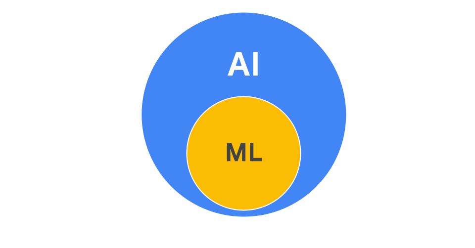

# Посібник із ШІ й машинного навчання

Інструменти на основі генеративного ШІ можуть створювати новий і оригінальний контент – від тексту й зображень до музики та коду. Але як ці інструменти генерують такі креативні й доречні результати? Відповідь полягає у взаємозв’язку між штучним інтелектом (ШІ) і машинним навчанням (МН). 

Розуміння того, як ШІ й МН працюють разом, є цінною професійною навичкою. Вона допоможе вам орієнтуватися в нових технологіях, які трансформують робочі процеси, брати участь у проєктах, пов’язаних із ШІ, або навіть керувати власними ШІ-ініціативами.

## Генеративний ШІ й машинне навчання
Штучний інтелект – це велика галузь, орієнтована на створення інструментів, що можуть виконувати завдання, які зазвичай пов’язані з людським інтелектом. Генеративний ШІ – це тип штучного інтелекту, заснований на машинному навчанні (МН), спеціальній технології, яка дає можливість інструменту вчитися на даних без застосування спеціального програмування для кожного можливого сценарію. Хоча обидва терміни здаються схожими, МН є підмножиною ШІ, що використовується багатьма доступними сьогодні інструментами.

Велике коло, що представляє AI, з меншим колом, що представляє ML всередині.

## Підходи до машинного навчання
Для розробки інструментів на основі ШІ використовуються три загальні підходи машинного навчання, описані нижче.

1. `Контрольоване навчання` використовується для тренування інструментів на величезному наборі даних, позначених людьми. Ця методика часто застосовується, коли є конкретний відомий результат. Наприклад, генератор зображень тренується на мільйонах позначених зображень, наприклад, на зображеннях, які мають чітку позначку "кіт". МН дає можливість інструменту розпізнавати особливості, схожі риси й характеристики котів, щоб він міг створювати власні нові зображення.

2. `Неконтрольоване навчання` використовується для тренування інструментів на наборі даних, не позначених людьми. Ця методика застосовується для визначення закономірностей і структур у даних, коли немає конкретного відомого результату. Наприклад, генератор зображень аналізує великий набір фотографій тварин. МН дає можливість інструменту самостійно визначати закономірності, групуючи зображення з подібними характеристиками, такими як вуса й загострені вуха. Таким чином він може дізнатися, як виглядає кіт, без будь-яких позначень людини.

3. `Навчання з підкріпленням` використовується для тренування інструментів через процес проб і помилок із постійним зворотним зв’язком. Ця методика застосовується для постійного вдосконалення й покращення ефективності інструмента у виконанні певного завдання. Наприклад, після того, як генератор зображень створює картинку кота, він отримує оцінку від людини. Якщо вона позитивна, це означає, що результат хороший. Такі відгуки збираються й використовуються розробниками, щоб покращити майбутні версії інструмента на основі ШІ.

Багато сучасних інструментів на основі ШІ використовують комбінацію всіх трьох підходів до МН для створення тексту, зображень, відео тощо.

Однак важливо зазначити, що "навчання", описане в цих пунктах, відбувається лише під час розробки й тренування інструмента – до того, як він буде доступний для більшості користувачів. Відгуки й дані, зібрані від користувачів, допомагають розробникам покращувати майбутні версії інструмента, але ШІ не навчається активно в режимі реального часу, коли ви ним користуєтесь. Пізніше ви дізнаєтеся більше про специфіку процесу навчання ШІ. 

## ШІ на основі правил: інший підхід
 Хоча багато сучасних ЩІ-інструментів працюють на основі машинного навчання, іншим поширеним підходом є ШІ на `основі правил`. Такі інструменти працюють на основі набору жорстко запрограмованих правил, створених розробниками-людьми, і не вчаться на нових даних. Вони точно дотримуються своїх конкретних указівок. 

Наприклад, простий чат-бот для обслуговування клієнтів може бути запрограмований за таким правилом: "Якщо повідомлення користувача містить фразу "номер відстеження", у відповіді вкажи посилання на наш вебсайт для відстеження посилок". Чат-бот буде щоразу дотримуватися цього правила, але він не зможе адаптувати відповідь або зрозуміти будь-які запити, які не відповідають його заздалегідь написаним правилам. 

Ви можете зустріти ШІ-інструменти на основі правил у робочих інструментах, призначених для виконання передбачуваних завдань. Цей підхід менш гнучкий, ніж машинне навчання, яке дає можливість інструментам на основі ШІ адаптувати й обробляти ширший діапазон складних реальних даних. 

## Ресурси для отримання додаткової інформації
 Якщо ви хочете дізнатися більше, перегляньте 
[PAIR Explorables](https://pair.withgoogle.com/explorables/) – колекцію інтерактивних статей, які допоможуть вам вивчити різні концепції ШІ й зрозуміти, як вони працюють