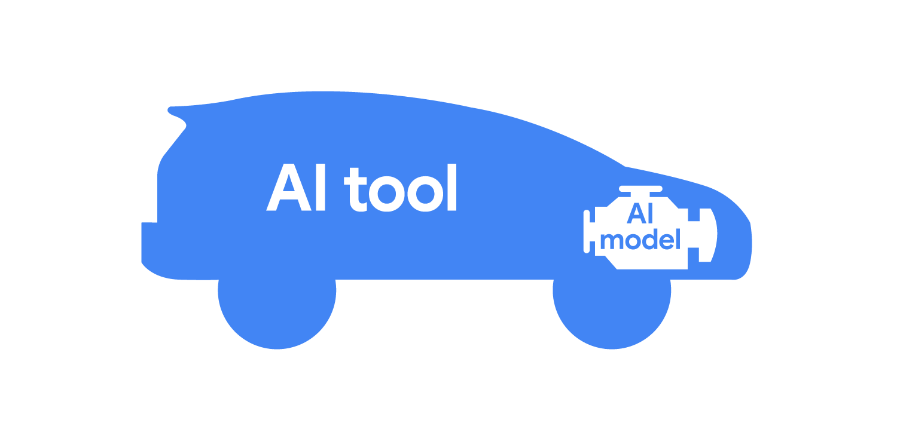

# Моделі ШІ й процес навчання

Ви дізналися, як моделі штучного інтелекту забезпечують роботу ШІ-інструментів. Але як саме створюються моделі ШІ? І як розуміння основ може допомогти вам розкрити весь потенціал інструментів на основі штучного інтелекту? 

Зʼясуймо.

## Інструменти на основі ШІ й моделі ШІ
*Інструменти на основі ШІ  й моделі ШІ* – це різні речі, хоча вони звучать схоже та тісно повʼязані між собою. 

**Інструмент на основі ШІ** – це програмне забезпечення на базі штучного інтелекту, яке може автоматизувати процеси або допомагати користувачам виконувати різноманітні завдання. 

**Модель ШІ** – це комп’ютерна програма, навчена на наборах даних для розпізнавання закономірностей і виконання конкретних завдань. Усі інструменти на основі ШІ побудовані на базі моделей ШІ, які необхідні для роботи ШІ-інструментів.

Щоб краще зрозуміти взаємозв’язок між інструментом ШІ та моделлю ШІ, подумайте про автомобіль і його двигун.

Автомобіль як метафора, де інструмент штучного інтелекту - це автомобіль, а модель AI - двигун

Автомобіль зі своїми зручними деталями, такими як кермо й панель приладів, – це як інструмент на основі штучного інтелекту, тільки авто допомагає їздити з одного місця в інше, а ШІ-інструмент – виконувати різні завдання.  І так само, як автомобілі, інструменти на основі ШІ також мають різні частини. Однією з найважливіших деталей автомобіля є його двигун. Без нього авто не працювало б. Те саме можна сказати й про інструмент на основі штучного інтелекту: його "двигуном" є модель штучного інтелекту, що обробляє інформацію, яку надає користувач, і дозволяє інструменту на основі ШІ функціонувати.

Але не всі двигуни працюють однаково. Подібно до того, як деякі автомобілі краще підходять для певних цілей, ніж інші (наприклад, пікапи можуть перевозити вантаж), інструменти на основі ШІ можна застосовувати для різноманітних завдань. Існують інструменти на основі ШІ для створення тексту, зображень, відео або навіть компʼютерного коду. Але незалежно від конкретної функції інструмента на основі штучного інтелекту, для роботи йому потрібна модель ШІ.

Уявімо автомобіль, який може самостійно переміщатися від одного пункту призначення до іншого без необхідності водієві торкатися керма, – схожим чином працює агент на основі штучного інтелекту. **Агент на основі ШІ** – це ШІ-інструмент, який може автономно виконувати завдання з незначним наглядом із боку людини. Наприклад, агенти на основі ШІ можуть автоматично відповідати на електронні листи, розміщувати контент у соціальних мережах або контролювати комп’ютерні мережі. Ви встановлюєте правила роботи агентів на основі штучного інтелекту, а вони виконують завдання, дотримуючись цих правил, що дає вам можливість зосередитись на інших завданнях. 

> [!NOTE]
> Деякі ШІ-інструменти спираються на кілька моделей штучного інтелекту, які працюють разом, щоб досягати більшого й виконувати ширший спектр завдань. Кожна модель може спеціалізуватися на виконання певного підзавдання, що зрештою сприяє підвищенню загальної функціональності інструмента на основі ШІ. Ви познайомитеся із цими типи мультимодальних інструментів пізніше в цьому курсі. 

## Навчання моделей ШІ.

Розробники й інженери штучного інтелекту створюють моделі ШІ за допомогою процесу, який називається навчанням. Нижче ви знайдете приклад типових кроків, які розробник може виконати в процесі. У цьому випадку йдеться про побудову моделі, що прогнозує кількість опадів.

1. **Визначити проблему, яку потрібно розвʼязати.** Інженери ШІ хочуть передбачати дощ, щоб допомагати людям залишатися сухими дорогою на роботу й додому. Вони враховують особливості й обмеження інструмента на основі ШІ, перш ніж обирають рішення ШІ.

2. **Збір відповідних даних для навчання моделі.** Інженери ШІ збирають історичні дані про дні, коли йшов дощ, і дні, коли дощу не було, за останні 50 років.

3. **Підготовка даних для навчання.** Інженери ШІ готують дані. Вони позначають важливі характеристики, як-от температуру повітря, вологість і атмосферний тиск, а потім відмічають, чи був дощ. Також прийнято розділяти дані на два різні набори: навчальний набір для використання під час тренувального етапу й набір для перевірки для проведення тестування після завершення навчання.

4. **Навчання моделі.** Інженери ШІ застосовують програми машинного навчання до підготовлених навчальних даних. Під час аналізу даних програми машинного навчання починають вчитися розпізнавати закономірності, які вказують на ймовірність опадів: поєднання високих температур, низького атмосферного тиску й підвищеної вологості.

5. **Оцінювання моделі.** Інженери ШІ використовують завчасно підготовлений набір для перевірки, щоб оцінити здатність своєї моделі точно й надійно прогнозувати кількість опадів. Аналіз продуктивності моделі може виявити потенційні проблеми, що впливають на модель, як-от недостатні або упереджені навчальні дані. Якщо існують якісь проблеми, інженери ШІ можуть переглянути попередній крок у процесі й спробувати інший підхід. Якщо модель добре впорається з набором для перевірки, переходьте до наступного кроку.

6. **Упровадження моделі.** Коли інженери ШІ задоволені роботою своєї моделі, вони впроваджують її в інструмент на основі штучного інтелекту. Так вони допомагають людям у своєму місті залишатися сухими дорогою на роботу.

Навчання моделі – це ітеративний процес. Розробники й інженери ШІ можуть повторювати кожен крок стільки разів, скільки потрібно, і робити корективи, доки не створять найкращу з можливих моделей. 

Але процес не зупиняється на впровадженні. Коли користувачі взаємодіють із моделлю в практичних ситуаціях, вона може зіткнутися з новими викликами. Інженери ШІ повинні постійно відстежувати й збирати відгуки про свої моделі, щоб забезпечувати їх надійну роботу й визначати сфери, які потребують удосконалення. Цей ітеративний процес постійного вдосконалення робить моделі штучного інтелекту точними й універсальними, що дозволяє створити ефективні, надійні інструменти на основі штучного інтелекту. 