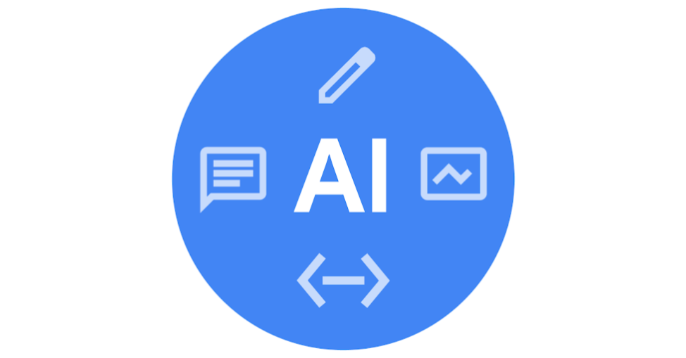

# Інструменти на основі генеративного ШІ для робочих 

Інструменти на основі генеративного штучного інтелекту розроблені для творчості й співпраці. Вони взаємодіють із користувачами через розмову, використовуючи повсякденну мову, що робить їх неймовірно універсальними для виконання широкого спектру завдань, таких як написання текстів, планування, кодування й проєктування. Деякі із цих інструментів є автономними додатками, а інші інтегруються в програмне забезпечення, яке ви використовуєте щодня. Тут наведено огляд основних категорій генеративного штучного інтелекту, ключові приклади й інформацію про те, як стратегічно інтегрувати їх у свою роботу, щоб досягати більшого швидше. 

## Інструменти на основі генеративного штучного інтелекту для створення тексту й контенту

Ці інструменти побудовані на великих мовних моделях (LLM), які пройшли навчання на величезних обсягах тексту й даних. Це дозволяє їм розуміти, підсумовувати, перекладати, передбачати й генерувати текст, схожий на створений людиною. Вони функціонують як універсальні помічники у виконанні будь-якого завдання, повʼязаного з мовою, – від складання електронного листа до аналізу складних дослідницьких робіт. Їх основна перевага полягає в здатності обробляти й генерувати мову з розумінням контексту, тону й наміру. 

Нижче наведено приклади.

- [Gemini](https://gemini.google.com/app)
- [NotebookLM](https://notebooklm.google/)
- [Anthropic Claude](anthropic.com/product)
- [ChatGPT](https://chatgpt.com/)
- [Clockwise](https://www.getclockwise.com/)
- [Grammarly](https://www.grammarly.com/)
- [Jasper](https://www.jasper.ai/)
- [Microsoft Copilot](https://www.microsoft.com/en-us/edge/features/copilot?form=MT00IS)
- [Notion AI](https://www.notion.com/product/ai)
- [Zapier](https://zapier.com/apps/ai/integrations)

## Інструменти на основі штучного інтелекту, які генерують код,

 часто описують як "інструменти парного програмування на основі ШІ". Такі інструменти спеціалізуються на розробці програмного забезпечення. Вони навчаються на мільярдах рядків коду із загальнодоступних сховищ, що дозволяє їм розуміти мови програмування, фреймворки й типові шаблони кодування. Вони допомагають розробникам доповнювати код, генерують цілі функції на основі описів природною мовою, виявляють і виправляють помилки, пишуть одиничні тести й пояснюють складні блоки коду. Їх інтегрують безпосередньо в середовища розробки (IDE), щоб надавати допомогу в реальному часі. 

Ось приклади таких інструментів:

- [Gemini Code Assist](https://codeassist.google/)
- [GitHub Copilot](https://github.com/features/copilot)
- [Jupyter AI](https://jupyter-ai.readthedocs.io/en/latest/)
- [Tabnine](https://www.tabnine.com/)

## Інструменти на основі ШІ, що генерують зображення й медіафайли
Ці інструменти спеціалізуються на створенні й редагуванні мультимедійного контенту: зображень, відео й аудіо. Зазвичай вони використовують технологію, відому як дифузійні моделі, які вчаться генерувати новий контент за текстовими описами (запитами). Користувачі можуть створювати фотореалістичні зображення, художні ілюстрації, маркетингові матеріали й відеокліпи, просто описавши те, що хочуть побачити. Ці інструменти створюють революцію в процесі генерування контенту, значно скорочуючи час, необхідний для візуалізації ідей і створення високоякісних медіафайлів. 

Ось приклади таких інструментів:

- [Gemini із Nano Banana](https://gemini.google.com/app)
- [Asset Studio](https://support.google.com/google-ads/answer/16456563?hl=en)
- [Adobe Firefly](https://www.adobe.com/products/firefly.html)
- [Canva Magic Design™](https://www.canva.com/magic-design/)
- [DALL-E](https://openai.com/dall-e-3)
- [ElevenLabs](https://elevenlabs.io/)
- [Midjourney](https://www.midjourney.com/home)
- [Runway](https://runwayml.com/)

## Інтеграція інструментів на основі ШІ у вашу роботу
Справжня сила штучного інтелекту розкривається, коли він перестає бути новинкою і стає природною частиною вашого щоденного життя. Продумана інтеграція може заощадити час, зменшити виснажливу роботу й підвищити креативність.

Нижче описано поширені методи інтеграції.

1. **Нативні функції.** Багато додатків, які ви вже використовуєте, мають вбудовані функції на основі ШІ. Це найзручніша форма інтеграції, оскільки ШІ має контекст того, що саме ви робите в додатку.

2. **Розширення у вебпереглядачі.** Деякі інструменти можна додати у свій вебпереглядач. Це дозволяє ШІ допомагати вам у різноманітних вебдодатках, від написання електронних листів у Gmail до створення публікацій у соціальних мережах.

3. **Виділені додатки.** Автономний ШІ-інструмент, який можна використовувати як "партнера, що міркує". Ви можете копіювати й вставляти текст між роботою та інструментом на основі ШІ, щоб шукати ідеї, підсумовувати інформацію або покращувати контент.

4. **Платформи автоматизації.** Для більш просунутих користувачів інструменти можна підключати в різних додатках. Ці складні платформи дозволяють створювати автоматизовані робочі процеси між різними додатками (наприклад, автоматично підсумувати електронний лист за допомогою ШІ й додати його до списку справ) без написання коду.

Практичний підхід до початку роботи.

1. **Визначте проблемні зони.** Визначте, які завдання протягом для займають найбільше часу або повторюються. Це написання перших чернеток? Підбиття підсумків зустрічі? Пошук помилок у коді?

2. **Почніть із малого.** Виберіть один такий проблемний процес і знайдіть один інструмент на основі ШІ, який допоможе з ним. Зосередьтеся на освоєнні цього інструмента для цього конкретного завдання.

3. **Виробіть звичку.** Регулярно використовуйте обраний вами інструмент, коли ви виконуєте це завдання. Важливо робити це, щоб застосування ШІ стало природним рефлексом.

4. **Оцініть результат і інтегруйте далі.** Через тиждень–два оцініть вплив. Чи економить це ваш час? Чи покращилася якість вашої роботи? Якщо інтеграція пройшла успішно, виберіть наступне завдання й дослідіть, як ШІ може допомогти вам із ним.

**Фінальна думка.** Цей список є лише відправною точкою. Світ генеративного штучного інтелекту розширюється неймовірними темпами, постійно з’являються нові потужніші інструменти. Головне не в тому, щоб стати експертом, який має всі інструменти, а розвивати допитливість. Знайдіть час, щоб вивчити інструменти, які відповідають вашим конкретним потребам, як-от [Gemini](https://www.youtube.com/watch?v=a-fmRIW8u-8&t=1107s)  або [NotebookLM](https://www.youtube.com/watch?v=a-fmRIW8u-8&t=1820s), і подумайте, як вони можуть розширити ваші навички й підтримати вас у роботі.