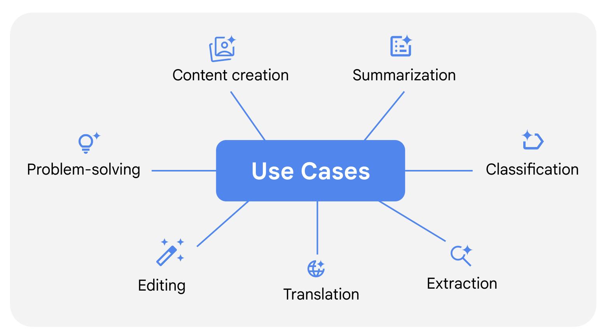

# Запити для різних цілей
Формулюючи ефективні запити, можна скеровувати інструмент штучного інтелекту, щоб він генерував корисні результати для різних завдань: від створення контенту до вирішення проблем. У цьому матеріалі ми покажемо на прикладах, як використовувати схему створення запитів (**завдання, контекст, референси, оцінка, ітерація**), щоб отримувати надійні й корисні результати для різних потреб. 

## Cтворення контенту 
здатні генерувати різноманітний контент для всіх можливих посад і галузей. Вони можуть допомагати вам створювати зображення, відео, документацію і програмний код. За умови ефективних запитів інструменти ШІ підсилять вашу креативність і заощадять час.

Ось зразок складеного за всіма рекомендаціями запиту, що містить конкретне завдання, контекст і референс:

*Ти спеціаліст із креативної реклами і вмієш розробляти оригінальні рекламні гасла, що підкреслюють позитивні якості товару. Створи лаконічне гасло для пральної машини, яка бездоганно пере одяг, має 25 налаштувань і поміщається в невеликому просторі. Гасло має містити заклик до дії і не більше 6 слів. Орієнтуйся на ці приклади успішних у цій галузі гасел, що підкреслюють ефективність і зручність.*

*- Зразок №1: "Менше мила. Більше чистоти."*

*- Зразок №2: "Перетворіть прання на справжню магію."*

Цей запит чітко описує завдання: створити оригінальне й стисле рекламне гасло. Він також забезпечує необхідний контекст, визначаючи тон, стиль і формат гасла. Надано приклади, які інструмент ШІ зможе наслідувати.

**Професійна порада.** Дізнайтеся більше про те, 
[як Gemini може стати вашим креативним помічником](youtube.com/watch?si=AljYxG8O5lqT4vko&v=aiNGHMrFW-0&feature=youtu.be).

## Створення підсумків 
Інструменти ШІ можуть швидко обробляти й стисло викладати великі обсяги тексту, не втрачаючи ключових ідей і фактів. Тому вони ідеально підходять для перетворення складної інформації на чіткі стислі підсумки. 

Ось зразок запиту, який містить конкретно сформульоване завдання, контекст і побажання щодо формату: 

*Підсумуй цей електронний лист від постачальника програмного забезпечення. Створи стислий професійний огляд із перевагами кожного рівня платної підписки у форматі окремого маркованого списку. Це має бути зручний документ для торговельного представника, з яким він зможе швидко ознайомитися, перш ніж зв’язуватися з потенційним клієнтом.*

*[Тут має бути текст електронного листа]*

Цей приклад показує, як можна отримати корисний і доречний, адаптований до потреб конкретної аудиторії підсумок інформації, сформулювавши побажання щодо стилю, тону й формату.

Професійна порада. Дізнайтеся більше про те, 
[як створювати за допомогою Gemini підсумки зустрічей](https://www.youtube.com/watch?si=zrjNKIDats3bbusd&v=h2JKmrBb-40&feature=youtu.be).

## Класифікація 
Інструменти на основі ШІ допоможуть вам аналізувати й категоризувати за конкретними критеріями такий контент, як службові електронні листи й відгуки клієнтів. Ця функція може допомогти вам сортувати інформацію і робити на її основі дієві змістовні висновки.

Ось зразок запиту, який визначає завдання, надає чіткі критерії класифікації і включає референси: 

- *Прочитай ці відгуки клієнтів і визнач їх настрій: позитивний, негативний чи нейтральний. Для кожного відгуку поясни одним реченням підстави для класифікації на основі зазначених далі критеріїв.*

- *Позитивний настрій: послідовно позитивні коментарі або переважно позитивні з незначною критикою.*

- *Нейтральний настрій: змішані або збалансовані позитивні й негативні коментарі.*

- *Негативний настрій: послідовно негативні коментарі або переважно негативні з незначними позитивними елементами.*

*- Відгук №1: Я не знаю, із чого почати. Ми забронювали столик на 7:00, але нас посадили о 7:45. Потім до нашого столика ніхто не підходив щонайменше 30 хвилин. Закуска та основна страва були посередніми. Мені дуже сподобався десерт, але цього було недостатньо, щоб урятувати ситуацію.*

*- Відгук №2: Мені подобається цей ресторан. Їжа смачна, обслуговування відмінне.*

На початку цього запиту чітко сформульовано завдання: проаналізувати настрій відгуку клієнта. Далі вказано варіанти настрою: позитивний, негативний або нейтральний. Кожну категорію чітко визначено, тому інструмент ШІ може робити точніші оцінки й надавати послідовніші результати.

## Збір даних
Інструменти ШІ можуть заощадити вам час, швидко збираючи потрібну вам інформацію з великих складних документів. Це можуть бути числові дані з фінансових звітів, специфікації товарів із каталогів або ключові моменти з нотаток зустрічі. Щоб отримати точніші результати, ви можете додати в запит фразу "створи витяг" чи "збери дані", а також надати чіткі вказівки щодо типу потрібної інформації і бажаного формату.

Ось зразок запиту, що включає специфіку завдання, доречний контекст і побажання щодо формату: 

*Я планую бюджет на закупівлю одягу для нашого відділу. Мені потрібно відстежити тенденції цін. Збери інформацію з указаного нижче допису в блозі про всі предмети одягу, які я можу придбати, і ціни на них. Створи електронну таблицю саме із цими предметами одягу. Підготуй таблицю з двома стовпцями: "Товар" і "Ціна". Записуй назви товарів із великої літери й упорядкуй їх за спаданням ціни.*

*[Тут має бути контент допису в блозі]*

На початку цього запиту чітко сформульовано завдання: створити витяг із допису в блозі з усіма згаданими предметами одягу й цінами на них. Також указано, як слід подати дані для швидшого аналізу: в електронній таблиці конкретного формату.

## Переклад 
Інструменти на основі ШІ допомагають перекладати контент для міжнародної аудиторії, щоб спростити спілкування з іноземними колегами й створювати контент багатьма мовами.

Ось зразок запиту, який включає конкретно сформульоване завдання, контекст і побажання щодо стилю:

*Наш магазин велотоварів продає обладнання для велоспорту й туризму. Переклади описи наших продуктів з англійської нідерландською. Збережи в нідерландському тексті ту саму структуру та невимушений тон, що й в англійській версії. Врахуй культурний контекст і подбай про те, щоб вирази нідерландською не втратили маркетингової привабливості.*

*- Зразок №1. І на міських вулицях, і на лісових стежках цей міцний елегантний велосипед не підведе вас.*

*- Зразок №2. Мчіть назустріч літу стильно на елегантних роликах із плавним ходом.*

На початку цього запиту чітко сформульовано завдання: перекласти описи товарів з англійської на нідерландську. Також зазначено, що переклади нідерландською мають зберігати структуру й тон англійської версії, щоб результат приваблював цільову аудиторію, не відходячи від духу оригіналу.

## Редагування 
Інструменти ШІ можуть покращувати й уточнювати вже наявні тексти для кращої комунікації. Завдяки чітким вказівкам щодо редагування інструменти ШІ можуть вносити відповідні корективи, не відходячи від суті початкового повідомлення.

 Ось зразок запиту, який включає конкретно сформульоване завдання, контекст і потреби аудиторії:

*Я менеджер зі зв’язків із громадськістю виробничої компанії. Мені потрібно пояснити представникам місцевої громади, за якою процедурою ми обираємо місце для наших виробничих потужностей. Перепиши цей текст для нетехнічної аудиторії. Спрости формулювання, не втрачаючи ключові ідеї.*

*[Тут має бути текстовий контент]*

Цей приклад показує, як можна краще відредагувати текст, визначивши завдання й цільову аудиторію.  Якщо ви чітко вкажете, що саме потрібно спростити, інструмент на основі ШІ зможе внести потрібні зміни, не відходячи від суті повідомлення.

## Розв’язання проблем
Також інструменти ШІ допомагають розділити складні проблеми на дрібніші й швидко знайти можливі варіанти їх розв’язання. Використовуючи ШІ для таких завдань, варто розбити запит на менші частини, щоб отримати кращі результати.

Ось зразок запиту для структурування складної проблеми: 

*Ми проводимо громадську програму з навчання дітей навичок садівництва. Програма триває з 1 червня до 15 серпня. Ми хочемо, щоб діти змогли виростити рослини та зібрати врожай до завершення програми. Спочатку склади список із 10 рослин, які можна посадити й виростити впродовж цього періоду. Включи джерела, які підтверджують час збору врожаю для кожної рослини.*

*Далі вибери зі списку три максимально відмінні одна від одної рослини. Ми хочемо забезпечити максимальне розмаїття.* 

На початку цього запиту надано корисний контекст, а саме вказано головну мету й часові рамки програми. Також запит розбиває досить складне завдання на менші зрозумілі кроки. Як і в будь-якому іншому випадку, для отримання від інструментів на основі ШІ надійних і корисних результатів важливо складати запити ефективними методами й адаптувати їх до своїх конкретних потреб.

Приклади в цьому матеріалі показують, як слід адаптувати запити до різних робочих завдань. Хоча кожен випадок використання може вимагати конкретних методів, основні принципи залишаються незмінними: **завдання, контекст, референси, оцінка, ітерація**. Практикуючись, ви зможете набути навички складання запитів для найрізноманітніших ситуацій і отримувати саме такі результати, які вам потрібні.