# Mermaid

**Mermaid** — це потужний інструмент, який перетворює текстовий код на графічні схеми. На GitHub або в VS Code він ініціалізується блоком коду з позначкою mermaid.

Ось детальний розбір основних типів діаграм та їхнього синтаксису:
## 1. Блок-схема (Flowchart)
Починається з ключового слова `graph` або `flowchart`, після якого йде напрямок:
- `TD` (Top Down) або `TB` (Top Bottom) — зверху вниз.
- `LR` (Left Right) — зліва направо.

Фігури вузлів:
- `ID[Текст]` — прямокутник (стандарт).
- `ID(Текст)` — закруглені кути.
- `ID{Текст}` — ромб (рішення).
- `ID((Текст))` — коло.

Типи стрілок:
- `-->` — тонка стрілка.
- `==>` — жирна стрілка.
- `-.->` — пунктирна стрілка.
- `-- Текст -->` — стрілка з написом.

  ```
  graph LR
      A[Запит] --> B{Валідація}
      B -- OK --> C((Успіх))
      B -- Помилка --> D[Лог помилки]
  ```


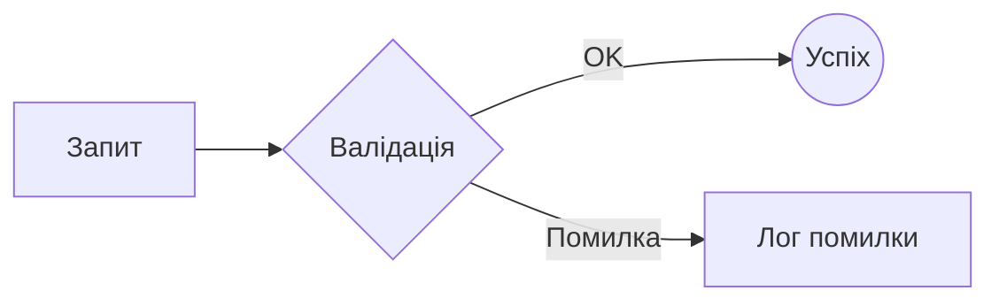

## 2. Діаграма послідовності (Sequence Diagram)
Використовується для відображення взаємодії між об'єктами в часі.

- `participant` — учасник (можна дати псевдонім через as).
- `actor` — учасник-людина (іконка чоловічка).
- `->>` — суцільна лінія зі стрілкою (запит).
- `-->>` — пунктирна лінія зі стрілкою (відповідь).
- `Note over/left/right of` — нотатка.


  ```
  sequenceDiagram
      actor User as Клієнт
      participant Server as Сервер
      
      User->>Server: Авторизація (login, pass)
      Server-->>User: JWT Токен
      Note right of Server: Токен діє 24 години
  ```

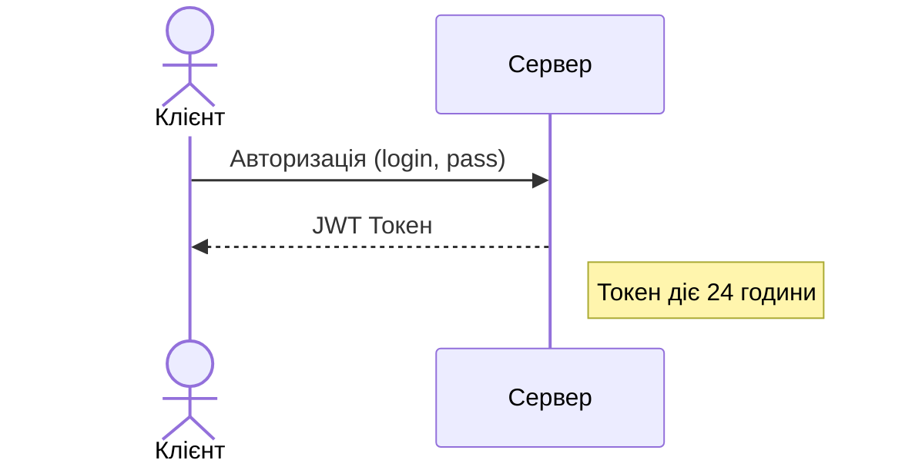

## 3. Діаграма станів (State Diagram)
Описує життєвий цикл об'єкта.
- `[*]` — початковий та кінцевий стан.
- `-->` — перехід.
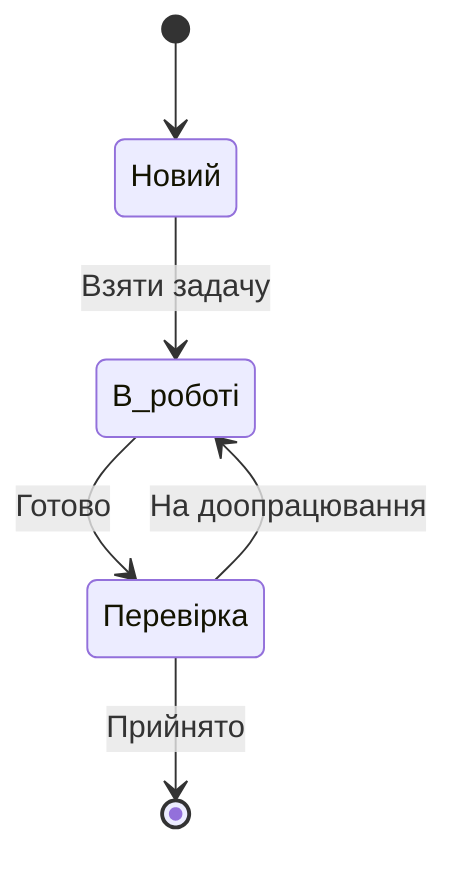

## 4. Кругова діаграма (Pie Chart)
Найпростіший синтаксис для візуалізації часток.
  ```mermaid
  pie title Розподіл мов у проекті
      "C#" : 45
      "TypeScript" : 35
      "SQL" : 20
  ```

## 5. Діаграма Ганта (Gantt Chart)
Для планування проектів.
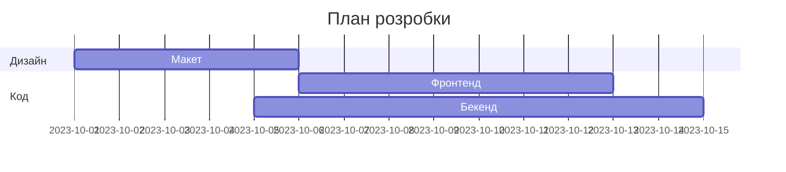

## 6. ERD (Entity Relationship Diagrams) 
Mermaid чудово підтримує створення ER-діаграм (Entity Relationship Diagrams). Це один із найзручніших способів документувати схему бази даних прямо в Markdown-файлі.  
Для цього використовується ключове слово `erDiagram`.

   1. Простий приклад (Сутності та зв'язки)
    Ви описуєте назви таблиць та як вони пов'язані між собою спеціальними стрілками.
    
  ```
  erDiagram
      USER ||--o{ ORDER : "робить"
      ORDER ||--|{ LINE-ITEM : "містить"
      PRODUCT ||--o{ LINE-ITEM : "додається до"
  ```
  
  ```mermaid
  erDiagram
      USER ||--o{ ORDER : "робить"
      ORDER ||--|{ LINE-ITEM : "містить"
      PRODUCT ||--o{ LINE-ITEM : "додається до"
  ```

  2. Докладний приклад (З полями та типами даних)  
   Ви можете прописати назви стовпців, типи даних (string, int) та ключі (PK, FK).

  ```
  erDiagram
      USERS {
          int id PK
          string username
          string email
          datetime created_at
      }
  
      POSTS {
          int id PK
          int author_id FK
          string title
          text content
      }
  
      USERS ||--o{ POSTS : "writes"
  ```

  ```mermaid
  erDiagram
      USERS {
          int id PK
          string username
          string email
          datetime created_at
      }
  
      POSTS {
          int id PK
          int author_id FK
          string title
          text content
      }
  
      USERS ||--o{ POSTS : "writes"
  ```

  3. Синтаксис стрілок (Типи зв'язків)
     
   В Mermaid стрілки показують "кардинальність" (скільки записів з одного боку відповідають записам з іншого):  
  - one to one: `||--||` (рівно один до одного)
  - one to many: `||--o{` (один до "нуль або багато")
  - one to many (min 1): `||--|{` (один до "мінімум один або багато")
  - many to many: `}|--|{` (багато до багатьох)

   Як це використовувати для SQL розробки:
  - Проєктування: Ви спочатку малюєте схему в Mermaid, а потім пишете SQL-код CREATE TABLE.
  - Документація: Вставте такий блок у свій README.md на GitHub або в нотатку Obsidian, і у вас завжди буде актуальна візуальна схема бази під рукою.
  - Обговорення: Замість того, щоб скидати скриншоти з бази, ви скидаєте текст Mermaid, який колеги можуть легко відредагувати.


## Важливі нюанси Mermaid:
- **Лапки**: Якщо в тексті вузла є спеціальні символи (дужки, крапки, знаки питання), обов'язково беріть текст у лапки: `ID["Текст (з дужками)"]`.
- Стилізація: Ви можете змінювати кольори вузлів за допомогою класів (`classDef`), але GitHub обмежує можливості кастомізації з міркувань безпеки.
- Сумісність: Якщо ви пишете в VS Code, встановіть розширення `Mermaid Markdown Syntax Highlighting` для підсвітки коду схеми.

## Інші потужні інструменти Mermaid
Mermaid — це цілий «швейцарський ніж» для візуалізації. Окрім блок-схем та ER-діаграм, є ще кілька потужних інструментів, які часто забувають:

### 1. Mind Maps (Ментальні карти)
Ідеально для брейнштормінгу або структурування ідей. Використовує відступи (табуляцію) для ієрархії.
```
mindmap
  root((Мій Проєкт))
    Технології
      C#
      PostgreSQL
    Дизайн
      Figma
      Tailwind
    Пріоритети
      ::icon(fa fa-star)
      MVP
      Безпека
```

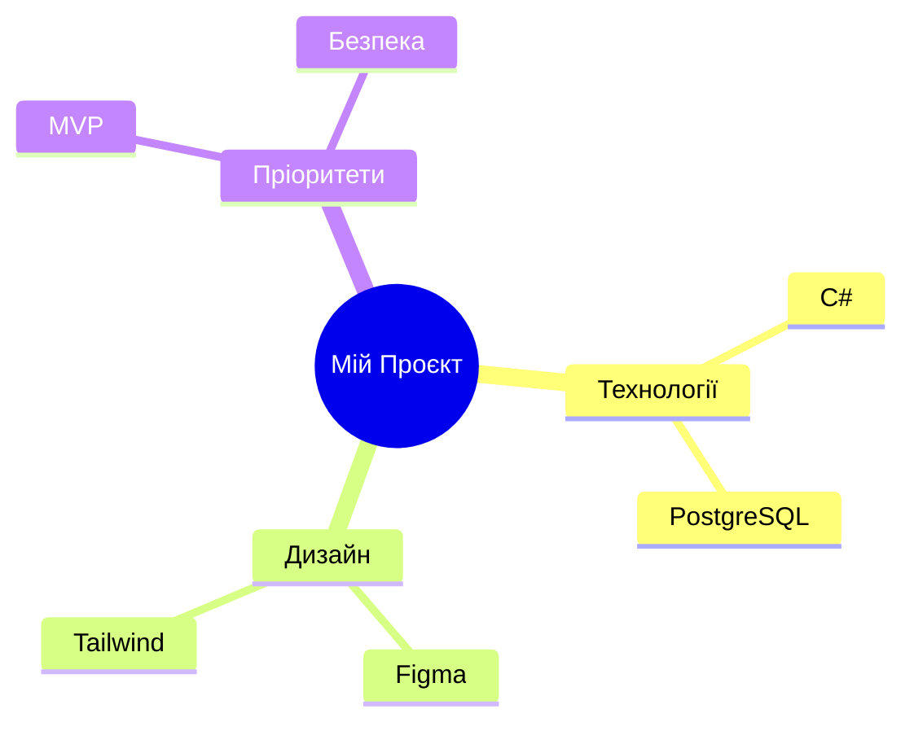

### 2. User Journey (Шлях користувача)
Використовується для опису досвіду користувача: які кроки він робить і наскільки він задоволений (оцінка від 1 до 5).
```
journey
    title Мій день розробника
    section Ранок
      Кава: 5: Користувач
      Перевірка пошти: 3: Користувач, Система
    section Робота
      Написання коду: 5: Користувач
      Фікс багів: 1: Користувач
```

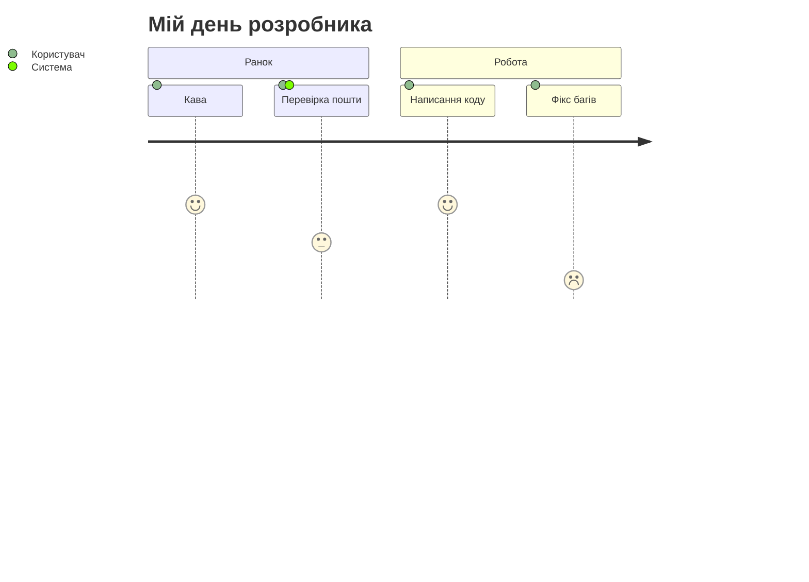

### 3. Git Graph (Візуалізація гілок Git)
Це просто знахідка для документації! Ви можете малювати коміти, мерджі та розгалуження прямо в коді.
```
gitGraph
    commit
    commit
    branch develop
    checkout develop
    commit
    commit
    checkout main
    merge develop
    commit id: "v1.0.0" tag: "v1.0.0"
```

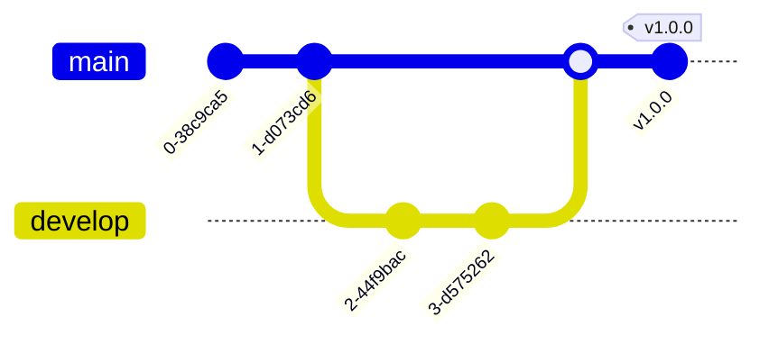

### 4. Quadrant Chart (Матриця пріоритетів)
Допомагає візуалізувати завдання за двома осями (наприклад, "Складність" та "Важливість").

```
quadrantChart
    title "Feature Analysis"
    x-axis "Low Complexity" --> "High Complexity"
    y-axis "Low Value" --> "High Value"
    quadrant-1 "Strategic"
    quadrant-2 "Quick Wins"
    quadrant-3 "Low Priority"
    quadrant-4 "Maintenance"
    "Авторизація": [0.2, 0.9]
    "Чат": [0.7, 0.8]
    "Зміна кольору кнопки": [0.1, 0.2]
    "AI аналітика": [0.9, 0.4]
```

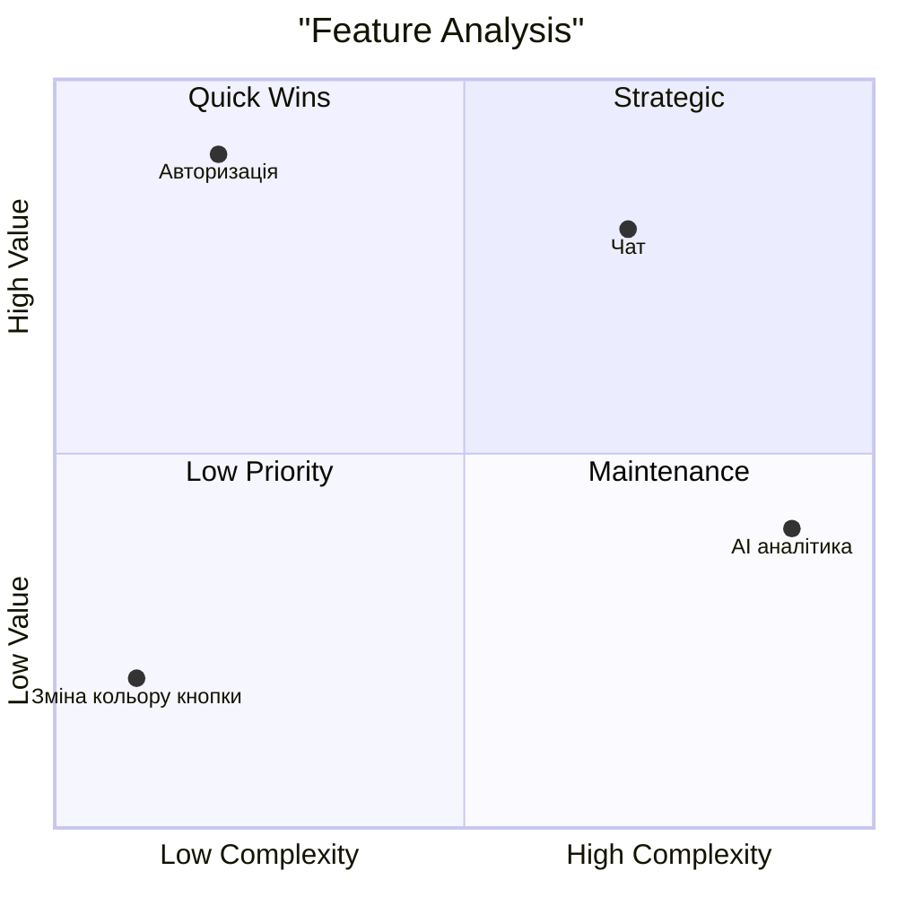

### 5. Timeline (Стрічка часу)
Для опису історії проєкту або релізів.
```
timeline
    title Історія розробки
    2023 : Ідея : Прототип
    2024 : Реліз MVP : Перші 100 юзерів
    2025 : Масштабування : Вихід на ринок
```

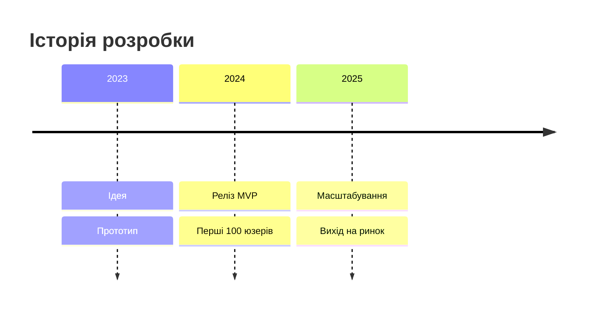

### 6. Спеціальні фішки синтаксису:
#### 6.1. Інтерактивність (Click): Можна додати подію click до вузла, щоб при натисканні на нього в браузері відкривалося посилання.  
  Це працює через ключове слово `click`. Ви вказуєте ідентифікатор вузла, посилання та (опціонально) підказку.  
  Приклад для блок-схеми:
  ```
  graph TD
      A[Документація] --> B[Репозиторій]
      
      click A "https://google.com" "Відкрити доки"
      click B "https://github.com" "Перейти на GitHub"
  ```
  ```mermaid
  graph TD
      A[Документація] --> B[Репозиторій]
      
      click A "https://google.com" "Відкрити доки"
      click B "https://github.com" "Перейти на GitHub"
  ```
 > [!NOTE]
 >  Важливі нюанси для GitHub:
 > - Безпека: GitHub дозволяє кліки лише на зовнішні посилання (http/https). Виклики JavaScript-функцій (click A call myFunc()) заблоковані.
> - Візуалізація: Користувач не завжди розуміє, що на вузол можна натиснути. Краще додавати в текст щось на кшталт (клікніть тут).
> - Синтаксис: У нових версіях Mermaid для посилань можна використовувати спрощений синтаксис:
> - `linkStyle 0 stroke:#ff0000,stroke-width:2px;` (це для ліній), але для вузлів стандарт `click ID "URL"` залишається найнадійнішим.

#### 6.2. FontAwesome: Mermaid підтримує іконки (наприклад, `:icon(fa fa-twitter)`), якщо підключена відповідна бібліотека.

На жаль, GitHub не підтримує пряме підключення сторонніх бібліотек на кшталт FontAwesome всередині Mermaid з міркувань безпеки.

Як це обійти?  
Використовуйте звичайні Emoji прямо в тексті вузла. Вони працюють всюди без жодних налаштувань:
```
graph LR
    A[📦 Backend] --> B[💾 PostgreSQL]
    B --> C[🚀 Deploy]
```   
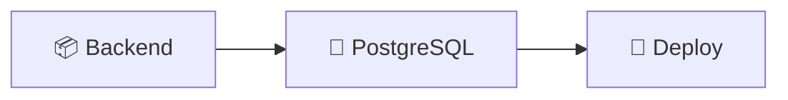

💡 Порада для професійного вигляду  
Якщо вам дуже потрібні іконки брендів (Docker, C#, React) на схемі для GitHub, замість тексту у вузлах можна використовувати HTML-тег img (якщо парсер дозволяє):
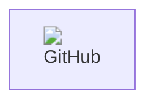

(Примітка: GitHub іноді обмежує рендеринг HTML всередині Mermaid, тому Emoji — найнадійніший шлях).
    
#### 6.3. Subgraphs (Підграфи): Можна групувати вузли в рамки всередині блок-схем:
```
graph TB
    subgraph База Даних
        A[(Postgres)]
        B[(Redis)]
    end
```

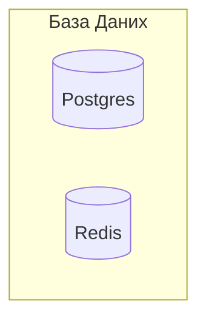

## Cпецифічні діаграми для вузьких задач
Остання порція «екзотики» Mermaid — це специфічні діаграми для вузьких задач, про які знають не всі розробники.

### 1. C4 Diagram (Архітектура систем)
Це стандарт для візуалізації архітектури програмного забезпечення. Вона дозволяє малювати контейнери, компоненти та системи.
```
C4Context
    title Контекстна діаграма системи лояльності
    Person(customer, "Клієнт", "Користувач сервісу")
    System(banking, "Інтернет-банк", "Зовнішня платіжна система")
    System_Boundary(c1, "Наш Проєкт") {
        System(web_app, "Веб-додаток", "Дозволяє купувати товари")
        System(api, "API", "Обробляє запити")
    }
    Rel(customer, web_app, "Користується")
    Rel(web_app, api, "Робить запити", "JSON/HTTPS")
    Rel(api, banking, "Перевіряє оплату")
```

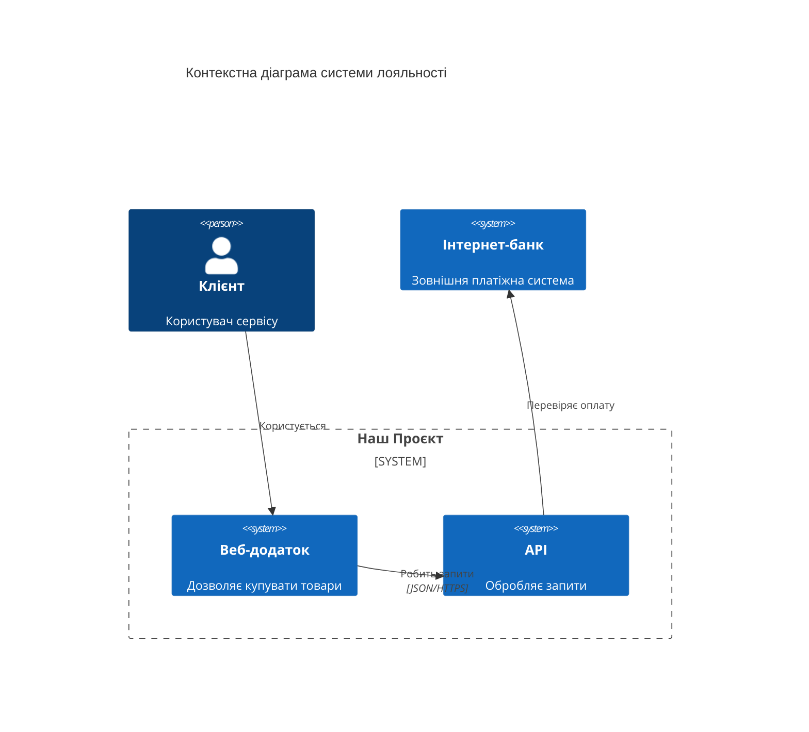

### 2. State Diagram (Діаграма станів)
Ідеально для логіки кнопок, статусів замовлень або життєвого циклу об'єктів у коді (наприклад, стан вашого Task або JoinRequest).
```
stateDiagram-v2
    [*] --> Pending
    Pending --> Approved: Адмін підтвердив
    Pending --> Rejected: Адмін відхилив
    Approved --> Completed: Завдання виконано
    Completed --> [*]
```

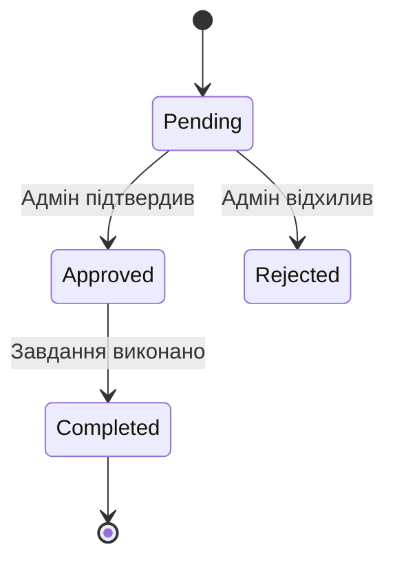

### 3. Class Diagram (Діаграма класів)
Якщо ви пишете на C#, це найкращий спосіб візуалізувати структуру класів, методи та типи даних перед кодингом.
```
classDiagram
    class User {
        +string Name
        +string Email
        +Login() bool
    }
    class Admin {
        +int AccessLevel
        +BanUser(id)
    }
    User <|-- Admin : успадкування
```

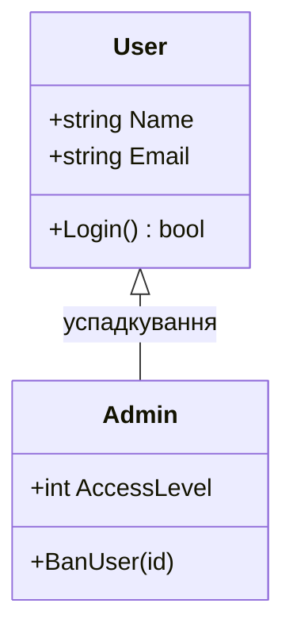

### 4. Sankey Diagram (Потоки даних/грошей)
Нова фіча (може не працювати в старих версіях плагінів), яка показує, як об'єм чогось перетікає з однієї категорії в іншу.
```
sankey-beta
    Budget,Salaries,3000
    Budget,Rent,1000
    Salaries,Frontend,1500
    Salaries,Backend,1500
```

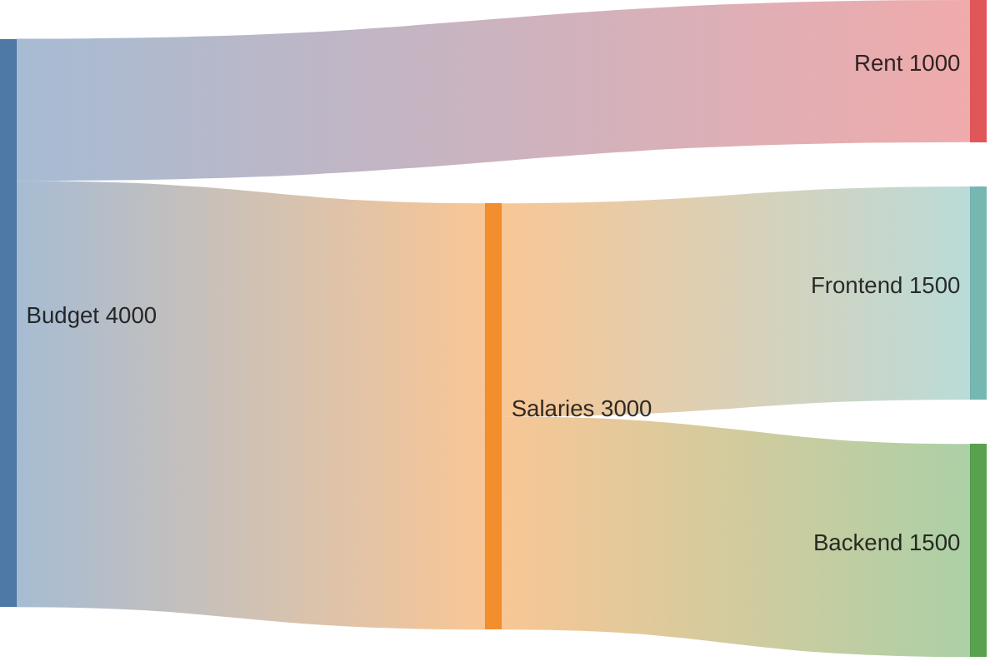

### 5. XY Chart (Графіки)
Так, Mermaid тепер може малювати прості лінійні графіки та гістограми безпосередньо в Markdown!
```
xychart-beta
    title "Активність користувачів за тиждень"
    x-axis ["Пн", "Вт", "Ср", "Чт", "Пт", "Сб", "Нд"]
    y-axis "Кількість постів" 0 --> 100
    line [10, 40, 35, 80, 50, 90, 70]
    bar [15, 30, 45, 60, 55, 85, 65]
```

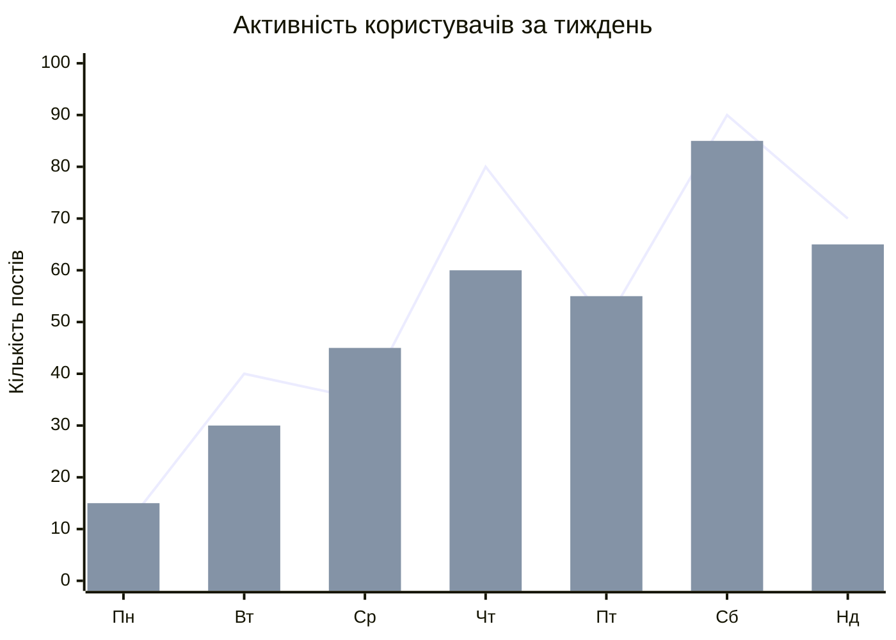

### 6. Конфігурація (Theming)
У Mermaid є два основні способи керувати зовнішнім виглядом: через глобальні теми або кастомні стилі прямо в коді.

  - Швидка зміна теми (Theming)

  Ви можете змінити загальну палітру кольорів за допомогою директиви `%%{init: {'theme': 'назва'}}%%`. Це ставиться на самому початку блоку.  
  Доступні варіанти: `default`, `forest`, `dark`, `neutral`, `base`.
  ```
  %%{init: {'theme': 'forest'}}%%
  mindmap
    root((Мій Проєкт))
      Технології
        C#
        PostgreSQL
      Дизайн
        Figma
  ```
  ```mermaid
  %%{init: {'theme': 'forest'}}%%
  mindmap
    root((Мій Проєкт))
      Технології
        C#
        PostgreSQL
      Дизайн
        Figma
  ```

  - Кастомна стилізація окремих вузлів
    
    У Mind Maps можна "розфарбувати" конкретні гілки, додаючи до них спеціальні класи (або використовуючи іконки).  
    Форми вузлів: (дужки визначають форму, що також візуально змінює акценти)  
      - ((Круг))
      - [Прямокутник]
      - {{Хмара}}
      - (( (Бум) )) — вибух.
  
  - Використання іконок (FontAwesome та Markdown)  
  Mind Maps підтримує Markdown-форматування та іконки всередині вузлів, що робить їх набагато яскравішими.
    ```
    %%{init: {'theme': 'neutral'}}%%
    mindmap
      root((fa:fa-brain Мій Мозок))
        )Програмування(
          ::icon(fa fa-code)
          **C#**
          **SQL**
        {{Відпочинок}}
          ::icon(fa fa-coffee)
          Сон
          Спорт
    ```

    ```mermaid
    %%{init: {'theme': 'neutral'}}%%
    mindmap
      root((fa:fa-brain Мій Мозок))
        )Програмування(
          ::icon(fa fa-code)
          **C#**
          **SQL**
        {{Відпочинок}}
          ::icon(fa fa-coffee)
          Сон
          Спорт
    ```
  
  - Тонке налаштування кольорів (Advanced)  
    Ви можете прописати конкретні кольори для рівнів ієрархії через CSS змінні в init:
    ```mermaid
    %%{init: {
      'theme': 'base',
      'themeVariables': {
        'primaryColor': '#ffcccc',
        'edgeColor': '#ff0000',
        'nodeTextColor': '#333'
      }
    }}%%
    mindmap
      root((Стильний Граф))
        Рівень 1
        Рівень 1
    ```


> [!NOTE]
> Важливо для Obsidian:  
> Оскільки Obsidian має власну темну/світлу тему, Mermaid зазвичай підлаштовується під неї автоматично. Якщо ви примусово поставите theme: 'dark', а в Obsidian у вас світла тема — текст може стати нечитабельним.


## Підсумок: 
Mermaid перетворює ваш README або нотатки в Obsidian на повноцінний технічний паспорт проєкту, де замість статичних картинок — живий код, який легко правити.
