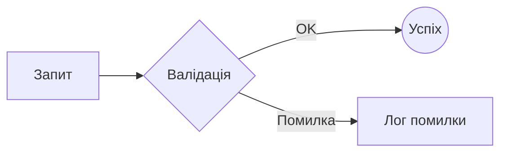
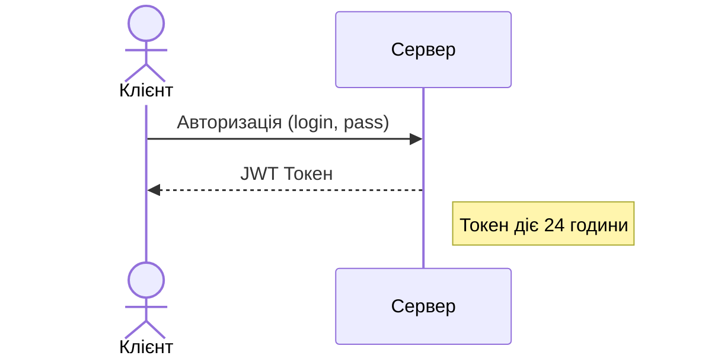
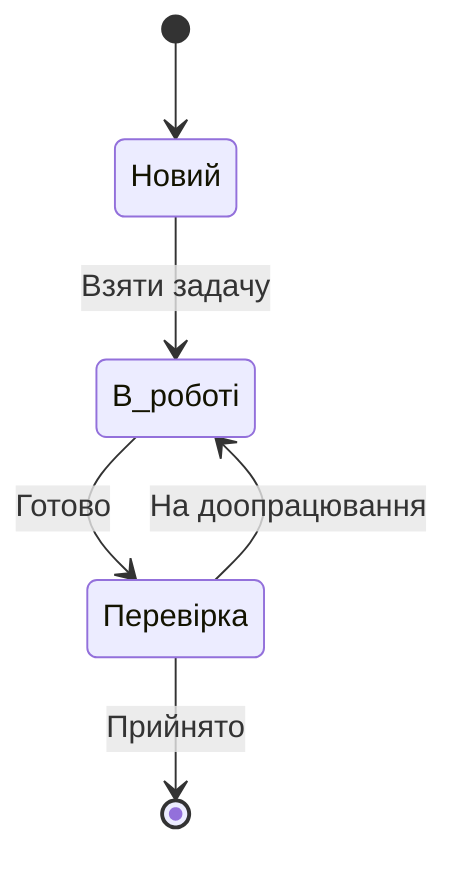
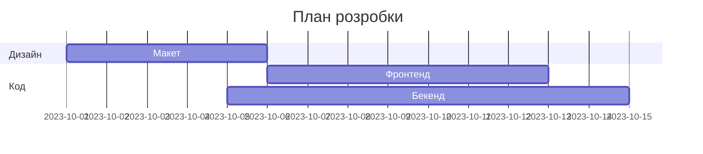

# Mermaid

**Mermaid** — це потужний інструмент, який перетворює текстовий код на графічні схеми. На GitHub або в VS Code він ініціалізується блоком коду з позначкою mermaid.

Ось детальний розбір основних типів діаграм та їхнього синтаксису:
## 1. Блок-схема (Flowchart)
Починається з ключового слова `graph` або `flowchart`, після якого йде напрямок:
- `TD` (Top Down) або `TB` (Top Bottom) — зверху вниз.
- `LR` (Left Right) — зліва направо.

Фігури вузлів:
- `ID[Текст]` — прямокутник (стандарт).
- `ID(Текст)` — закруглені кути.
- `ID{Текст}` — ромб (рішення).
- `ID((Текст))` — коло.

Типи стрілок:
- `-->` — тонка стрілка.
- `==>` — жирна стрілка.
- `-.->` — пунктирна стрілка.
- `-- Текст -->` — стрілка з написом.

  ```
  graph LR
      A[Запит] --> B{Валідація}
      B -- OK --> C((Успіх))
      B -- Помилка --> D[Лог помилки]
  ```




## 2. Діаграма послідовності (Sequence Diagram)
Використовується для відображення взаємодії між об'єктами в часі.

- `participant` — учасник (можна дати псевдонім через as).
- `actor` — учасник-людина (іконка чоловічка).
- `->>` — суцільна лінія зі стрілкою (запит).
- `-->>` — пунктирна лінія зі стрілкою (відповідь).
- `Note over/left/right of` — нотатка.


  ```
  sequenceDiagram
      actor User as Клієнт
      participant Server as Сервер
      
      User->>Server: Авторизація (login, pass)
      Server-->>User: JWT Токен
      Note right of Server: Токен діє 24 години
  ```



## 3. Діаграма станів (State Diagram)
Описує життєвий цикл об'єкта.
- `[*]` — початковий та кінцевий стан.
- `-->` — перехід.


## 4. Кругова діаграма (Pie Chart)
Найпростіший синтаксис для візуалізації часток.
  ```mermaid
  pie title Розподіл мов у проекті
      "C#" : 45
      "TypeScript" : 35
      "SQL" : 20
  ```

## 5. Діаграма Ганта (Gantt Chart)
Для планування проектів.


## Важливі нюанси Mermaid:
- **Лапки**: Якщо в тексті вузла є спеціальні символи (дужки, крапки, знаки питання), обов'язково беріть текст у лапки: `ID["Текст (з дужками)"]`.
- Стилізація: Ви можете змінювати кольори вузлів за допомогою класів (`classDef`), але GitHub обмежує можливості кастомізації з міркувань безпеки.
- Сумісність: Якщо ви пишете в VS Code, встановіть розширення `Mermaid Markdown Syntax Highlighting` для підсвітки коду схеми.