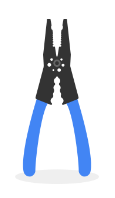
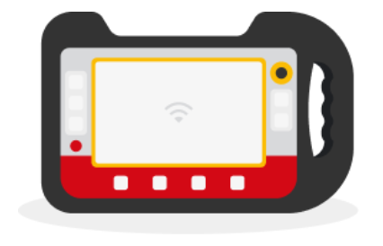
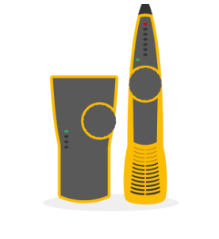
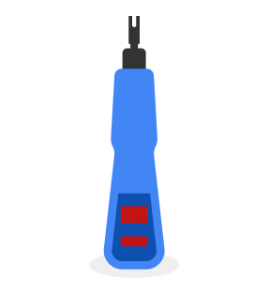
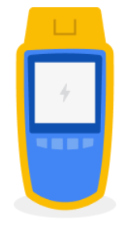
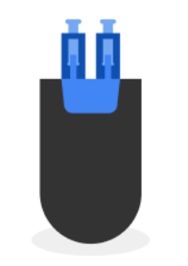
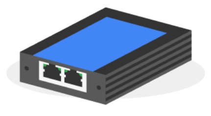

# Інструменти для кабелювання
Як ми вже розглянули, порти та патч-панелі є частиною фізичного шару. Кабельні інструменти є розширенням фізичного шару. У цьому читанні ви дізнаєтеся більше про інструменти для кабелювання, як вони виглядають і для чого вони використовуються.

## Кримпер 
 Кримпер - це ручний інструмент, який зовні нагадує набір плоскогубців. Застосовується для стиснення або обтиску проводів.

## Зачищувач кабелю
 Зачищувач кабелю - це ще один портативний пристрій, який також виглядає як плоскогубці. Його мета - зняти захисне гумове покриття з кабелів.

## Аналізатор Wi-Fi
 Аналізатор WiFi - це сканер, який аналізує потужність та якість WiFi в районі. Він також збирає дані про WiFi та його обставини.

## Тонерний зонд
 Тонерний зонд є частиною набору пристроїв, які використовуються для пошуку Ethernet та інших інтернет-роз'ємів. Один пристрій підключається до кабелю, тоді як інший пристрій, тональний зонд, використовує тон, який стає гучнішим, коли він наближається до пристрою, підключеного до кабелю. (Мейєрс, 2022). 

## Інструмент для перфорації
Інструмент для перфоратора або інструмент Krone використовується для пробивання проводів у пробивні панелі або домкрати. Спочатку знімається захисне покриття з проводів, потім дроти пробиваються на місце.

## Кабельний тестер
 Кабельний тестер цифровим способом вимірює цілісність кабелю на відповідність розробленим стандартам кабелю. 

 
Вони вимірюють кілька параметрів:
- ослаблення
- Імпеданс
- шум
- Близький перехресний перехід
- Коефіцієнт ослаблення до перехресної передачі (ACR)
- PowerSum NEXT (Мережева енциклопедія, 2022).

## Штепсельна вилка
Штекер зворотного циклу - це пристрій, який тестує порти. Провід з'єднуються в цикл, який відправляє трафік назад в порт після його отримання.

                  

## Мережевий тап
 Мережевий кран - це пристрій, який копіює інформацію про трафік для використання в пристроях моніторингу. Являє собою зовнішній пристрій.

## Посилання на ресурси

- [Мейерс, М. (2022). За допомогою тонера і зонда. [Відео].](https://www.oreilly.com/videos/comptia-network-certification/9781803249797/9781803249797-video5_8/)

- [Мережева енциклопедія. (2022). Що таке кабельний тестер?](https://networkencyclopedia.com/cable-tester/)

- [Synchronet.NET (2025).](https://synchronet.net/loopback-plug/) Основний посібник із використання та переваг штекера Loopback.