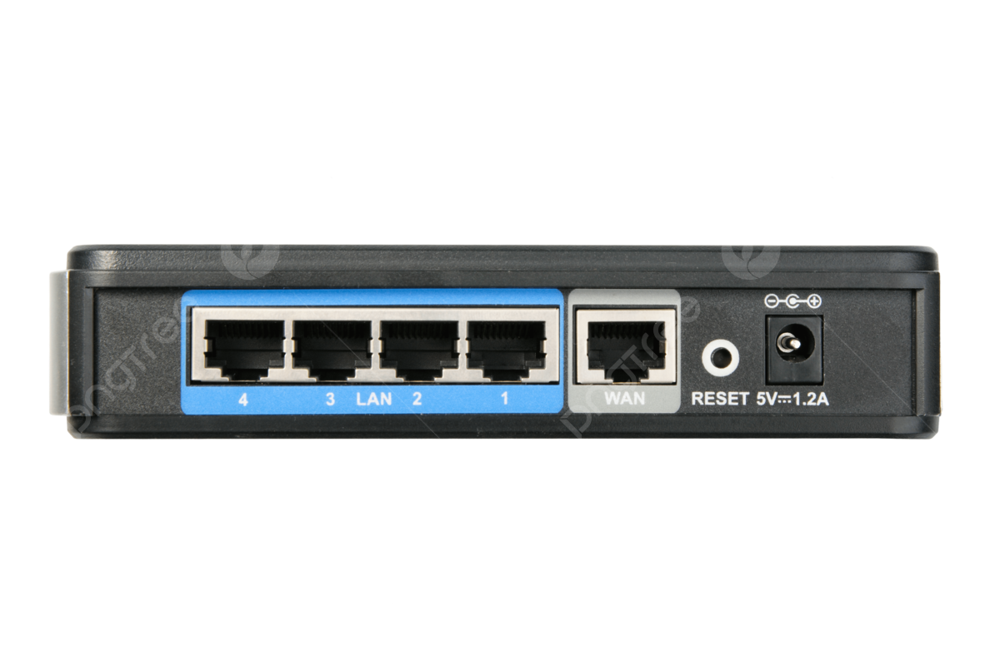
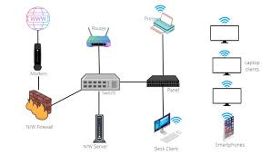
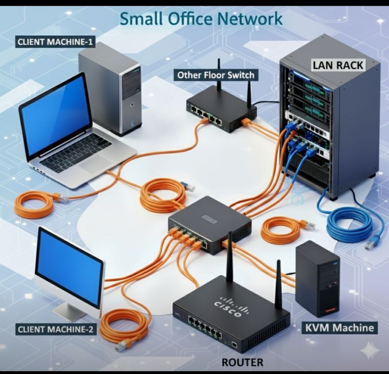
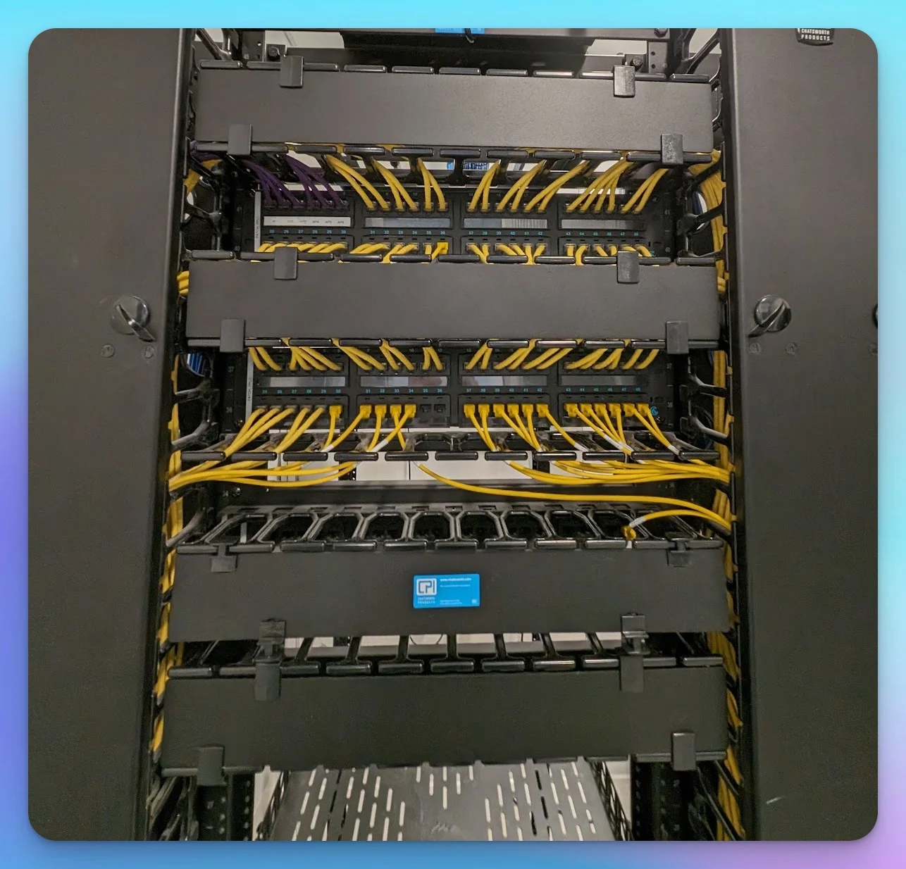
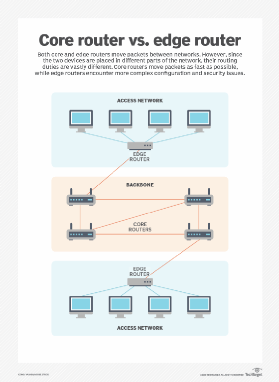
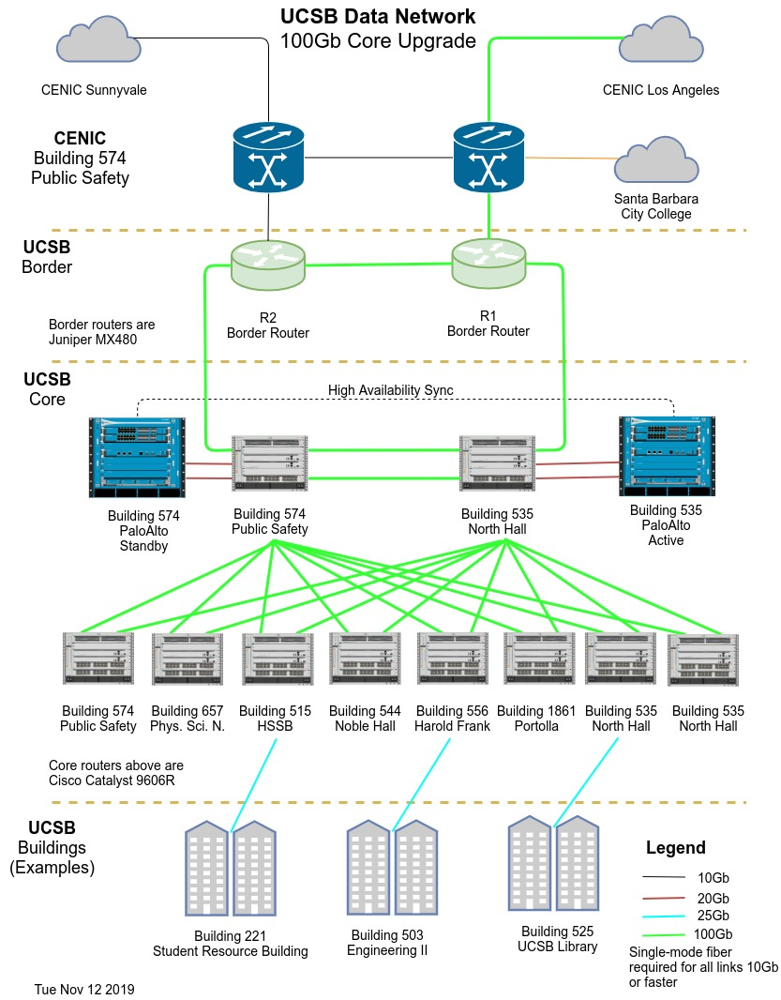

# Маршрутизатори (Routers)
## Вступ

Раніше ми розглянули:
- хаби і комутатори → працюють в межах однієї мережі (LAN)

Але в реальному житті потрібно:
- передавати дані між різними мережами

👉 Саме для цього використовуються маршрутизатори

## 📡 Що таке маршрутизатор
**📌 Визначення:**

`Маршрутизатор (Router)` — це пристрій, який:

> пересилає дані між різними мережами

**🧱 Рівень роботи:**
- працює на мережевому рівні (Layer 3)

**⚙️ Як працює:**
- аналізує дані протоколу  
    → IP
- визначає:
  - куди потрібно відправити дані
  - пересилає їх у потрібну мережу

**🧠 Простими словами:**

> Якщо комутатор знає “кому в кімнаті”,  
то маршрутизатор знає “в яку країну”

## 🔀 Порівняння пристроїв
| Пристрій      | Рівень  | Функція                |
| ------------- | ------- | ---------------------- |
| Хаб           | Layer 1 | передає всім           |
| Комутатор     | Layer 2 | передає в межах мережі |
| Маршрутизатор | Layer 3 | передає між мережами   |

**🧭 Таблиця маршрутизації**
**📌 Що це:**

Маршрутизатори зберігають:

- інформацію про мережі
- можливі шляхи (routes)

**📡 Функція:**
- вибір оптимального маршруту для передачі даних

## 🏠 Домашні маршрутизатори

**📌 Особливості:**
- прості таблиці маршрутизації
- основна задача:
  - передати трафік з дому → до провайдера

👉 тобто:

> “все, що не локальне — відправити в Інтернет”

## 🌐 Роль провайдера
**📌 Що відбувається далі:**
- дані потрапляють до:  
  → інтернет-провайдера (ISP)
- далі працюють значно складніші маршрутизатори
  
## 🏢 Магістральні маршрутизатори (Core Routers)

**📌 Особливості:**
- обробляють величезний трафік
- мають багато з’єднань з іншими маршрутизаторами
- приймають складні рішення про маршрути

**🌍 Важливо:**

> Саме ці маршрутизатори формують основу Інтернету

## 🔗 Протокол маршрутизації
📡 Основний протокол:  
> → BGP

**📌 Що робить:**
- маршрутизатори “спілкуються” між собою
- обмінюються інформацією про маршрути
- знаходять найкращий шлях для даних

## 🌐 Як рухаються дані в Інтернеті
**📦 Приклад:**

Коли ти відкриваєш сайт:

1. запит виходить з твого комп’ютера
1. проходить через домашній роутер
1. потрапляє до ISP
1. проходить через багато маршрутизаторів
1. доходить до сервера

👉 іноді через десятки маршрутизаторів

**🧠 Простими словами**

> Маршрутизатори — це “навігатори Інтернету”,
які визначають найкращий шлях для кожного пакета

## 🧾 Висновок
- маршрутизатори:
  - працюють на Layer 3
  - використовують IP
  - з’єднують різні мережі
- існують:
  - прості (домашні)
  - складні (ядро Інтернету)
- Інтернет = величезна система маршрутизаторів

## 📌 Головна ідея

> Без маршрутизаторів не існувало б Інтернету —
вони забезпечують доставку даних у глобальному масштабі