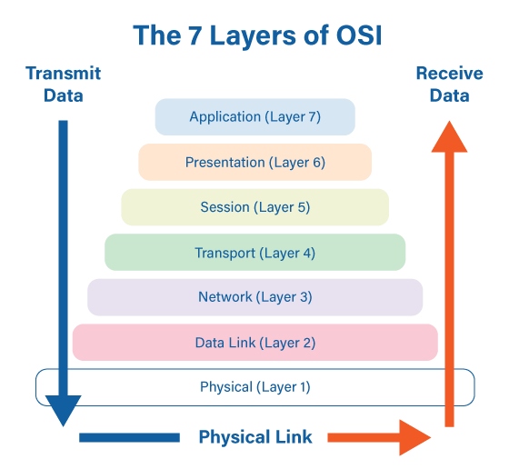
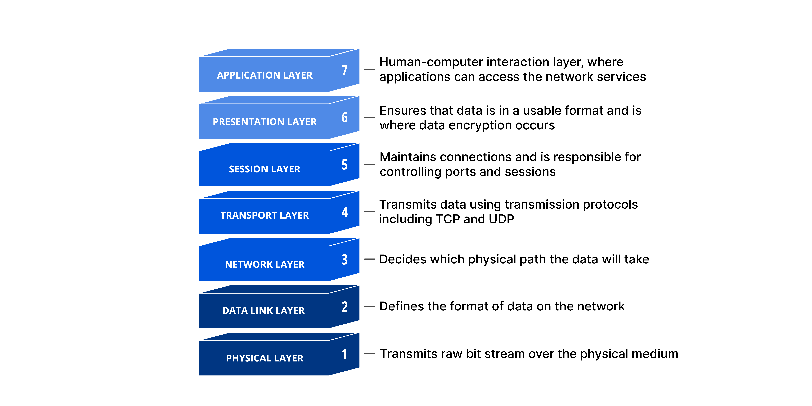
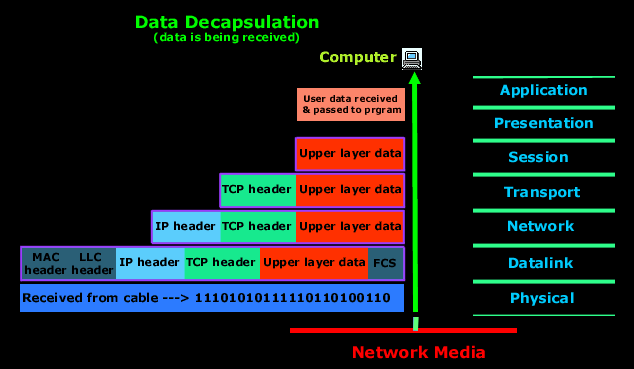
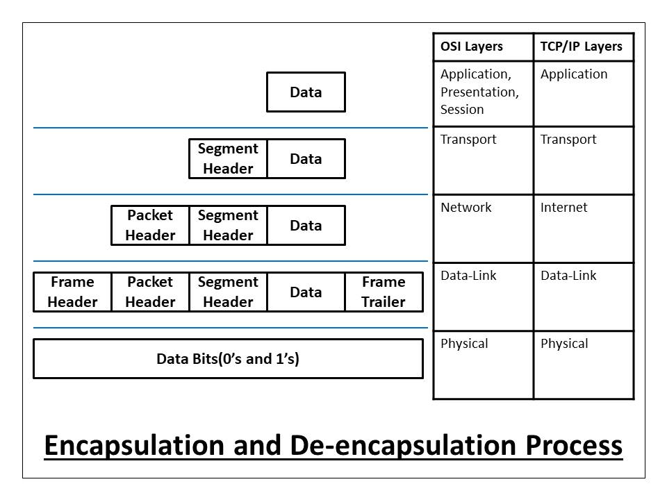
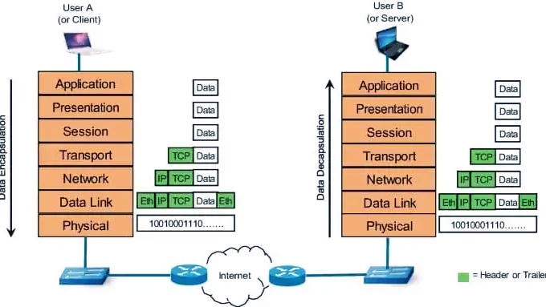
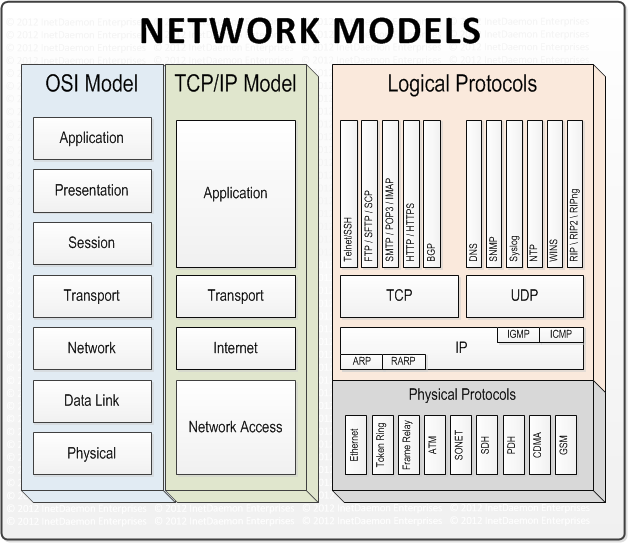
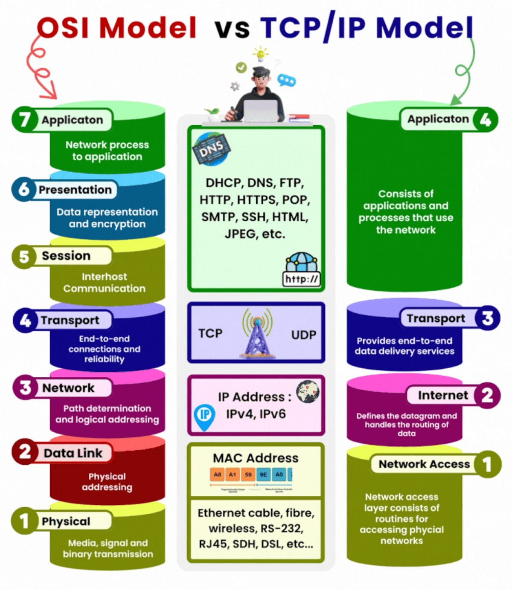

# Мережева модель OSI Model

`Мережева модель OSI Model (Open Systems Interconnection)` — це концептуальна модель, яка описує, як дані передаються через мережу, розбиваючи цей процес на 7 логічних рівнів.

Вона потрібна, щоб:

- стандартизувати мережеву взаємодію
- спростити розробку протоколів
- полегшити troubleshooting (дуже корисно для LNA 👀)

📊 Загальна схема OSI

👉 Дані рухаються:

- зверху вниз (від користувача → до мережі)
- і назад знизу вверх на стороні отримувача

## 🔢 7 рівнів OSI (зверху вниз)
### 7️⃣ Application Layer (Прикладний рівень)

👉 Найближчий до користувача

Що робить:

- взаємодія з програмами
- надає мережеві сервіси

Приклади протоколів:

- HTTP / HTTPS
- FTP
- SMTP

💡 Тут працюють браузери, пошта, API

### 6️⃣ Presentation Layer (Рівень представлення)

👉 “Перекладач” даних

Що робить:

- шифрування / дешифрування
- стиснення
- перетворення форматів (JSON, XML, JPEG)

💡 Наприклад:

- SSL/TLS (частково тут)\
  
### 5️⃣ Session Layer (Сеансовий рівень)

👉 Керує “сесіями” між клієнтом і сервером

Що робить:

- відкриває / підтримує / закриває з’єднання
- синхронізація

💡 Наприклад:

- сесії в API або RPC

### 4️⃣ Transport Layer (Транспортний рівень)

👉 Надійність передачі

Що робить:

- розбиває дані на сегменти
- контроль доставки
- контроль помилок

Протоколи:

- TCP (надійний)
- UDP (швидкий, але без гарантій)

💡 Тут важливі:

- порти (80, 443, 22)

### 3️⃣ Network Layer (Мережевий рівень)

👉 Логічна адресація і маршрути

Що робить:

- визначає шлях пакета
- працює з IP-адресами

Протоколи:

- IP
- ICMP (ping)

💡 Тут працюють:

- маршрутизатори

### 2️⃣ Data Link Layer (Канальний рівень)

👉 Передача в межах однієї мережі

Що робить:

- MAC-адресація
- контроль помилок на рівні кадрів

Приклади:

- Ethernet
- ARP

💡 Тут працюють:

- комутатори (switches)

### 1️⃣ Physical Layer (Фізичний рівень)

👉 Реальна передача бітів

Що робить:

- електричні сигнали
- кабелі, роз'єми

💡 Це:

- LAN-кабель
- Wi-Fi сигнал

## 📦 Як дані проходять через OSI (інкапсуляція)

Коли ти відкриваєш сайт:

1. Application → формує запит (HTTP)
1. Transport → додає порт (TCP)
1. Network → додає IP
1. Data Link → додає MAC
1. Physical → передає біти

👉 Це називається інкапсуляція

## 🧠 Як це використовувати в реальному житті (troubleshooting)

OSI — це супер-інструмент для діагностики:

| Рівень | Проблема          | Приклад            |
| ------ | ----------------- | ------------------ |
| 7      | API не відповідає | 500 error          |
| 4      | TCP проблема      | порт закритий      |
| 3      | IP                | не пінгується      |
| 2      | MAC               | ARP issue          |
| 1      | кабель            | "нема інтернету" 😄 |

👉 Правило:
Йдеш знизу вверх або зверху вниз

## 🔄 OSI vs TCP/IP

👉 У реальності частіше використовують TCP/IP model

| OSI          | TCP/IP    |
| ------------ | --------- |
| 7 рівнів     | 4 рівні   |
| теоретична   | практична |
| деталізована | спрощена  |

## 🧩 Як запам’ятати рівні

👉 Зверху вниз:
> All People Seem To Need Data Processing

👉 Або український варіант:
> Аплікація → Представлення → Сесія → Транспорт → Мережа → Канал → Фізика

## 💡 Важливо зрозуміти
- OSI — це модель, не реальна реалізація
- кожен рівень:
  - має свою роль
  - не знає деталей інших рівнів
- допомагає:
  - проектувати системи
  - дебажити мережі