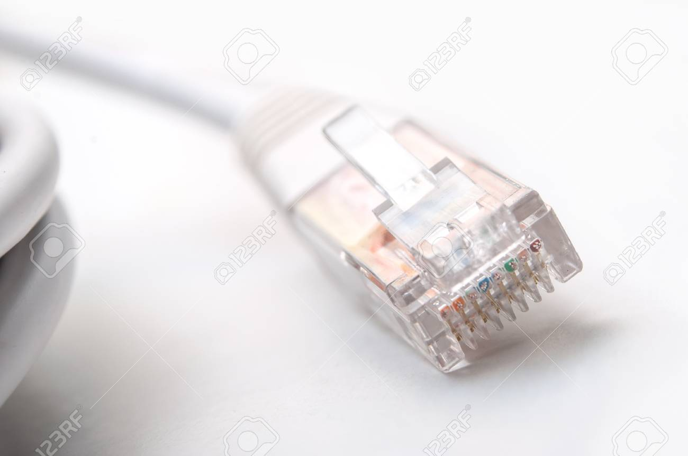
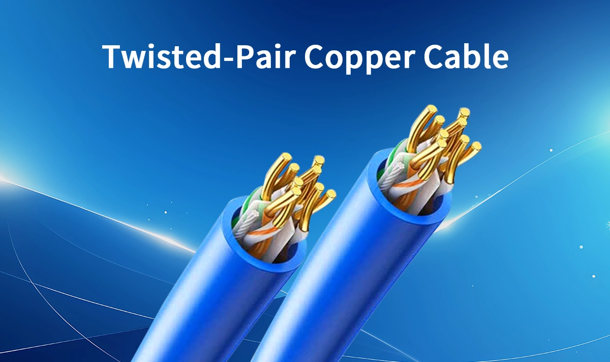
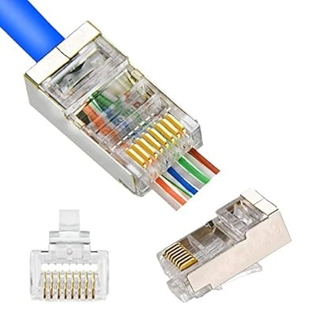
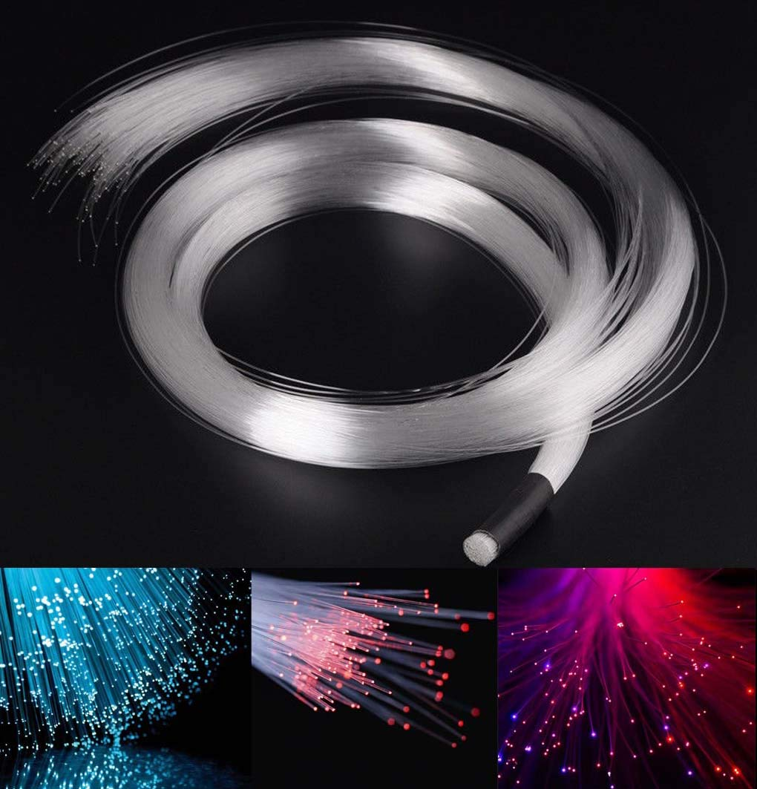
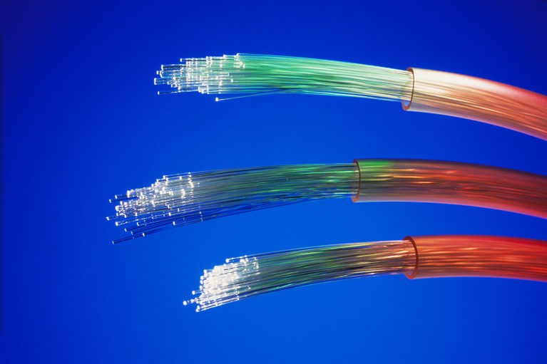
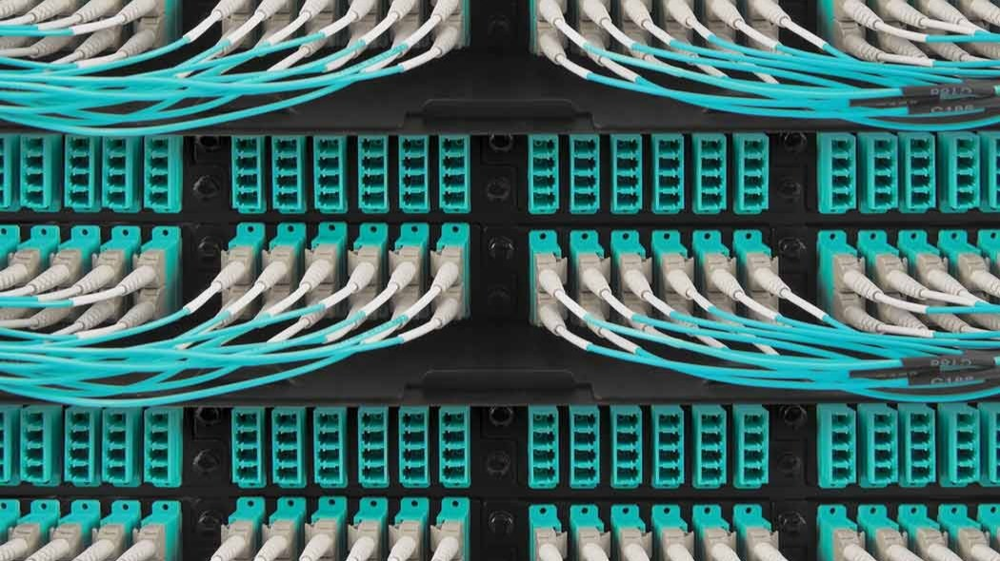

# Мережеві кабелі та базові принципи передачі даних
## Вступ

Комп’ютерні мережі складаються не лише з програм і протоколів, а й із фізичних компонентів:

- кабелі
- мережеві пристрої
- середовище передачі даних

👉 Для ІТ-спеціаліста важливо:

- розрізняти типи кабелів
- розуміти їхні особливості
- знати, коли який використовується

## 🔗 Що таке мережевий кабель
**📌 Визначення:**

`Мережевий кабель` — це фізичне середовище, яке з’єднує пристрої та дозволяє передавати дані між ними.

**📡 Як передаються дані:**
- комп’ютери працюють у двійковій системі (0 і 1)
- ці значення передаються через:
  - електричні сигнали (в мідних кабелях)
  - світлові імпульси (в оптичних кабелях)

## 🧵 Основні типи кабелів

Існує 2 головні категорії:

### 🟤 1. Мідні кабелі (Copper Cables)

**📌 Що це:**

Кабелі з мідними проводами, які передають дані через електричні сигнали

**🔧 Будова:**
- кілька пар мідних проводів
- кожна пара скручена (twisted pair)
- покриті ізоляцією

**⚡ Як працює:**
- передача через зміну напруги
- приймач інтерпретує:
  - висока напруга → 1
  - низька напруга → 0

**📊 Основні категорії:**
| Кабель | Опис                        |
| ------ | --------------------------- |
| Cat 5  | застарілий                  |
| Cat 5e | покращений (менше перешкод) |
| Cat 6  | швидший і надійніший        |

**⚠️ Перехресні перешкоди (Crosstalk)**
**📌 Що це:**

Ситуація, коли сигнал з одного дроту впливає на інший

**❗ Наслідки:**
- помилки в передачі
- потреба повторної відправки даних

**✅ Рішення:**
- краща ізоляція
- більше скручування пар (як у Cat 5e, Cat 6)

**🚀 Порівняння:**
- Cat 5e
  - менше перешкод
  - стабільна робота
- Cat 6
  - вища швидкість
  - краща якість
  - ❗ менша максимальна довжина на високих швидкостях
  - 💰 дорожчий

**🧠 Простими словами:**

> Мідні кабелі — дешеві, поширені, але чутливі до перешкод

**💡 Важливо:**

Навіть якщо кабелі виглядають однаково — їх внутрішня структура сильно впливає на швидкість і якість

### 💡 2. Волоконно-оптичні кабелі (Fiber Optic)

**📌 Що це:**

Кабелі, які передають дані через світло

**🔧 Будова:**
- тонкі скляні волокна (як людське волосся)
- передають світлові імпульси

**💡 Як працює:**
- світло = дані (0 і 1)
- немає електрики → немає електромагнітних перешкод

**⚡ Переваги:**
- 🚀 дуже висока швидкість
- 📏 велика відстань передачі
- 🛡️ нечутливість до електромагнітних перешкод

**❗ Недоліки:**
- 💰 дорожчі
- 🧩 більш крихкі
- складніші в установці

**🧠 Простими словами:**

> Волоконні кабелі — швидкі і “чисті”, але дорогі і делікатні

## 🏢 Де використовуються
- 🏠 Дім / офіс → переважно мідні кабелі
- 🏢 Дата-центри → часто волоконні кабелі

## 🧾 Висновок
- Кабелі — основа фізичної мережі
- Є два головні типи:
  - мідні → дешевші, але з перешкодами
  - оптичні → швидші, але дорожчі
- Якість кабелю напряму впливає на:
  - швидкість
  - стабільність
  - кількість помилок

## 📌 Ключова ідея

> Передача даних — це не тільки “інтернет”, а й фізика:
електрика (мідь) або світло (оптика)