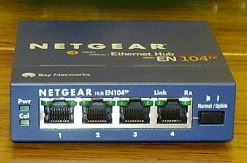
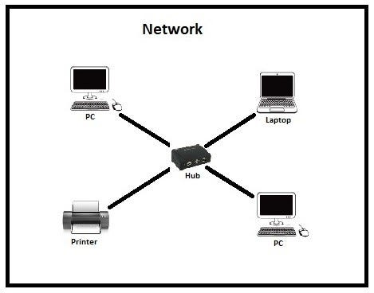
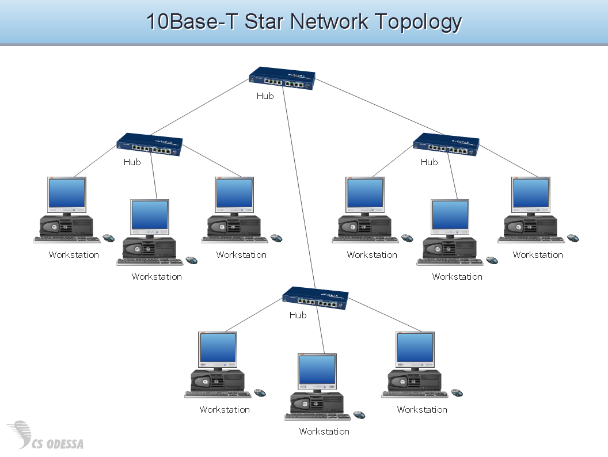
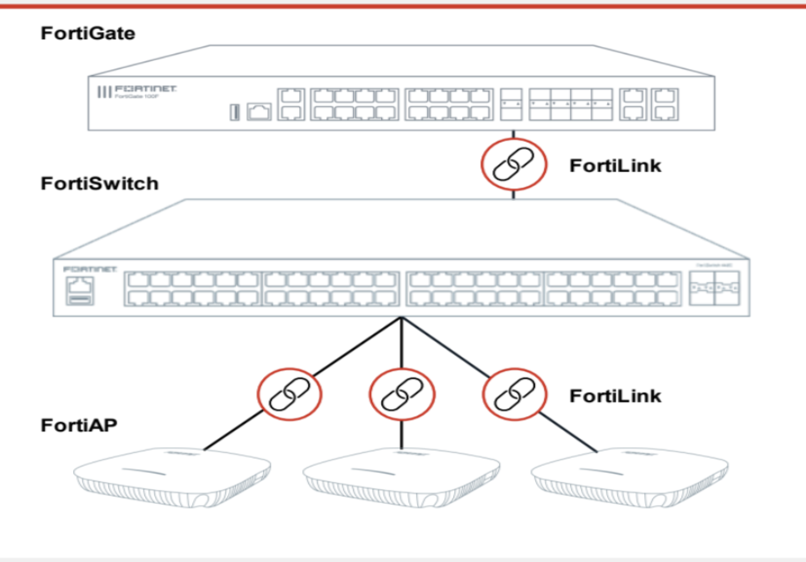
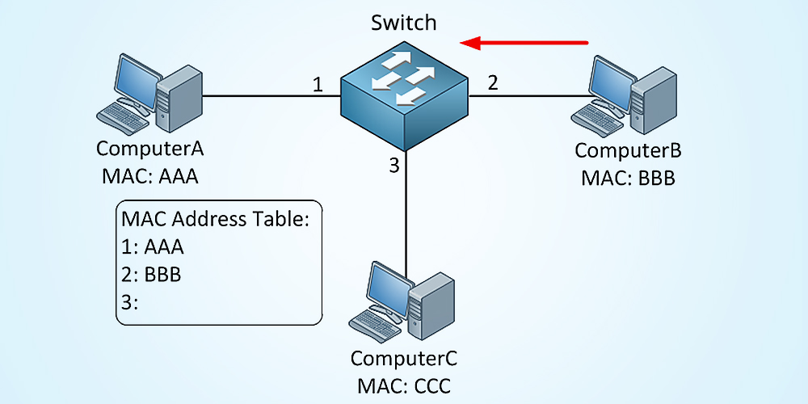
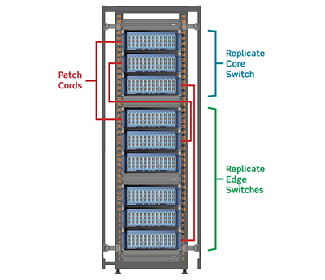
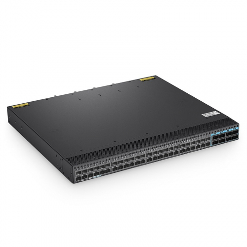

# Мережеві пристрої: хаби та комутатори
## Вступ

У реальних мережах недостатньо просто з’єднати два комп’ютери кабелем.
Потрібні мережеві пристрої, які дозволяють:

- підключати багато пристроїв
- організовувати ефективну передачу даних
- зменшувати помилки та перевантаження

## 🔗 Точка-точка (Point-to-Point)
**📌 Що це:**

З’єднання, де:

- один пристрій ↔ один пристрій

**❗ Проблема:**
- не масштабується
- не підходить для сучасного світу (мільярди пристроїв)

**🧠 Висновок:**

> Потрібні пристрої, які об’єднують багато вузлів у мережу

## 🔌 1. Хаб (Hub)

**📌 Що це:**

Простий мережевий пристрій, який працює на
фізичному рівні (Layer 1)

**⚙️ Як працює:**
- отримує сигнал
- розсилає його всім підключеним пристроям

**📡 Поведінка:**
- всі пристрої отримують всі дані
- кожен сам вирішує:
  - це йому → обробити
  - не йому → ігнорувати

**⚠️ Проблема: домен колізій**

**📌 Що таке домен колізій:**

Сегмент мережі, де:

> лише один пристрій може передавати дані в один момент часу

**❗ Що відбувається:**
- кілька пристроїв передають одночасно
- сигнали “накладаються”
- виникає колізія (collision)

**🔁 Наслідки:**
- дані пошкоджуються
- потрібна повторна передача
- мережа сповільнюється

**🧠 Простими словами:**

> Хаб = “кричить всім одразу” → багато шуму і помилок

**📉 Чому хаби більше не використовуються:**
- велика кількість колізій
- низька ефективність
- погана масштабованість

👉 Сьогодні — майже повністю застаріли

## 🔀 2. Комутатор (Switch)

**📌 Що це:**

Більш розумний мережевий пристрій, який працює на
канальному рівні (Layer 2)

**⚙️ Як працює:**
- аналізує дані (Ethernet-кадри)
- визначає:
  - кому призначені дані
- відправляє їх тільки потрібному пристрою

**🔍 Ключова відмінність від хаба:**
| Хаб            | Комутатор       |
| -------------- | --------------- |
| Шле всім       | Шле конкретному |
| Layer 1        | Layer 2         |
| Багато колізій | Майже немає     |
| Неефективний   | Ефективний      |

**🚀 Переваги:**
- менше колізій
- менше повторних передач
- вища швидкість
- краща пропускна здатність

**🧠 Простими словами:**

> Комутатор = “розумна доставка” → тільки потрібному адресату

## 📌 Ключове поняття: зменшення колізій

Комутатори:

- розділяють мережу на менші сегменти
- практично усувають домени колізій

👉 результат:

- швидша мережа
- стабільніша робота

## 🧾 Висновок
- Хаби — прості, але неефективні (історія)
- Комутатори — стандарт сучасних мереж
- Головна різниця:
  - broadcast (хаб) vs targeted delivery (switch)

## 📌 Головна ідея

> Чим “розумніший” пристрій — тим менше хаосу в мережі