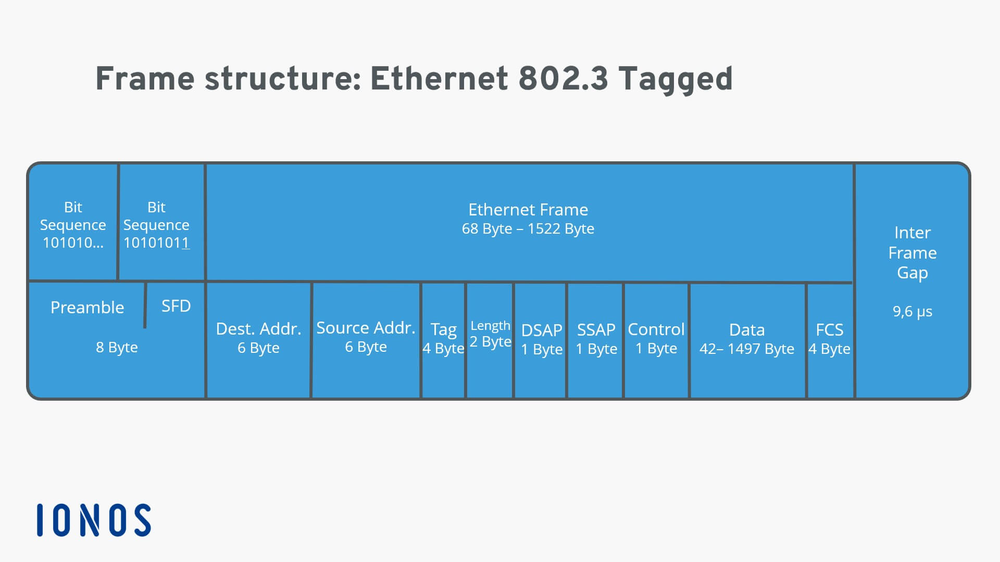
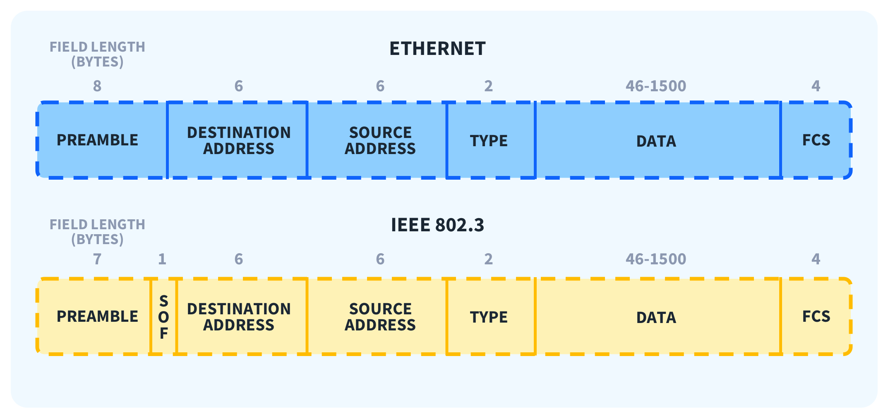
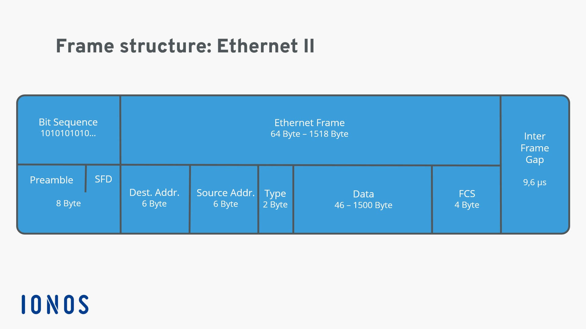
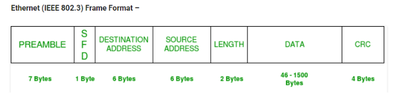

# Ethernet-кадр (Ethernet Frame)
## Вступ

У мережах часто використовують загальний термін:

**📌 Пакет даних (Data Packet)**
> будь-який набір бітів, що передається мережею

❗ Але:
- це загальний термін
- не прив’язаний до конкретного рівня

**📡 На канальному рівні:**
> пакет = Ethernet-кадр (frame)

**🧠 Простими словами:**
> Ethernet-кадр — це “контейнер”, у якому передаються дані

## 🧱 Структура Ethernet-кадру





Ethernet-кадр має чітку структуру і порядок полів:

### 1️⃣ Преамбула (Preamble)
**📌 Характеристики:**
- 8 байтів (64 біти)
- складається з:
  - 7 байтів → чергування 1 і 0
  - 1 байт → SFD (Start Frame Delimiter)

**📡 Призначення:**
- синхронізація пристроїв
- сигнал: “починається кадр”

**🧠 Простими словами:**
> “підготовка перед передачею”

### 2️⃣ MAC-адреса призначення
- 6 байтів
- кому адресовані дані

### 3️⃣ MAC-адреса джерела
- 6 байтів
- хто відправив дані

### 4️⃣ EtherType
**📌 Що це:**
- 2 байти (16 біт)
  
**📡 Призначення:**
- визначає:
  - який протокол всередині (наприклад IP)

### 🔀 VLAN (опційно)
**📌 Що це:**

VLAN (Virtual LAN) — віртуальна локальна мережа

**📡 Навіщо:**
- розділення мережі логічно
- одна фізична мережа → кілька віртуальних


**💡 Приклад:**
- VLAN 1 → офісні ПК
- VLAN 2 → IP-телефонія

### 5️⃣ Payload (корисне навантаження)
**📌 Що це:**
- реальні дані

**📏 Розмір:**
- від 46 до 1500 байт

**📦 Що містить:**
- IP
- TCP/UDP
- дані додатків

**🧠 Простими словами:**
> це “те, що ми реально передаємо”

### 6️⃣ FCS (Frame Check Sequence)
**📌 Характеристики:**
- 4 байти (32 біти)

**📡 Що це:**

результат перевірки:
> CRC (Cyclic Redundancy Check)

## 🔐 CRC — перевірка цілісності
**📌 Що це:**

математичний алгоритм для перевірки:
> чи дані не пошкоджені

**⚙️ Як працює:**

🔁 На відправнику:
- формується кадр
- обчислюється CRC
- додається в кінець

🔁 На приймачі:
- отримує кадр
- знову обчислює CRC
- порівнює

**❗ Якщо не співпадає:**
- кадр відкидається

**⚠️ Важливо:**
- Ethernet:
  - лише перевіряє
  - ❌ не відновлює дані
- повторна передача:
  - справа вищих рівнів (TCP)

**🧠 Простими словами:**
> CRC = “перевірка, чи пакет не зламався по дорозі”

## 📊 Повна структура кадру
```
Preamble | MAC dest | MAC src | EtherType | (VLAN) | Payload | FCS
```

## 🧾 Висновок
- Ethernet-кадр:
  - чітко структурований
  - містить адреси, дані і контроль
- ключові частини:
  - MAC → хто кому
  - Payload → дані
  - CRC → перевірка

## 📌 Головна ідея

> Дані в мережі передаються не “як є”, 
а в чітко структурованих кадрах із перевіркою цілісності