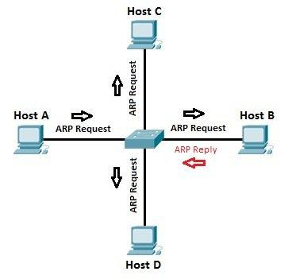
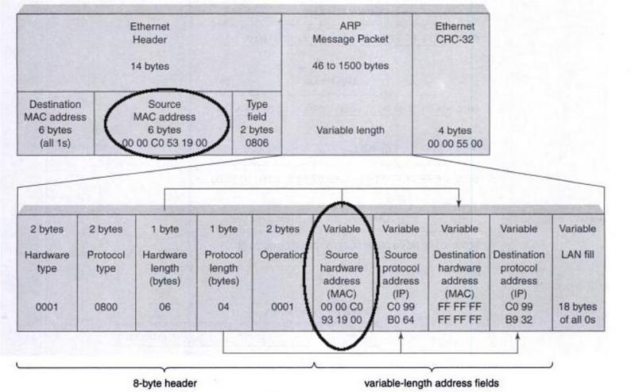
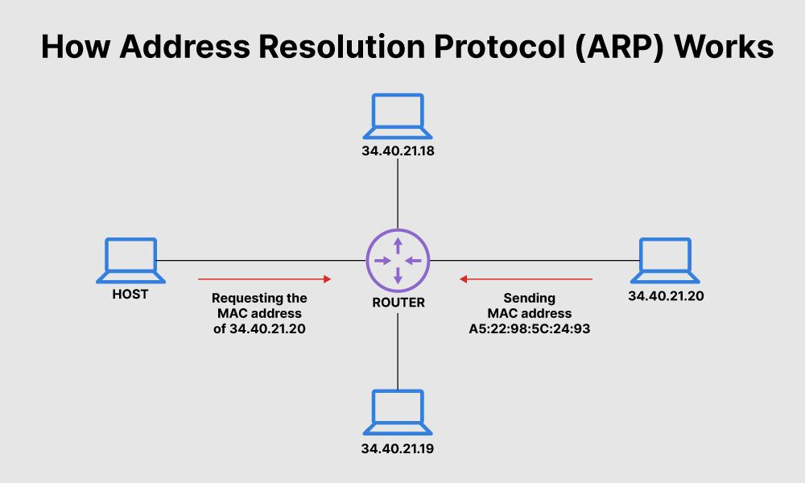
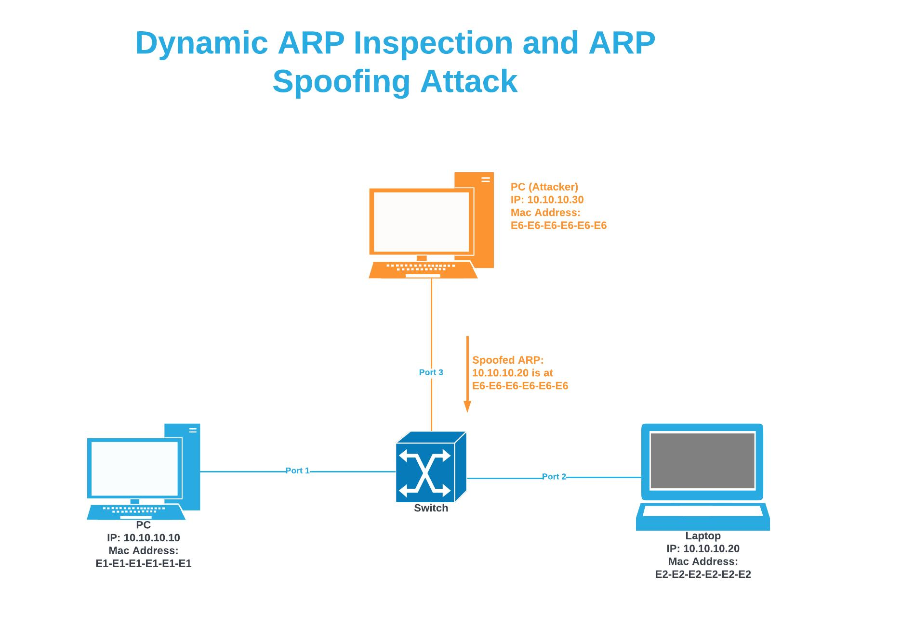
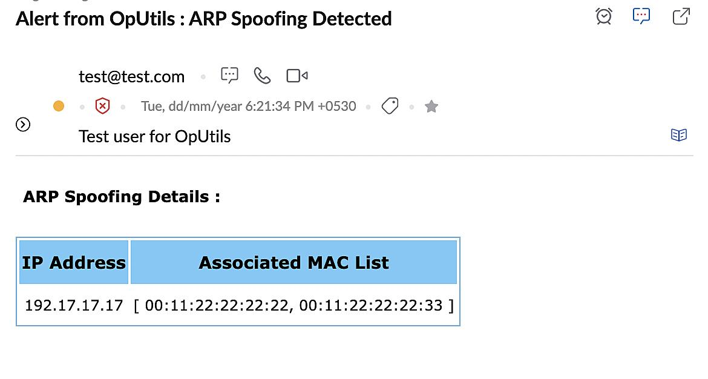

# ARP: зв’язок між IP і MAC
## Вступ

Ми вже знаємо:
- IP-адреси → використовуються на мережевому рівні
- MAC-адреси → використовуються на канальному рівні

👉 Але виникає питання:
> ❓ як IP “перетворюється” на MAC?

## 📡 Протокол ARP
**📌 Визначення:**

`ARP` — це:
> протокол, який визначає MAC-адресу за відомою IP-адресою

<details><summary>ARP</summary>

`Протокол Address Resolution Protocol (ARP)` — це мережевий протокол, що використовується в комп’ютерних мережах TCP/IP для визначення відповідності між IP-адресою вузла та його апаратною (MAC) адресою в локальній мережі Ethernet. ARP є необхідним компонентом комунікацій у локальних мережах і є ключовим елементом мережевого рівня моделі TCP/IP. 







**Основні факти**
- Рівень мережі: Мережевий рівень (Network Layer) TCP/IP.
- Призначення: Відображення IP-адреси у MAC-адресу.
- Тип повідомлень: ARP Request і ARP Reply.
- Стандартизований: Internet Engineering Task Force (RFC 826, 1982).

**Як працює**  
ARP функціонує у межах локальної мережі (LAN). Коли пристрій хоче передати пакет іншому пристрою, але знає лише його IP-адресу, він надсилає широкомовний ARP-запит. Вузол із відповідною IP-адресою відповідає ARP-відповіддю, у якій зазначає свою MAC-адресу. Ця інформація зберігається в ARP-кеші для прискорення майбутніх обмінів.

**Безпека та вразливості**  
Через відсутність автентифікації ARP-запитів і відповідей можливі атаки, такі як ARP-spoofing або ARP-poisoning. Унаслідок цього зловмисник може підмінити MAC-адресу в кеші іншого пристрою, перенаправляючи трафік через себе. Сучасні методи захисту включають моніторинг ARP-трафіку, використання статичних ARP-записів, а також алгоритми виявлення атак із машинним навчанням, як-от ARP-PROBE для IoT-мереж.

**Роль у сучасних мережах**  
ARP залишається базовим протоколом для IPv4-мереж. Його аналогом у IPv6 є Neighbor Discovery Protocol (NDP), який поєднує функції ARP і ICMP для розширеної підтримки безпеки та автоматичного налаштування вузлів.

</details>

**🧠 Простими словами:**
> ARP = “знайди MAC за IP”

## 📦 Чому ARP потрібен
**📌 Проблема:**
- IP-датаграма вже створена
- але для Ethernet потрібна:
  - MAC-адреса призначення

**👉 Рішення:**

використати ARP, щоб:
- знайти MAC
- заповнити Ethernet-кадр

## 📋 ARP-таблиця
**📌 Що це:**

локальний список:
> IP ↔ MAC відповідностей

**📡 Де зберігається:**
- на кожному пристрої

**🧠 Простими словами:**
> це “кеш контактів” у мережі

## 🔄 Як працює ARP
**📦 Сценарій:**

потрібно надіслати дані на:
```
10.20.30.40
```

**1️⃣ Перевірка таблиці**
- є запис? → використовуємо
- немає? → далі

**2️⃣ ARP-запит (Request)**
- надсилається:
  - broadcast

- MAC-адреса:
  ```
  FF:FF:FF:FF:FF:FF
  ```

**📡 Суть запиту:**
> “Хто має IP 10.20.30.40?”

**3️⃣ ARP-відповідь (Reply)**
- пристрій з цим IP:
  - відповідає
  - надсилає свою MAC-адресу

**📡 Суть відповіді:**
> “Це я, моя MAC-адреса — XX:XX:XX:XX:XX:XX”

**4️⃣ Збереження**
- запис додається в ARP-таблицю
- наступного разу → без broadcast

**5️⃣ Передача даних**
- Ethernet-кадр заповнюється
- дані відправляються

## ⏳ Час життя ARP-записів
**📌 Важливо:**
- записи:
  - тимчасові
- автоматично видаляються

**💡 Чому:**
- мережа змінюється
- IP ↔ MAC можуть змінюватись

**🧠 Простими словами**
> ARP — це як запит у кімнаті:  
“Хто тут Петро?” → “Я!”

## 🔗 Як це вписується в модель
**📡 Ланцюг:**
```
IP (мережевий рівень)
   ↓
ARP (зв’язок IP ↔ MAC)
   ↓
Ethernet (канальний рівень)
```

## 🧾 Висновок
- ARP:
  - з’єднує IP і MAC
- працює:
  - тільки в локальній мережі
- використовує:
  - broadcast + reply

## 📌 Головна ідея
> Без ARP IP-адреси не могли б працювати в реальних мережах,  
бо Ethernet потребує MAC-адреси для доставки