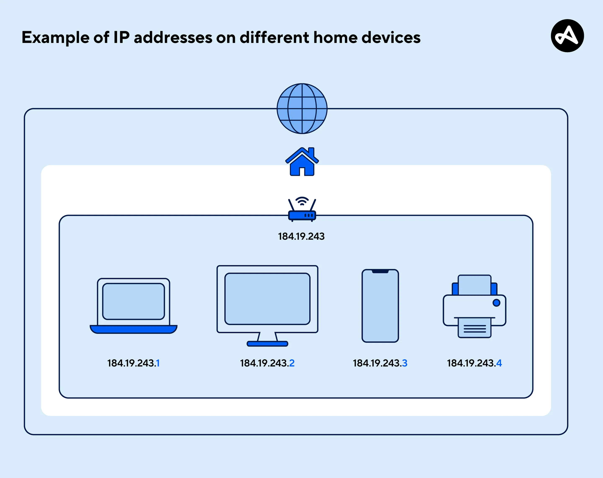
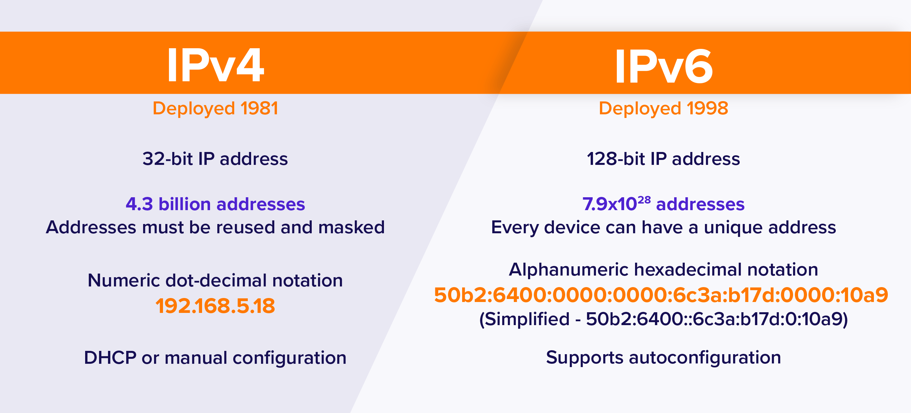
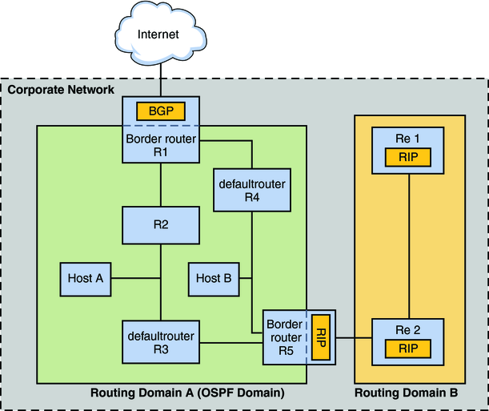
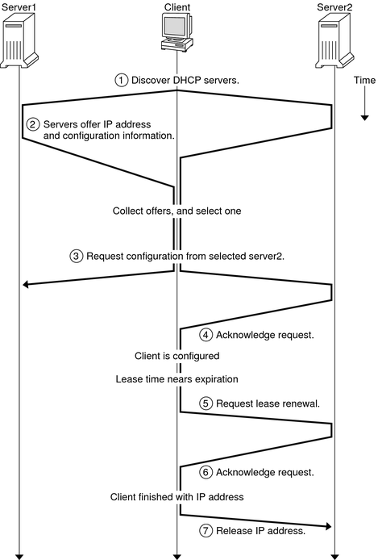
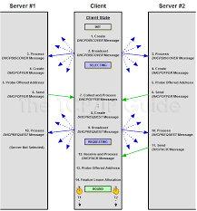
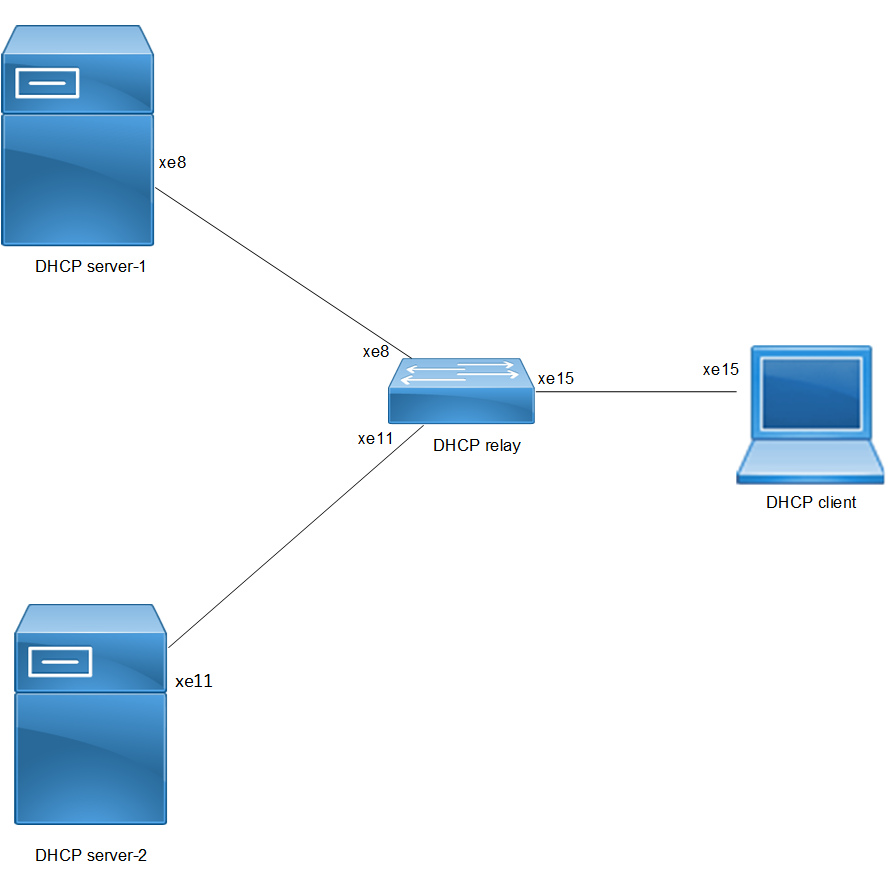
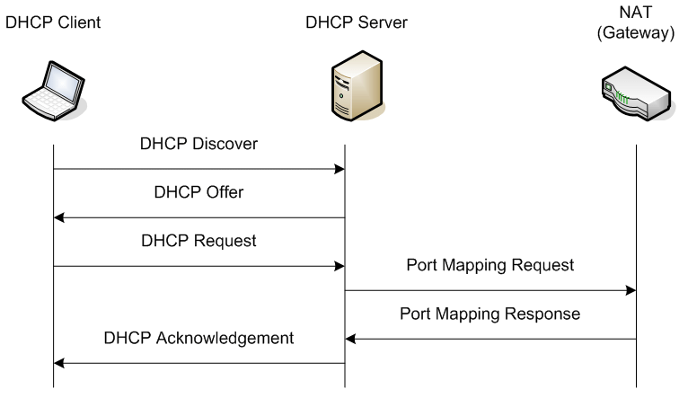
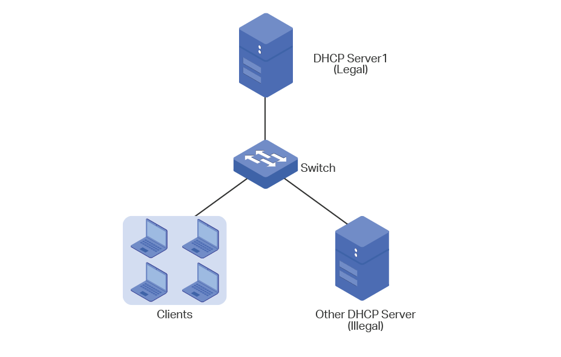

# IP-адреси (IPv4)
## Вступ

На мережевому рівні для ідентифікації пристроїв використовується:
> IP address

<details><summary>IP address</summary>

`An IP address (Internet Protocol address)` — це унікальний числовий ідентифікатор, який призначається кожному пристрою, підключеному до мережі, що використовує протокол Internet Protocol. Він дозволяє комп’ютерам, серверам і маршрутизаторам ідентифікувати один одного та обмінюватися даними через Інтернет чи локальні мережі.




**Ключові факти**
- Тип: цифровий ідентифікатор пристрою в мережі
- Основні версії: IPv4 (32 біти) і IPv6 (128 біт)
- Формат IPv4: чотири числа (0–255), розділені крапками
- Формат IPv6: вісім груп шістнадцяткових чисел, розділених двокрапками
- Функції: маршрутизація трафіку, ідентифікація пристроїв, геолокація

**Принцип роботи**  
IP-адреса функціонує як поштова адреса для мережевих пристроїв. Коли користувач надсилає запит до вебсайту, адреса джерела і призначення вказується в заголовках IP-пакетів, щоб маршрутизатори могли доставити дані потрібному отримувачу. Для зворотного зв’язку сервери використовують IP клієнта.

**Типи адрес**  
Існують публічні IP-адреси, що унікальні в глобальному Інтернеті, і приватні IP-адреси, використовувані в локальних мережах (наприклад, 192.168.0.1). Динамічні адреси призначаються тимчасово через Dynamic Host Configuration Protocol, а статичні — закріплюються постійно за конкретним вузлом.

**Еволюція версій**  
Через обмежену кількість у IPv4 (близько 4,3 млрд адрес) була розроблена версія IPv6 із практично необмеженим простором (≈3,4×10³⁸ адрес). IPv6 також удосконалює маршрутизацію, безпеку та підтримку мобільних пристроїв.

**Використання та значення**  
IP-адреси критично важливі для управління мережею, аналітики трафіку, кібербезпеки, блокування доступу, а також геолокаційних і рекламних сервісів. Сучасні дослідження включають автоматизовану класифікацію сценаріїв використання IP для підвищення ефективності онлайн-сервісів і виявлення шахрайства
</details>

## 🔢 Формат IPv4
**📌 Основні характеристики:**
- довжина: 32 біти
- складається з:
  - 4 октетів (по 8 біт)

**🔢 Діапазон значень:**
- кожен октет:
  - від 0 до 255

**🧾 Запис:**

👉 десятковий запис із крапками (dotted decimal notation)
```
12.34.56.78  ✅ валідна
123.456.789.100 ❌ невалідна
```

**🧠 Простими словами:**
> IP-адреса = 4 числа через крапку

## 🧱 Ієрархічність IP-адрес
**📌 Важлива відмінність від MAC:**
- IP-адреси:
  - організовані ієрархічно
  - розподіляються блоками

**📡 Як це працює:**
- великі діапазони IP:
  - видаються організаціям
- ті далі:
  - розподіляють їх всередині

**💡 Приклад ідеї:**
- якщо адреса починається з певного числа  
  👉 маршрутизатор знає:
- куди приблизно її направити

**🧠 Простими словами:**

> IP = “адреса з логікою”,  
яка допомагає знайти шлях

## 🔄 IP ≠ прив’язка до пристрою
**📌 Важливо:**
> IP-адреси належать мережам, а не пристроям

**🔁 Наслідок:**
- один і той самий пристрій:
  - може мати різні IP

**💡 Приклад:**
| Місце | IP       |
| ----- | -------- |
| вдома | один     |
| кафе  | інший    |
| офіс  | ще інший |

**🧠 Простими словами:**

> MAC — постійна  
IP — змінна

## ⚙️ Як видається IP
**📡 Основний механізм:**  
→ DHCP

<details><summary>DHCP</summary>

`DHCP (Dynamic Host Configuration Protocol)` — це мережевий протокол, який автоматично призначає IP-адреси та інші параметри конфігурації пристроям у комп’ютерних мережах. Його використання спрощує адміністрування мереж, зменшує ризик конфліктів адрес і дозволяє пристроям швидко підключатися без ручного налаштування.






**Ключові факти**  
- Стандарт: RFC 2131 (1997), оновлений у RFC 8415 для IPv6.
- Порт сервера: UDP 67.
- Порт клієнта: UDP 68.
- Архітектура: модель «клієнт–сервер».
- Розширення: DHCPv6 для мереж IPv6.

**Принцип роботи**  
DHCP працює за схемою «DISCOVER–OFFER–REQUEST–ACK» (DORA). Клієнт надсилає широкомовний запит, сервер відповідає пропозицією з IP-адресою, клієнт обирає її та підтверджує запитом, після чого сервер підтверджує остаточне призначення. Цей процес забезпечує автоматичне виділення адрес і параметрів, як-от шлюз за замовчуванням, DNS-сервери й маску підмережі.

**Компоненти та роль**  
Основні елементи — DHCP-сервер, який зберігає пул доступних IP-адрес; DHCP-клієнт, що ініціює запит; і, за потреби, DHCP-релей, який передає запити між підмережами. Сервер також може видавати додаткові параметри (опції DHCP), наприклад, час оренди адреси або параметри домену.

**Значення та застосування**  
DHCP є ключовим елементом сучасних локальних і корпоративних мереж, а також домашніх маршрутизаторів. Він значно скорочує час і складність адміністрування, підтримує мобільність користувачів і масштабованість мережі. Для IPv6 використовується версія DHCPv6, яка підтримує розширені можливості автоконфігурації.

</details>

**🔧 Що робить DHCP:**
- автоматично видає IP
- при підключенні до мережі

## 📌 Типи IP-адрес:
### 🔁 1. Динамічна IP-адреса
- видається автоматично (DHCP)
- змінюється з часом

👉 використовується:
- для клієнтів (ПК, телефони)

### 🔒 2. Статична IP-адреса
- задається вручну
- не змінюється

👉 використовується:
- для серверів
- мережевих пристроїв

**⚠️ Важливо:**

це правило не абсолютне, але:
> найчастіше саме так

## 📦 Чому IP важливі
- дозволяють:
  - маршрутизувати дані
  - знаходити пристрої в Інтернеті

## 🧾 Висновок
- IPv4:
  - 32 біти
  - 4 октети
- IP:
  - логічна адреса
  - ієрархічна
- може бути:
  - динамічна
  - статична

## 📌 Головна ідея

> IP-адреса — це “адреса в мережі”,  
яка дозволяє доставити дані в потрібне місце