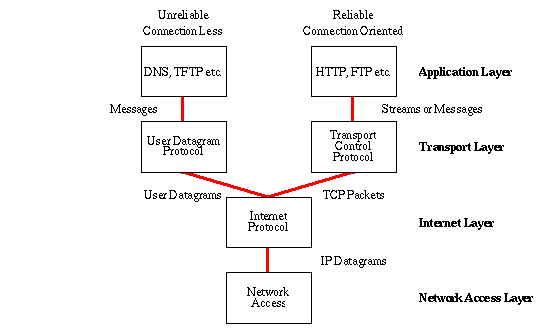
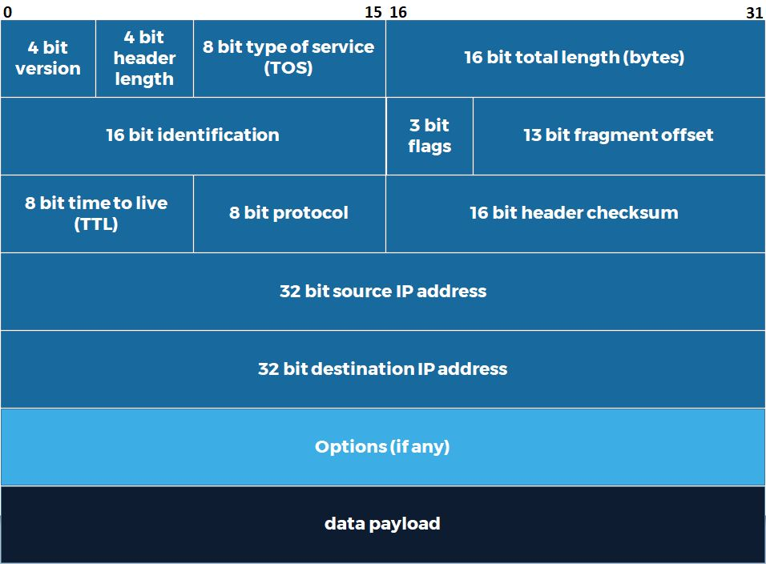
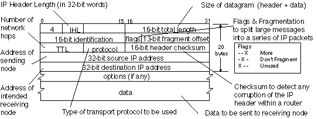
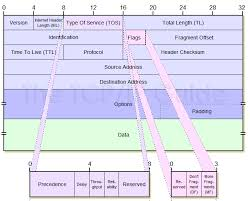

# IP-датаграма (IP Datagram)
## Вступ

Так само як на канальному рівні:
- пакет = Ethernet-кадр

👉 на мережевому рівні:
- пакет = IP-датаграма

**📌 Визначення:**

`IP-датаграма` — це:
> структурований пакет даних, який передається за допомогою
IP



<details><summary>Internet Protocol (IP)</summary>

`Інтернет-протокол (Internet Protocol, IP)` — це основний мережевий протокол, який забезпечує адресацію та маршрутизацію даних між пристроями в мережі. Він визначає формат пакетів, правила їх передавання та логічні IP-адреси, що дозволяє комп’ютерам спілкуватися через інтернет чи локальні мережі.

**Основні факти**
- Тип протоколу: Мережевий (Network Layer, рівень 3 OSI)
- Поточна версія: IPv4 (1983), IPv6 (1998)
- Розмір адреси: 32 біти (IPv4), 128 бітів (IPv6)
- Основні функції: Адресація, маршрутизація, фрагментація пакетів
- Стандартизація: Internet Engineering Task Force (IETF)

**Архітектура і принцип роботи**  
Інтернет-протокол працює на третьому рівні моделі OSI. Він інкапсулює дані у пакети, які містять заголовок із адресами відправника та одержувача. Маршрутизатори використовують ці адреси для визначення найкращого шляху доставки. IP не гарантує доставку чи послідовність пакетів — ці завдання виконує транспортний рівень (наприклад, Transmission Control Protocol).

**Версії: IPv4 і IPv6**


IPv4 — найпоширеніша версія з адресами формату 32 біти (приблизно 4,3 мільярда унікальних адрес). Через їх вичерпання була розроблена версія IPv6, яка використовує 128-бітові адреси, що забезпечує майже необмежений простір і покращену маршрутизацію та безпеку.

**Значення для інтернету**  
IP є фундаментом усього інтернету — без нього неможливий обмін даними між мережами. Він дозволяє інтегрувати різноманітні технології (Wi-Fi, Ethernet, мобільний зв’язок) у єдиний глобальний простір. IPv6 поступово замінює IPv4, забезпечуючи майбутню масштабованість і стабільність глобальної мережевої інфраструктури.

</details>

## 🧱 Структура:

IP-датаграма складається з:
- заголовка (header)
- корисного навантаження (payload)

**🧠 Важливо**

👉 Заголовок IP:
- значно складніший за Ethernet
- містить багато службової інформації

## 🧾 Основні поля IP-заголовка





### 1️⃣ Version (версія)
- 4 біти
- визначає версію IP

👉 найчастіше:
- IPv4
- IPv6 (новіший)

### 2️⃣ Header Length (довжина заголовка)
- 4 біти
- зазвичай:
  - 20 байт (мінімум)

### 3️⃣ Type of Service (ToS / QoS)
- 8 біт
- визначає:
  - пріоритет пакета

**📡 QoS (Quality of Service)**
- дозволяє маршрутизаторам:
- визначати важливість трафіку

### 4️⃣ Total Length (загальна довжина)
- 16 біт
- максимальний розмір:
  - 65 535 байт

**🔄 Фрагментація**  
**📌 Проблема:**

якщо пакет занадто великий →
його потрібно розділити

**📡 Рішення:**
> фрагментація

### 5️⃣ Identification
- 16 біт
- “номер пакета” для збору частин

### 6️⃣ Flags
- вказує:
  - чи дозволена фрагментація

### 7️⃣ Fragment Offset
- допомагає:
  - зібрати пакет назад

**🧠 Простими словами:**
> великий пакет → ріжеться на частини → збирається назад

### ⏳ TTL (Time To Live)
**📌 Характеристики:**
- 8 біт
**📡 Як працює:**
- кожен маршрутизатор:
  - зменшує TTL на 1
- якщо TTL = 0:
  - пакет видаляється

**💡 Навіщо:**
- запобігає:
  - нескінченним циклам у мережі

**🧠 Простими словами:**
> TTL = “ліміт життя пакета”

### 🔗 Protocol (протокол)
**📌 Що це:**
- 8 біт

**📡 Вказує:**

який протокол всередині:
- TCP
- UDP

### 🔐 Header Checksum
**📌 Що це:**
- перевірка:
  - цілісності заголовка

**⚠️ Особливість:**
- змінюється на кожному маршрутизаторі
- бо змінюється TTL

### 🆔 IP-адреси
**📌 Поля:**
- Source IP (джерело)
- Destination IP (призначення)

**📏 Розмір:**
- по 32 біти кожне

### ⚙️ Options + Padding
**📌 Options:**
- додаткові налаштування (рідко)

**📌 Padding:**
- заповнення нулями
- для вирівнювання

### 📦 Payload
**📌 Що це:**

дані всередині IP:

👉 зазвичай:
- TCP або UDP пакет

## 🔗 Інкапсуляція
📡 Як це працює:
```
Ethernet Frame
  └── IP Datagram
        └── TCP/UDP Segment
              └── Дані
```

**🧠 Простими словами:**
> кожен рівень “обгортає” дані в свій формат

## 🧾 Висновок
- IP-датаграма:
  - містить заголовок + дані
- заголовок:
  - керує доставкою
- важливі поля:
  - IP адреси
  - TTL
  - фрагментація

## 📌 Головна ідея

> Мережевий рівень не просто передає дані —  
він керує їх маршрутом, розміром і життям