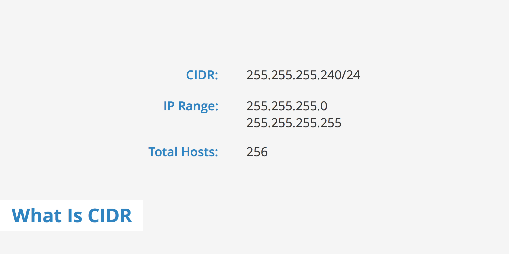
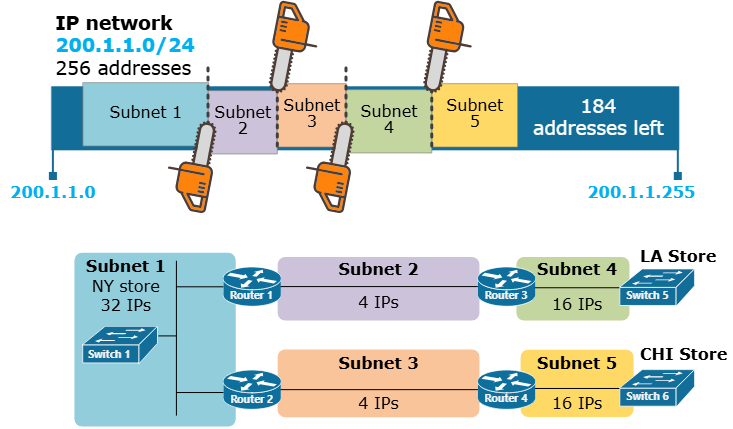
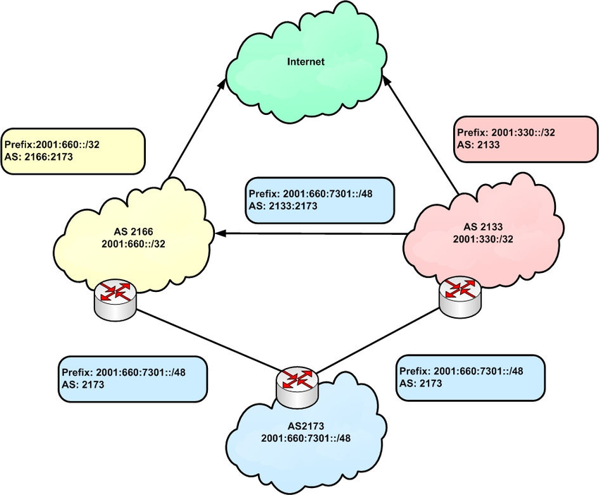
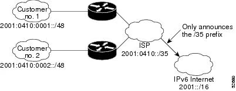

# Класи адрес IPv4

## Поділ IP-адреси: мережа і хост
🔹 Основна ідея

Кожна IPv4-адреса складається з двох частин:
- ідентифікатор мережі (Network ID)
- ідентифікатор хоста (Host ID)

**📌 Приклад:**
```
9.100.100.100
```
- 9 → мережа
- 100.100.100 → хост

**🧠 Простими словами:**
> IP = “адреса будинку”

- мережа → вулиця
- хост → номер будинку
  
## 🧱 Класова адресація (Classful Addressing)
**📌 Що це:**

Стара система, яка визначає:
> як поділяється IP-адреса на мережу і хост

## 📊 Основні класи
### 🔵 Class A
- перший октет → мережа
- решта → хост
```
[Network].[Host].[Host].[Host]
```

**📏 Діапазон:**
- 0 – 127

**📦 Кількість хостів:**
- 2²⁴ ≈ 16 млн

### 🟢 Class B
- перші 2 октети → мережа
- решта → хост
```
[Network].[Network].[Host].[Host]
```

**📏 Діапазон:**
- 128 – 191

**📦 Кількість хостів:**
- 2¹⁶ ≈ 65 тис

### 🟡 Class C
- перші 3 октети → мережа
- останній → хост
```
[Network].[Network].[Network].[Host]
```

**📏 Діапазон:**
- 192 – 223

**📦 Кількість хостів:**
- 2⁸ = 256

## 🔢 Як визначити клас
📌 За першими бітами:
| Клас | Біти | Діапазон |
| ---- | ---- | -------- |
| A    | 0    | 0–127    |
| B    | 10   | 128–191  |
| C    | 110  | 192–223  |

**🧠 Простими словами:**
> дивишся на перше число → знаєш клас

## 📡 Інші класи

### 🟣 Class D
- діапазон: 224–239
- використовується для:
  - multicast

### ⚫ Class E
- діапазон: 240–255
- використовується:
  - для тестування

## ⚠️ Обмеження класової системи
**📌 Проблема:**
- жорсткий поділ
- неефективне використання IP

**💡 Приклад:**
- компанії може потрібно:
  - 1000 адрес
- але:
  - Class C → мало
  - Class B → занадто багато

## 🚀 Сучасне рішення
**📡 Заміна:**

→ CIDR

<details><summary>CIDR</summary>

`Classless Inter-Domain Routing (CIDR)` — це метод адресації та маршрутизації в IP-мережах, який замінив попередню систему класових мереж (A, B, C). Його запровадили у 1993 році для підвищення ефективності використання IP-адрес та скорочення розміру глобальних таблиць маршрутизації.





**Основні факти**
- Впроваджено: 1993 рік (IETF RFC 1518/1519)
- Мета: оптимізувати розподіл IP-адрес
- Формат запису: IP-адреса/довжина_префікса (наприклад, 192.168.0.0/24)
- Застосування: IPv4 та IPv6
- Перевага: зменшення розміру таблиць маршрутизації

**Принцип роботи**  
CIDR використовує бітову маску змінної довжини для визначення мережевої частини адреси. Формат IP/префікс означає, скільки старших бітів адреси належить до мережі. Наприклад, /24 визначає мережу з 256 адресами (192.168.0.0 – 192.168.0.255). Такий підхід дозволяє гнучко розподіляти блоки адрес різного розміру.

**Агрегація маршрутів**  
Одним з головних досягнень CIDR стало впровадження «супермереж» — об’єднання кількох суміжних мереж в одну більшу за допомогою спільного префікса. Це суттєво скорочує кількість записів у таблицях маршрутизації магістральних маршрутизаторів і покращує масштабованість Інтернету.

**Значення для Інтернету**  
CIDR є основою сучасної системи адресації та маршрутизації. Завдяки йому стало можливим економніше використовувати обмежений простір IPv4-адрес і підготувати перехід до IPv6. Він залишається стандартом у конфігураціях мережевого обладнання, протоколах BGP та внутрішніх системах маршрутизації.

</details>

**📌 Що дає CIDR:**
- гнучкий поділ мереж
- ефективніше використання IP

## 🧾 Висновок
- IP-адреса має:
  - мережеву частину
  - хостову частину
- класова система:
  - A → великі мережі
  - B → середні
  - C → малі
- сьогодні:
  - використовується CIDR
  - але класи важливо знати

## 📌 Головна ідея

> IP-адреса — це не просто число,  
а структура, яка визначає де мережа і де пристрій