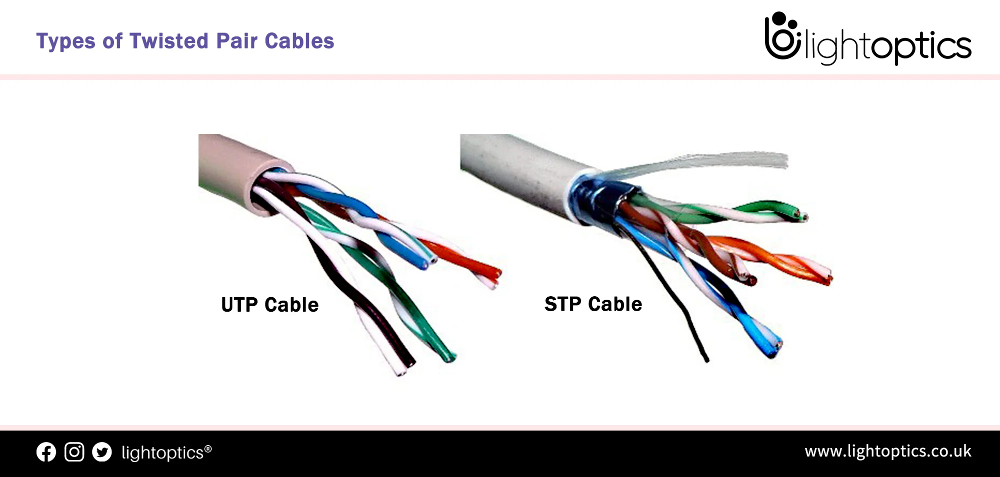
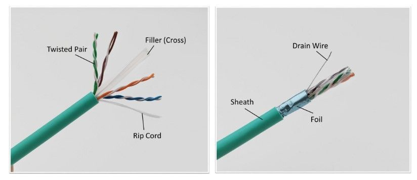
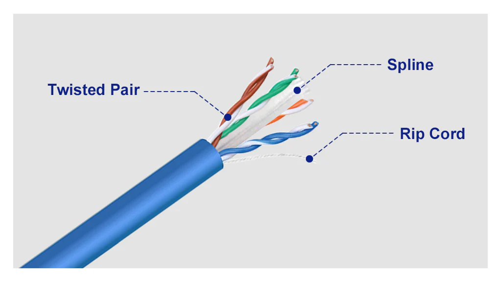
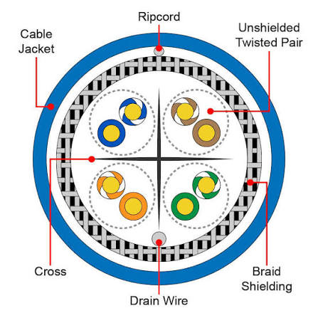

# Кручена пара та режими передачі даних
## Вступ

Найпоширеніший тип кабелю в комп’ютерних мережах:
> кабель типу “кручена пара” (twisted pair)

Саме він використовується:
- вдома
- в офісах
- у більшості локальних мереж (LAN)

## 🧵 Кручена пара (Twisted Pair)

**📌 Що це:**

Кабель, який містить:
- пари мідних проводів
- кожна пара скручена разом

**🔧 Будова:**
- зазвичай:
  - 8 проводів
  - = 4 пари
- всі пари знаходяться в одній оболонці (ізоляції)

**💡 Навіщо скручування:**

Скручування допомагає:
- зменшити електромагнітні перешкоди
- зменшити перехресні завади (crosstalk)

**🧠 Простими словами:**
> скручування = захист сигналу від шуму

## 🔗 Використання пар
**📌 Важливо:**

Не всі пари завжди використовуються однаково —
це залежить від технології (Ethernet стандарту)

**⚙️ Але загальний принцип:**
- частина пар → передача в один бік
- інші пари → передача в інший бік

## 🔄 Типи зв’язку
### 🔁 1. Дуплексний зв’язок (Duplex)
**📌 Визначення:**

Передача даних в обох напрямках

**✅ Повний дуплекс (Full Duplex)**
**📡 Що це:**
- обидва пристрої можуть:
- одночасно відправляти і отримувати дані

**🚀 Переваги:**
- швидко
- без колізій
- стандарт у сучасних мережах

**🧠 Простими словами:**
> як телефонна розмова — говорять обидва одночасно

### 🔁 2. Напівдуплекс (Half Duplex)
**📌 Що це:**
- передача можлива в обох напрямках
- ❗ але не одночасно

**⚠️ Причина:**
- проблеми з підключенням
- старе обладнання
- обмеження мережі

**🧠 Простими словами:**
> як рація — говорить тільки один, інший слухає

### ➡️ 3. Симплекс (Simplex)
**📌 Що це:**
- передача тільки в одному напрямку

**🧠 Приклад:**
- телевізійний сигнал
- радіо

## ⚠️ Важливий практичний момент

Якщо мережа працює:
- повільно
- нестабільно

👉 можливо:
- замість full duplex використовується half duplex

## 🧾 Висновок
- кручена пара:
  - основний тип кабелю
  - використовує скручені пари для захисту сигналу
- передача даних:
  - відбувається через різні пари
- режими роботи:
  - simplex → один напрямок
  - half duplex → по черзі
  - full duplex → одночасно

## 📌 Головна ідея

> Не тільки кабель важливий —  
а й як саме по ньому передаються дані