# Мережеві порти та патч-панелі
## Вступ

Фізичний рівень завершується в кінцевих точках мережі:
- там, де кабель підключається до пристрою
- або до інфраструктури (стіни, серверні)

👉 Саме тут відбувається фактичне підключення пристроїв до мережі

## 🔗 Роз’єм RJ45
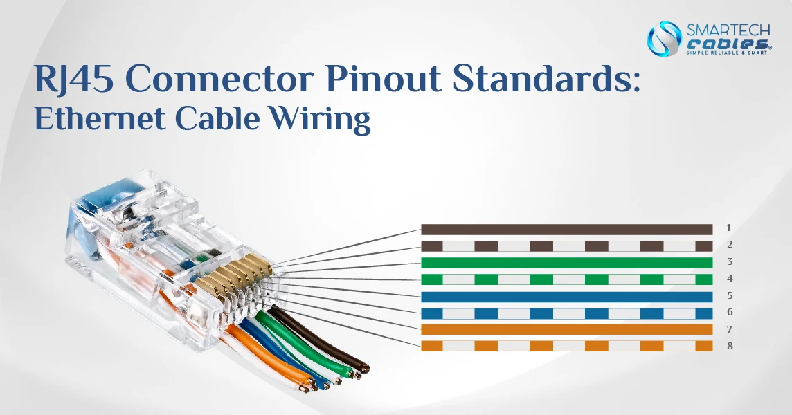
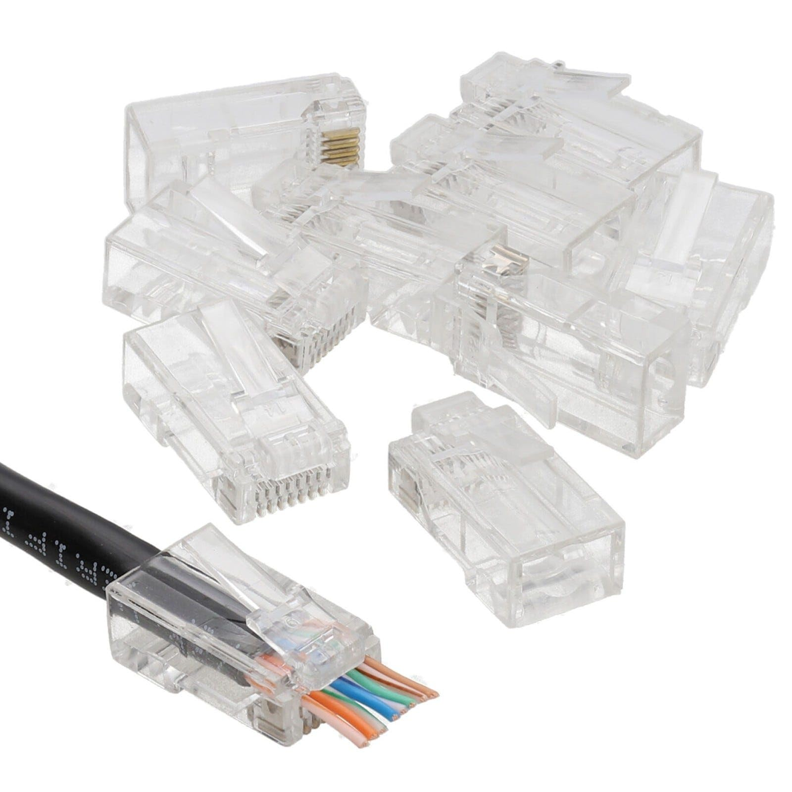
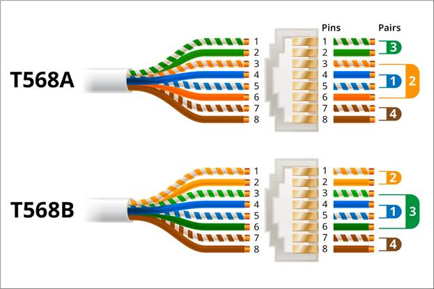
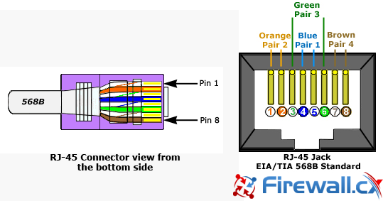

**📌 Що це:**

Найпоширеніший мережевий роз’єм:
> RJ45 (Registered Jack 45)

**🔧 Як працює:**
- оголює внутрішні дроти кабелю
- забезпечує контакт із портом
- використовується в Ethernet-мережах


**🧠 Простими словами:**

>  RJ45 — це “штекер”, який вставляється в мережевий порт

## 🖥️ Мережеві порти (Network Ports)
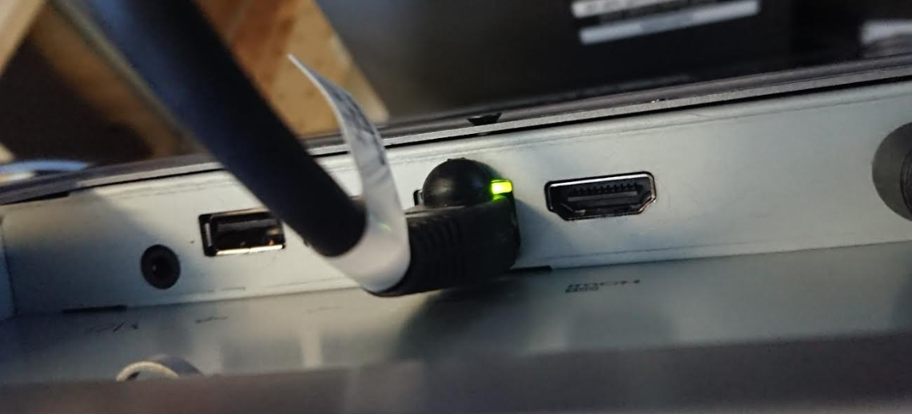

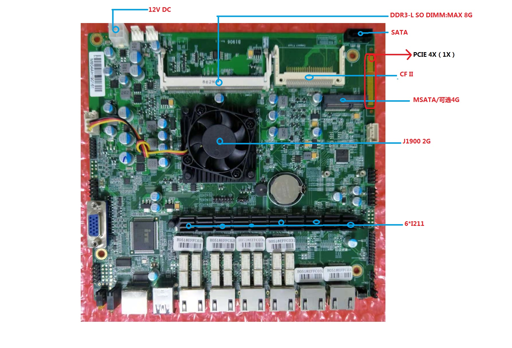
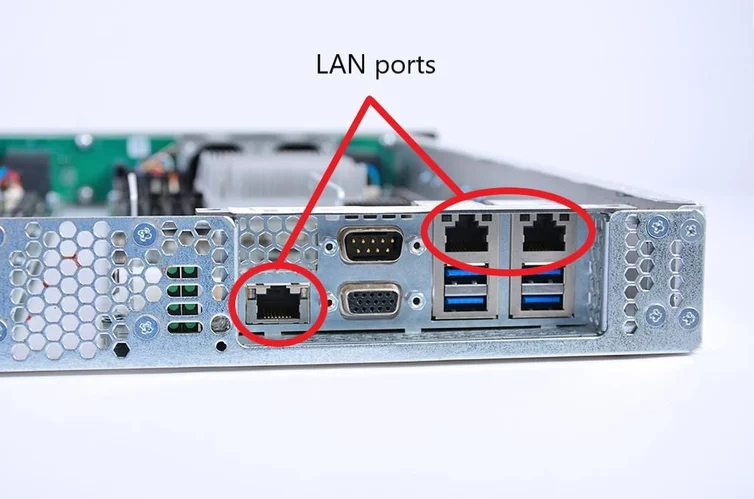

**📌 Що це:**

Роз’єми на пристроях, куди підключається кабель

**📍 Де зустрічаються:**
- комутатори (багато портів)
- маршрутизатори
- сервери
- ПК

❗ ноутбуки / телефони:

- часто не мають RJ45 (Wi-Fi)

**💡 Індикатори (LED)**

Більшість портів мають 2 світлодіоди:

**🟢 Link (зв’язок)**
- світиться → кабель підключений
- обидва пристрої працюють
  
**🟡 Activity (активність)**
- блимає → передаються дані

**⚠️ Важливо:**
- раніше миготіння ≈ біти
- зараз → просто показує наявність трафіку

**🔍 Додатково:**

На деяких пристроях LED можуть:
- показувати швидкість (100 Мбіт / 1 Гбіт)
- комбінувати функції

👉 залежить від обладнання

## 🧱 Патч-панелі (Patch Panels)
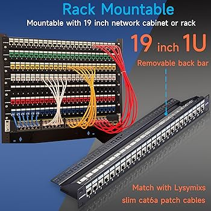
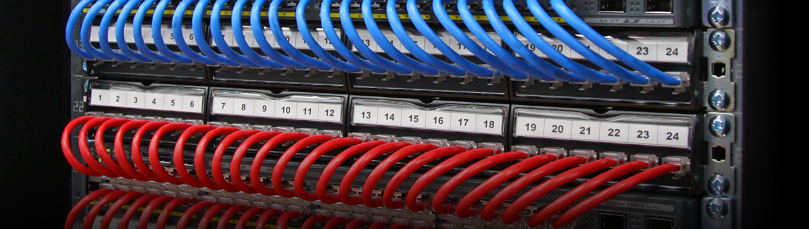
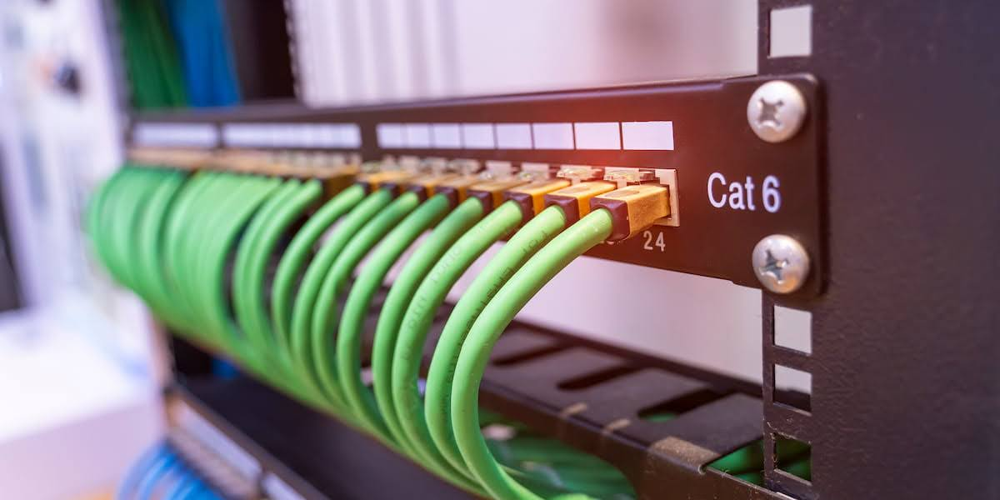
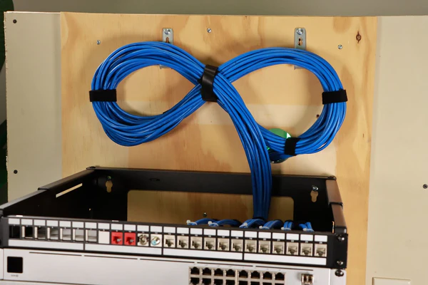

**📌 Що це:**

Пристрій, який:
> містить багато мережевих портів, але не обробляє дані

**🔧 Функція:**
- організація кабелів
-  точка завершення кабелів зі стін

**🧠 Простими словами:**
> патч-панель = “розетка для мережі”

## 🏢 Як це виглядає в реальності
**📦 Типова схема:**
1. кабелі прокладені в стінах
2. виходять у:
     - розетки в офісі
3. сходяться в:
     - патч-панель
4. звідти короткими кабелями:
     - підключаються до комутатора

**🔗 Ланцюг підключення:**
```
ПК → розетка → кабель у стіні → патч-панель → комутатор → мережа
```

## ⚠️ Важливість для troubleshooting

LED-індикатори допомагають:
- перевірити, чи є з’єднання
- зрозуміти, чи передаються дані
- швидко знайти проблему

## 🧾 Висновок
- RJ45 → стандартний мережевий роз’єм
- порти → точки підключення пристроїв
- LED → базова діагностика
- патч-панелі → організація кабелів

## 📌 Головна ідея

> Фізичний рівень — це не тільки кабелі,  
а й точки підключення та інфраструктура навколо них