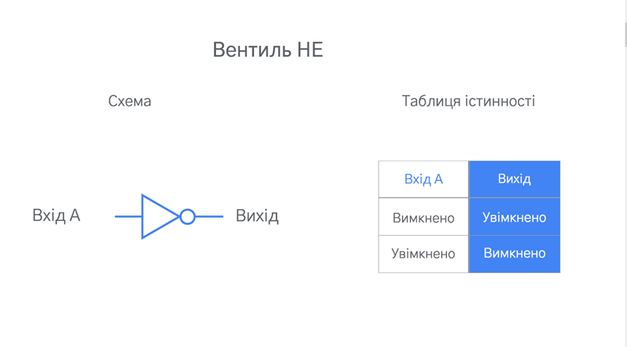
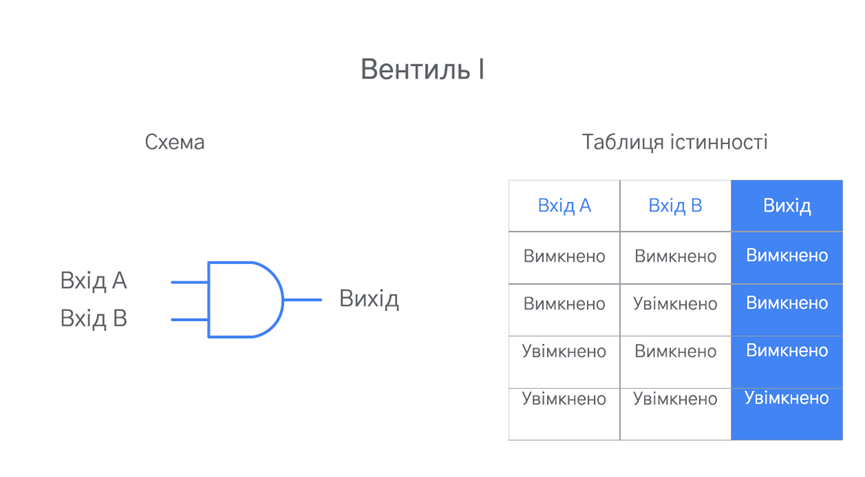
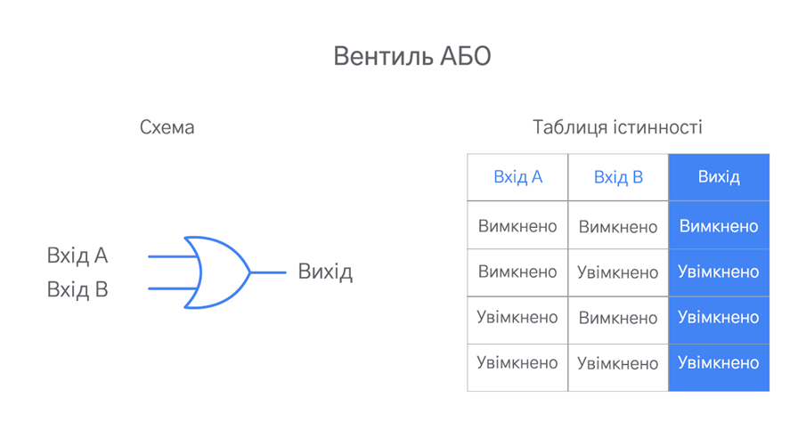
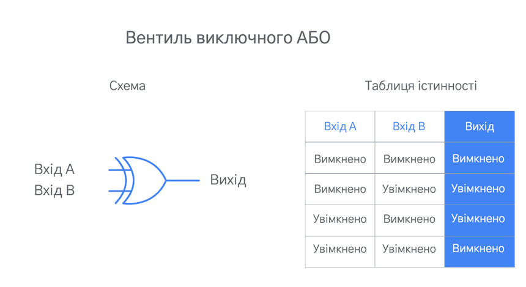
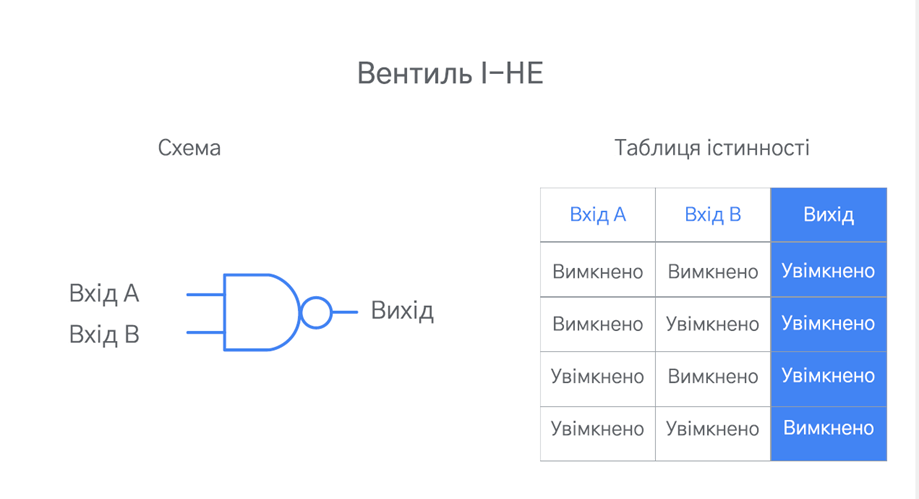
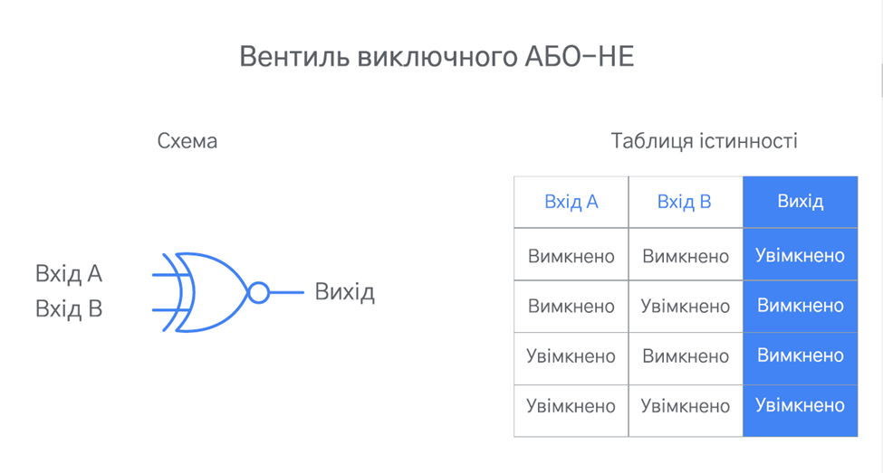
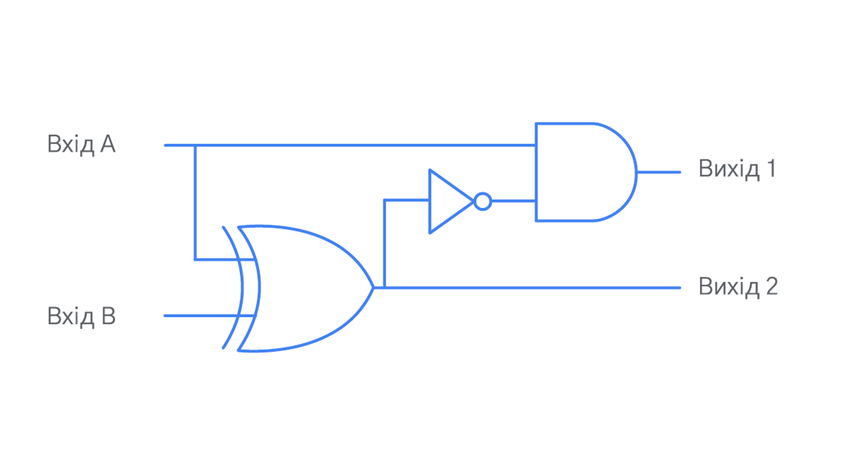
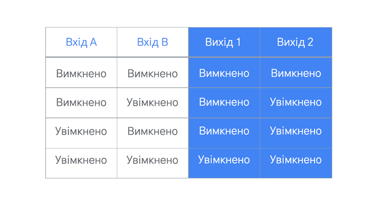

# Логічні вентилі

## Логічні вентилі
Щоб зрозуміти, як працює комп’ютер, важливо знати, що таке логічні вентилі і як вони функціонують. Комп’ютери виконують обчислення у двійковому форматі. Логічні вентилі – це електричні компоненти, які вказують комп’ютеру, як робити двійкові обчислення. Вони визначають правила, за якими на основі одного або кількох вхідних електричних сигналів видається вихідний електричний сигнал. Комп’ютери використовують ці електричні сигнали для позначення двох двійкових станів: "увімкнено" або "вимкнено". Логічний вентиль приймає один або кілька цих двійкових станів і визначає, який сигнал потрібно передавати: "увімкнено" чи "вимкнено".

Було розроблено кілька логічних вентилів, які представляють різні правила для виведення двійкового вихідного сигналу. У цьому матеріалі розглядаються шість найпоширеніших логічних вентилів.

## Шість поширених логічних вентилів

### Вентиль НЕ (NOT)
Вентиль НЕ найпростіший, оскільки має лише один вхідний сигнал. Вентиль НЕ приймає вхідний сигнал і видає сигнал із протилежним двійковим станом. Якщо вхідний сигнал має стан "увімкнено", вентиль НЕ видає сигнал зі станом "вимкнено". Якщо вхідний сигнал має стан "вимкнено", вентиль НЕ видає сигнал зі станом "увімкнено". Усі логічні вентилі можна визначити за допомогою схеми й таблиці істинності. Це логічне правило зазвичай представлено так:

Ліворуч зображено схему вентиля НЕ. На кресленнях фізичний вентиль НЕ зазвичай представлено трикутником із маленьким колом із боку вихідного сигналу. Праворуч від схеми розташовано таблицю істинності, де вказано вихідні значення для кожного з двох можливих вхідних значень.

### Вентиль І (AND)
Вентиль І обробляє два вхідні сигнали. Це означає, що можливі чотири комбінації вхідних значень. Правило І виводить сигнал "увімкнено", лише якщо обидва вхідні сигнали мають стан "увімкнено". В іншому разі вихідний сигнал буде "вимкнено".

### Вентиль АБО (OR)
Вентиль АБО обробляє два вхідні сигнали. Правило АБО виводить сигнал "вимкнено", лише якщо обидва вхідні сигнали мають стан "вимкнено". В іншому разі вихідний сигнал буде "ввімкнено".

### Вентиль виключного АБО (XOR)
Вентиль виключного АБО також обробляє два вхідні сигнали. Правило виключного АБО виводить сигнал "увімкнено", коли лише один (але не обидва) з вхідних сигналів має стан "увімкнено". В іншому разі вихідний сигнал буде "вимкнено".

Таблиці істинності для вентилів виключного АБО й АБО дуже схожі. Єдина відмінність полягає в тому, що вентиль виключного АБО виводить "вимкнено", коли обидва вхідні сигнали мають стан "увімкнено", а АБО в такому випадку виводить сигнал "увімкнено".

### Вентиль І-НЕ (NAND)
Вентиль І-НЕ обробляє два вхідні сигнали. Правило І-НЕ виводить сигнал "вимкнено", лише якщо обидва вхідні сигнали мають стан "увімкнено". В іншому разі вихідний сигнал буде "ввімкнено".

Якщо порівняти таблиці істинності для вентилів І-НЕ й І, можна побачити, що результати І-НЕ протилежні результатам І. Це пов’язано з тим, що правило І-НЕ – це комбінація правил І й НЕ. Воно бере результати вентиля І й застосовує до них правило НЕ. З цієї причини правило І-НЕ іноді називають не-І (not-AND).

### Вентиль виключного АБО-НЕ (XNOR)
Насамкінець розгляньмо вентиль виключного АБО-НЕ. Він також обробляє два вхідні сигнали. Правило виключного АБО-НЕ виводить сигнал "увімкнено", лише якщо обидва вхідні сигнали мають однакове значення (обидва мають стан "увімкнено" або "вимкнено"). В іншому разі вихідний сигнал буде "вимкнено".

Правило виключного АБО-НЕ – це інша комбінація двох попередніх правил: воно виводить результати виключного АБО й застосовує до них правило НЕ. З цієї причини правило виключного АБО-НЕ іноді називають не виключним АБО (not-XOR).

## Поєднання вентилів (побудова електричних схем)
Логічні вентилі – це фізичні електронні компоненти, які можна придбати й підключити до друкованої плати. Їх можна з’єднувати між собою й створювати комплексні електричні системи (схеми), які виконують складні двійкові обчислення. При цьому вихід одного вентиля має слугувати входом для іншого або в кількох вентилів має бути один і той самий вхід. Комп’ютери і є такими комплексними електричними системами.

Нижче наведено приклад креслення для невеликої схеми, яку створено з використанням описаних вище вентилів.

Ось таблиця істинності для цієї схеми:

У цій схемі використовуються три логічні вентилі: виключне АБО, НЕ й І. Вона приймає два вхідні сигнали (А й Б) і виводить два вихідні (1 і 2). А й Б є вхідними сигналами для виключного АБО. Вихідний сигнал цього вентиля стає вхідним для вентиля НЕ. Після цього вихідний сигнал вентиля НЕ стає вхідним для вентиля І (разом із вхідним сигналом А). Вихідний сигнал 1 – це вихідний сигнал із вентиля І Вихідний сигнал 2 – це вихідний сигнал із вентиля виключного АБО.

## Основні висновки
- Логічні вентилі – це фізичні компоненти, за допомогою яких комп’ютери можуть здійснювати двійкові обчислення.

- Логічні вентилі представляють різні правила для отримання одного чи кількох двійкових вхідних сигналів і виведення певного двійкового значення ("увімкнено" або "вимкнено").

- Логічні вентилі можна з’єднати, щоб вихідний сигнал одного вентиля слугував вхідним для іншого.

- Схеми – це комплексні електричні системи, побудовані за допомогою з’єднання логічних вентилів. Комп’ютери і є такими комплексними електричними системами.