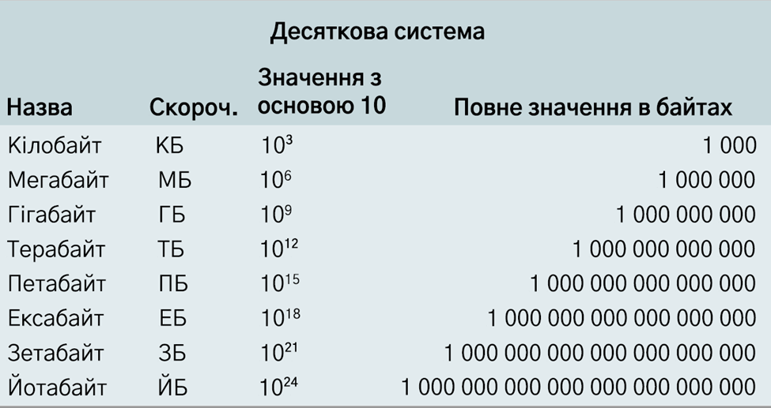
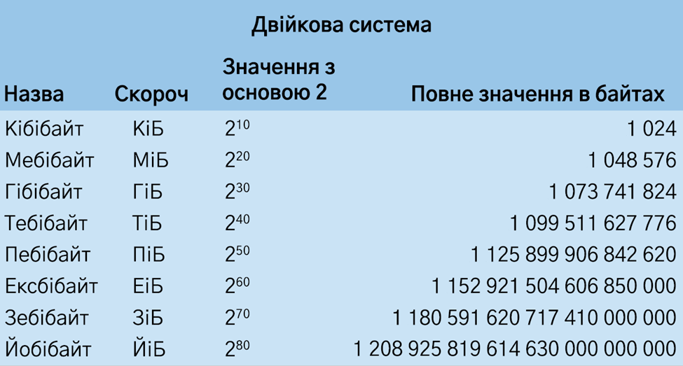

# Як вимірюються обсяги зберігання даних

З цього матеріалу ви дізнаєтеся, як називаються одиниці вимірювання обсягів пам’яті для зберігання даних і розмірів файлів. З розвитком технологій комп’ютерного апаратного забезпечення збільшуються й обсяги пам’яті диска. Більші обсяги пам’яті дозволяють динамічно збільшувати розмір файлів. Такий прогрес дає змогу компаніям, таким як Netflix і Hulu, зберігати тисячі повнометражних фільмів у відеоформаті високої якості.

Існують стандартизовані набори термінів, які використовуються для йменування постійно зростаючих розмірів пам’яті й файлів. Наприклад, найбільш поширені терміни, які описують розміри файлів і обсяги пам’яті на жорсткому диску, включають байти, кілобайти, мегабайти, гігабайти й терабайти. Однак якщо ви комп’ютерний інженер, ви можете використовувати інший набір термінів.

## Одиниці вимірювання обсягів зберігання даних

- Десяткові одиниці: кілобайт, мегабайт, гігабайт, терабайт, петабайт, ексабайт, зетабайт, йотабайт.

У системі десяткових назв для обсягів зберігання даних використовуються метричні префікси міжнародної системи одиниць вимірювання: кіло, мега, гіга, тера, пета, екса, зета і йота. Такі префікси також можуть називатися десятковими. Метрична/десяткова система одиниць відображає приблизну кількість байтів фактичної пам’яті на основі десяткового числення. Префікси метричної системи було вибрано для спрощення маркетингу комп’ютерних продуктів.

- Двійкові одиниці: кібібайт, мебібайт, гібібайт, тебібайт, пебібайт, ексбібайт, зебібайт, йобібайт.

Система двійкових назв – це стандарт, визначений Міжнародною організацією зі стандартизації (ISO) спільно з Міжнародною електротехнічною комісією (IEC). Стандарти одиниць вимірювання ISO 80000 і IEC 80000 описують міжнародну систему величин (ISQ). Префікси кібі-, мебі-, гібі-, тебі-, пебі-, ексбі-, зебі- і йобі- розроблені комісією IEC. Це поєднання двох перших літер метричного префікса з першими двома літерами слова "бінарний" (двійковий). Наприклад: мегабайт + бінарний + байт = мебібайт.

Двійкова система вимірювання комп’ютерних даних точніша за десяткову. Десяткові одиниці вимірювання зазвичай використовуються в маркетингу для продажу комп’ютерів і комп’ютерних деталей ширшому загалу, а двійкові одиниці часто використовуються в комп’ютерній інженерії для числової точності.

## Кількість даних в одиницях вимірювання пам’яті
Оскільки обсяги зберігання даних із часом зростають, постійно виникає потреба в новій термінології для описання все більшої кількості байтів. Нижче наведено поточні терміни на основі байта, їх математичні вираження й відповідні обсяги пам’яті.

- **Один біт.** Його також називають двійковим числом. Біти зберігають електричний сигнал як 1. Відсутність електричного сигналу зберігається як 0, що також є значенням біта за умовчанням. В одному біті може зберігатися лише одне значення (1 або 0). Ці два можливі значення є основою системи двійкових чисел, яку використовують комп’ютери. Усі числа у двійковій системі збільшуються експоненційно як степені числа 2.

- **Один байт** зберігає вісім бітів зі значенням один або нуль, які перетворюються на символ або базову інструкцію для комп’ютера. Наприклад, 01101101 – це байт, який перетворюється на літеру m. Байт 01111111 повідомляє комп’ютеру, що потрібно видалити символ праворуч від курсора.

- **Один кілобайт (1 КБ)**

  - Кілобайт (КБ) у десятковому форматі: 103 = 1000 байтів.

  - Кібібайт (КіБ) у двійковому форматі: 210 = 1024 байти.

  - Неточність десяткового формату: менше на 2,4% або 24 байти.

  - Походження назви: "кіло-" – це французька похідна від давньогрецького слова, що означає "тисяча". Один кілобайт – це одна тисяча байтів.

  - 1 КБ може вмістити короткий текстовий файл або невеликий значок у файлі формату GIF розміром 16x16 пікселів.

- **Один мегабайт (1 МБ)**

  - Мегабайт (МБ) у десятковому форматі: 106 = 1 000 000 байтів.

  - Мебібайт (МіБ) у двійковому форматі: 220 = 1 048 576 байтів.

  - Неточність десяткового формату: менше на 4,9% або 48 576 байтів.

  - Походження назви: "мега-" походить від давньогрецького слова, що означає "великий". Один мегабайт – це велика кількість байтів.

  - 1 МБ може вмістити близько 1 хвилини музики у форматі MP3 без утрат або короткий роман.

- **Один гігабайт (1 ГБ)**

  - Гігабайт (ГБ) у десятковому форматі: 109 = 1 000 000 000 байтів.

  - Гібібайт (ГіБ) у двійковому форматі: 230 = 1 073 741 824 байти.

  - Неточність десяткового формату: менше на 7,4% або 73 741 824 байти.

  - Походження назви: "гіга-" походить від давньогрецького слова, що означає "гігантський". Один гігабайт – це гігантська кількість байтів.

  - 1 ГБ може вмістити 2,5–3 години музики у форматі MP3 або 300 зображень із високою роздільною здатністю.

- **Один терабайт (1 ТБ)**

  - Терабайт (ТБ) у десятковому форматі: 1012 = 1 000 000 000 000 байтів.

  - Тебібайт (ТіБ) у двійковому форматі: 240 = 1 099 511 627 776 байтів.

  - Неточність десяткового формату: менше на 10,0%.

  - Походження назви: "тера-" – це скорочена форма префікса "тетра-", що походить від давньогрецької назви числа чотири. Десятковий формат 1012 також можна записати як 10004 (тисяча в четвертому степені). У перекладі з давньогрецької "тера" означає "монстр". Можна вважати, що слово "терабайт" означає монструозну кількість байтів.

  - 1 ТБ може вмістити приблизно 200 000 пісень у форматі MP3 або 300 годин відео.

- **Один петабайт (ПБ)**

  - Петабайт (ПБ) у десятковому форматі: 1015 = 1 000 000 000 000 000 байтів.

  - Пебібайт (ПіБ) у двійковому форматі: 250 = 1 125 899 906 842 624 байта.

  - Неточність десяткового формату: менше на 12,6%.

  - Походження назви: "пета-" походить від давньогрецького слова "пента", що означає "п’ять". Десятковий формат 1015 також можна записати як 10005 (тисяча в п’ятому степені).

  - 1 ПБ може вмістити контент 1,5 мільйона компакт-дисків або 500 мільярдів сторінок із текстом.

- **Один ексабайт (ЕБ)**

  - Ексабайт (ЕБ) у десятковому форматі: 1018 = 1 000 000 000 000 000 000 байтів.

  - Ексбібайт (ЕіБ) у двійковому форматі: 260 = 1 152 921 504 606 846 976 байтів.

  - Неточність десяткового формату: менше на 15,3%.

  - Походження назви: "екса-" походить від давньогрецької назви числа шість. Десятковий формат 1018 також можна записати як 10006 (тисяча в шостому степені).

  - 1 ЕБ може вмістити приблизно 11 мільйонів фільмів із роздільною здатністю 4K або 3000 копій усієї Бібліотеки Конгресу США.

- **Один зетабайт (ЗБ)**

  - Зетабайт (ЗБ) у десятковому форматі: 1021 = 1 000 000 000 000 000 000 000 байтів.

  - Зебібайт (ЗіБ) у двійковому форматі: 270 = 1 180 591 620 717 411 303 424 байта.

  - Неточність десяткового формату: менше на 18,1%.

  - Походження назви: "зета-" походить від латинського слова "septem", яке означає "сім". Десятковий формат 1021 також можна записати як 10007 (тисяча в сьомому степені).

  - 1 ЗБ може вмістити 30 мільярдів фільмів із роздільною здатністю 4K (за даними Seagate).

- **Один йотабайт (ЙБ)**

  - Йотабайт (ЙБ) у десятковому форматі: 1024 = 1 000 000 000 000 000 000 000 000 байтів.

  - Йобібайт (ЙіБ) у двійковому форматі: 280 = 1 208 925 819 614 629 174 706 176 байтів.

  - Неточність десяткового формату: менше на 20,9%.

  - Походження назви: "йота-" походить від давньогрецького слова, яке означає "вісім". Десятковий формат 1024 також можна записати як 10008 (тисяча у восьмому степені).

  - Скільки даних може вмістити 1 ЙБ. У 2011 році компанія, що надає послуги хмарного сховища, підрахувала, що один йотабайт може вмістити дані одного мільйона центрів обробки даних.

