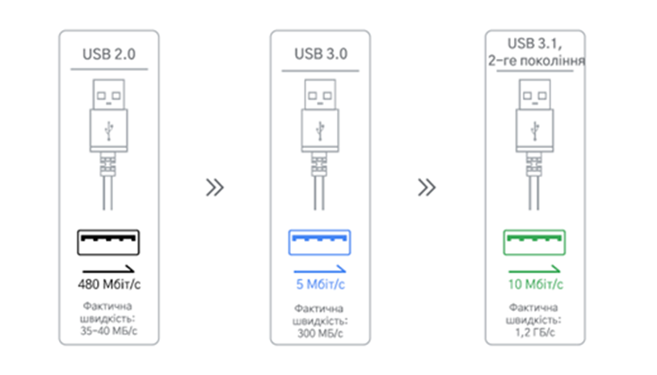
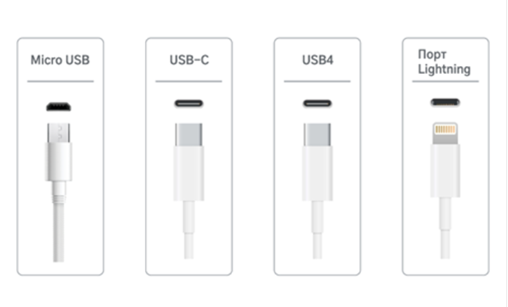
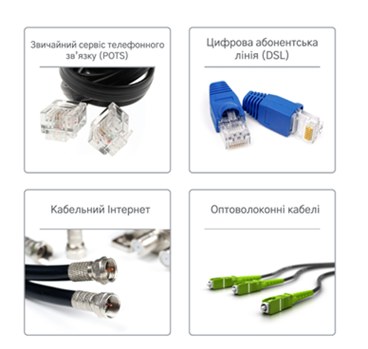
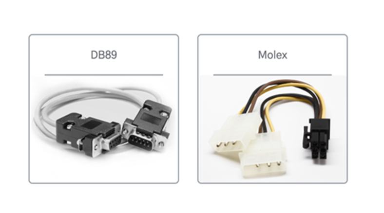
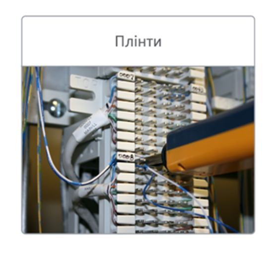

# Типи конекторів
На комп’ютері є багато фізичних портів або конекторів. За допомогою цих конекторів можна підключати пристрої, які додають до обчислень функціональні можливості, як-от клавіатуру, мишу або монітор. Ці зовнішні пристрої називаються периферійними. IT-фахівці часто працюють із такими периферійними пристроями й вирішують проблеми з ними, тому варто знати типи конекторів. У цьому матеріалі описано різні типи конекторів і їх призначення.   

## Конектори USB 
### USB 2.0, 3.0 і 3.1 
Конектори USB передають дані й електроживлення на пристрої, підключені до комп’ютера. Це найпопулярніший тип конекторів для всіх типів периферійних пристроїв. 

Зараз є три покоління конекторів USB типу A: USB 2.0, 3.0 і 3.1. Нижче описано відмінності між ними. 

- USB 2.0: чорний порт на комп’ютері, швидкість передавання даних 480 Мбіт/с. 

- USB 3.0: синій порт на комп’ютері, швидкість передавання даних 5 Гбіт/с. 

- USB 3.1: бірюзовий порт на комп’ютері, швидкість передавання даних 10 Гбіт/с. 

USB-порти мають зворотну сумісність, тобто в будь-який USB-порт можна підключати конектори USB типу A будь-якого з трьох поколінь. Швидкість передавання даних залежатиме від підключеного кабелю. Якщо підключити пристрій USB 3 до порту USB 2, швидкість передавання даних становитиме 480 Мбіт/с. 

### Micro USB, USB-C й Lightning 
Порти micro USB, USB-C, USB4 (Thunderbolt) і Lightning – це менші за розміром конектори, які передають більше енергії порівняно зі старішими конекторами USB й мають вищу швидкість передавання даних. Ці конектори використовуються для таких пристроїв, як смартфони, ноутбуки й планшети. 

- `Micro USB` – це невеликий USB-порт, який можна знайти на багатьох мобільних телефонах, планшетах і інших пристроях, які вироблено не компанією Apple.

- `USB-C` – це найновіший реверсивний конектор, обидва кінці якого мають однакову конструкцію. Кабелі USB-C замінюють традиційні конектори USB, оскільки вони можуть переносити значно більше енергії і передавати дані зі швидкістю 20 Гбіт/с.   

- `USB4` забезпечує передавання даних зі швидкістю 40 Гбіт/с і живлення за допомогою протоколу Thunderbolt 3 й кабелів USB-C. 

- `Порт Lightning` – це конектор для пристроїв Apple, який має схожі характеристики з USB-C. Він використовується для заряджання пристроїв і їх підключення до комп’ютерів, зовнішніх моніторів, камер і іншого периферійного обладнання. 

## Конектори для зв’язку 
Для обміну інформацією між пристроями й підключення до Інтернету використовуються різноманітні кабельні конектори. IT-фахівці обслуговують системи мереж, у яких використовуються різні типи конекторів зв’язку.  

- `POTS (Plain Old Telephone Service, звичайний сервіс телефонного зв’язку)` – це кабелі, що передають голос через мідну виту пару. POTS використовується для стаціонарних телефонів, комутованого доступу в Інтернет і систем сигналізації. POTS працює через конектор RJ-11 (Register Jack 11). 

- `DSL (Digital Subscriber Line, цифрова абонентська лінія)` надає доступ до високошвидкісних мереж або Інтернету через телефонні лінії і модем. Комп’ютер з’єднується з елементами мережі за допомогою конектора RJ-45, з яким здебільшого використовуються кабелі Ethernet. 

- `Кабельний Інтернет`. Користувачі отримують високошвидкісний доступ до Інтернету через інфраструктуру кабельного телебачення й модем. З кабельними модемами зазвичай використовується конектор типу F. 

- `Оптоволоконні кабелі` – це пучки скляних волокон у термоізоляційній оболонці, які можуть передавати дані на довгі відстані й забезпечують вищу пропускну спроможність. Великі постачальники послуг Інтернету використовують оптоволоконні кабелі для надання високошвидкісного Інтернету. 

## Конектори пристроїв 
IT-фахівці можуть стикатися в роботі із застарілими пристроями, які все ще використовують старі конектори, як-от DB89 і Molex. 

- Конектори `DB89` використовуються для старіших периферійних пристроїв, наприклад клавіатур, мишей і джойстиків. IT-фахівець усе ще може натрапити на конектор DB89 для зовнішнього обладнання комп’ютера й має розпізнавати його кабель, щоб підключити його до відповідного порту. 

- Конектори `Molex` забезпечують живлення дисків або пристроїв усередині комп’ютера. Вони використовуються для підключення жорсткого диска, дисковода (CD-ROM, DVD, Blu-ray) або відеокарти. . 

## Плінти 
Плінт – це блок клем, що використовується для підключення ліній телефонії і передавання даних. Це швидкий і легкий спосіб підключення дротів. IT-фахівці використовують плінти для заміни дротів або створення нового з’єднання з телефонною системою чи локальною мережею (LAN). 

Вище ми перелічили найпоширеніші кабелі й конектори. З розвитком технологій ці кабелі й конектори також змінюватимуться. . 

## Ключові висновки 
IT-фахівці повинні знати кабелі й конектори, які використовуються для підключення периферійних пристроїв до комп’ютерів. 

- Конектори USB – це найпоширеніший тип конекторів, які передають дані й живлення до пристроїв, підключених до комп’ютера. 

- Конектори зв’язку, як-от RJ-45 і оптоволоконні кабелі, з’єднують пристрої з Інтернетом і між собою. 

- IT-фахівці можуть стикатися в роботі із застарілими пристроями, які використовують старіші конектори, як-от DB89 і Molex. 

- Плінти – це блоки клем, які використовуються для з’єднання ліній телефонії або передавання даних. 

