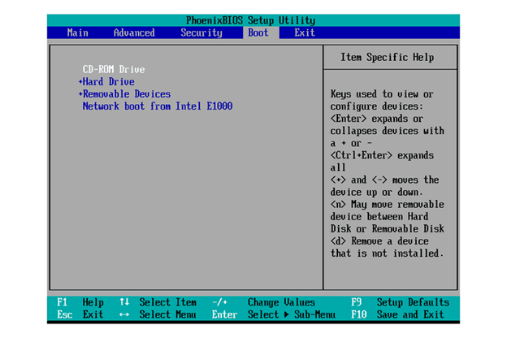

# Практичні поради щодо способів запуску
Найпоширеніший спосіб запустити комп’ютер – просто натиснути кнопку живлення й зачекати на виконання звичайного процесу. Але що робити, якщо під час цього процесу виникає помилка й комп’ютер не запускається? Або вам може знадобитися запустити на комп’ютері іншу операційну систему, а не ту, яка автоматично вибирається під час запуску. У таких ситуаціях у вас є кілька варіантів запуску операційної системи. Їх описано в цьому матеріалі.

## Процес запуску
Коли ви вмикаєте живлення комп’ютера, мікропрограма BIOS/UEFI (BIOS) проводить низку діагностичних перевірок, щоб переконатися, що комп’ютер перебуває в належному робочому стані. BIOS – це низькорівневе ПЗ, яке виконує ініціалізацію апаратних компонентів комп’ютера для забезпечення правильної роботи. Пристрій запуску вибирається на основі порядку запуску, який налаштовано в BIOS. Комп’ютер перевіряє підключені до системи пристрої (наприклад, жорсткі диски, носії USB й компакт-диски) у вказаному порядку запуску й шукає на них маленьку програму під назвою "завантажувач операційної системи". Коли комп’ютер знаходить цю програму на пристрої, він виконує її. Завантажувач ініціює процес, який запускає потрібну вам конфігурацію операційної системи.

Ви можете вибрати метод запуску комп’ютера, указавши в BIOS, на якому пристрої потрібно шукати завантажувач. Якщо ви хочете запустити конфігурацію ОС, яка зберігається на носії USB, вам потрібно змінити порядок запуску в BIOS, щоб комп’ютер у першу чергу шукав завантажувач операційної системи на носії USB.

## Налаштування параметрів запуску
Порядок запуску – це порядок, у якому комп’ютер вибирає, які файли використовувати для запуску. Цей порядок визначає спосіб запуску. Щоб указати порядок запуску на комп’ютері, увійдіть у BIOS і налаштуйте параметри запуску.

Щоб увійти в BIOS на комп’ютері з ОС Windows або Linux, увімкніть живлення системи й чекайте на появу на екрані повідомлення про те, яку функціональну клавішу потрібно натиснути для початку налаштування. Функціональні клавіші, які використовуються для входу в BIOS, залежать від виробника комп’ютера й версії BIOS. Ось кілька найпоширеніших повідомлень щодо функціональних клавіш: Press DEL to enter SETUP (Натисніть DEL, щодо перейти до налаштування), F2=SETUP (F2=налаштування) або Press F12 to enter SETUP (Натисніть F12, щоб перейти до налаштування). Під час запуску macOS утримуйте клавішу Option. Відкриється Менеджер запуску, який просканує комп’ютер і виявить пристрої, з яких можна виконати запуск. Виберіть потрібний пристрій.

Якщо ви натиснете вказану функціональну клавішу під час увімкнення Windows або Linux (до запуску ОС), відкриється програма BIOS. Екран BIOS матиме приблизно такий вигляд:

Вигляд екрана BIOS залежить від виробника комп’ютера й версії BIOS, однак в усіх версіях BIOS є меню параметрів запуску. У ньому можна вибрати потрібний спосіб запуску.

У меню параметрів запуску наведено перелік усіх пристроїв, підключених до системи комп’ютера, які можуть містити завантажувач операційної системи. До таких пристроїв належать внутрішні жорсткі диски, носії USB, компакт-диски, а також інші варіанти зберігання даних, як-от мережеве сховище або хмарне сховище. У меню параметрів запуску BIOS можна вказати конкретний порядок пошуку пристроїв, з яких потрібно завантажити ОС. BIOS запускає перший завантажувач операційної системи, який знаходить.

## Способи запуску
У параметрах запуску BIOS можуть бути доступні наведені нижче способи запуску.

### Зовнішні способи
- **Носій USB.** На носій USB потрібно завантажити ресурси для запуску комп’ютера, а потім вставити його в USB-порт і вибрати під час запуску.

- **Оптичний носій.** Ресурси для запуску завантажуються на оптичний диск. Це може бути компакт-диск, DVD або Blu-ray. Його потрібно вставити в оптичний привод комп’ютера.

Носій USB й оптичні носії добре підходять для відновлення роботи комп’ютера з пошкодженою ОС. Їх також можна використовувати для запуску комп’ютера з іншою ОС. Наприклад, комп’ютер з ОС Windows можна запустити в середовищі Linux за допомогою носія USB з ОС Linux. Перш ніж використовувати ці пристрої для запуску ОС, їх потрібно підготувати (див. наведені нижче ресурси).

- **SSD-диск.** Для запуску можна використовувати твердотілий накопичувач (SSD). У SSD-дисках немає деталей, що обертаються або рухаються. Такий диск можна встановити на комп’ютер, або він може бути меншого розміру, наприклад носієм флеш-пам’яті.

- **Зовнішній диск із можливістю гарячої заміни.** Запуск виконується із зовнішнього жорсткого диска, який можна переміщати між комп’ютерами, не вимикаючи їх.

- **Запуск із мережі.** Операційна система запускається безпосередньо через локальну мережу без використання пристрою зберігання даних. Для цього комп’ютер має бути підключено до локальної мережі. Такий спосіб запуску можна, зокрема, використовувати, якщо на комп’ютері не встановлено ОС. Щоб запустити систему із мережі, потрібно налаштувати в BIOS середовище PXE й підготувати мережеве середовище для цього типу запиту (див. ресурси нижче).

- **Запуск через Інтернет.** Комп’ютер запускається з інтернет-джерела, якщо воно безпечне. Якщо ви керуєте мережею і ваш сервер не працює з будь-якої причини, ви можете скористатися цим способом запуску, щоб віддалено ввімкнути сервер і перезапустити мережеві операції. Запуск через Інтернет можна виконати одним із двох способів.

  - Віддалений доступ У BIOS потрібно ввімкнути контролер віддаленого доступу (IPMI або схожий), а до комп’ютера має бути підключено пристрій дистанційного керування, як-от IDRAC (див. ресурси нижче).

  - Пробудження за сигналом із локальної мережі (Wake on LAN, WoL). Для цього у BIOS потрібно ввімкнути параметр WoL (див. наведені нижче ресурси). Інструкція WoL має надходити з пристрою в мережі або через шлюз WoL, а мережева картка має підтримувати WoL.

### Внутрішні способи
Розділення диска. На диску комп’ютера можна створити розділи, щоб процес запуску виконувала лише одна частина диска. Зазвичай диск розділяють, щоб установити на одному комп’ютері дві окремі операційні системи. Наприклад, на одному розділі диска можна встановити Windows, а на іншому – Linux. Якщо на вашому диску дві операційні системи, вам потрібно вибрати, яка з них виконуватиме процес запуску. Наявність двох доступних систем називається подвійним запуском.

Мати дві операційні системи може бути зручно з різних причин, але це особливо корисно, коли в одній із систем стається збій або вона не може запуститися. У такому разі ви можете запустити комп’ютер через іншу систему й вирішити проблему..

## Ключові висновки
Запустити комп’ютер можна кількома способами.

- На комп’ютері можна створити розділи для різних операційних систем і вибирати потрібну систему під час запуску.

- Для запуску можна використовувати зовнішні інструменти. До них входять носії USB, оптичні носії, твердотілі диски, зовнішні жорсткі диски з можливістю гарячої заміни, а також запуск із мережі й запуск з Інтернету.

- Дії, які потрібно виконати, щоб вибрати спосіб запуску, залежать від операційної системи.

## Посилання на ресурси

- [Як створити інсталяційний компакт-диск, DVD або USB для встановлення Windows](https://www.makeuseof.com/tag/make-bootable-usb-cd-dvd-install-windows-using-iso-file/)

- [Як створити власний інсталяційний компакт-диск Linux](https://www.makeuseof.com/tag/build-bootable-linux-live-cd/)

- [Створення завантажувального інсталятора для macOS](https://support.apple.com/en-us/101578)

- [Що таке середовище виконання попереднього завантаження (PXE)?](https://www.techtarget.com/searchnetworking/definition/Preboot-Execution-Environment)

- [Як налаштувати запуск за допомогою PXE для апаратного забезпечення UEFI](https://cs.uwaterloo.ca/~brecht/servers/docs/PowerEdge-2600/en/ERA/rac34c6.htm)

- [Як установити й налаштувати програмне забезпечення RAC](https://cs.uwaterloo.ca/~brecht/servers/docs/PowerEdge-2600/en/ERA/rac34c6.htm)

- [Як увімкнути й використовувати WoL у Windows 10](https://www.windowscentral.com/how-enable-and-use-wake-lan-wol-windows-10)