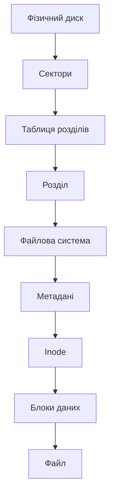
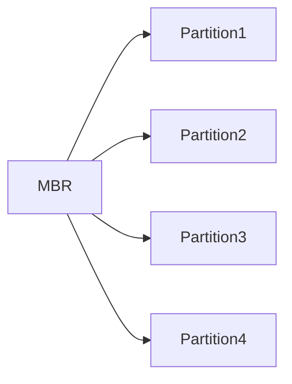
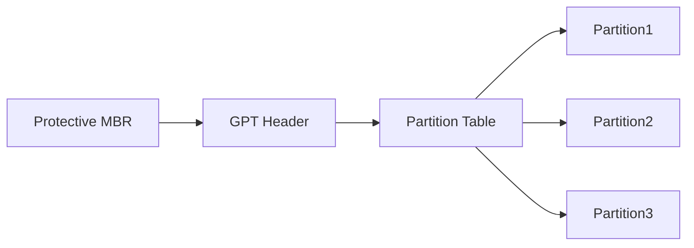
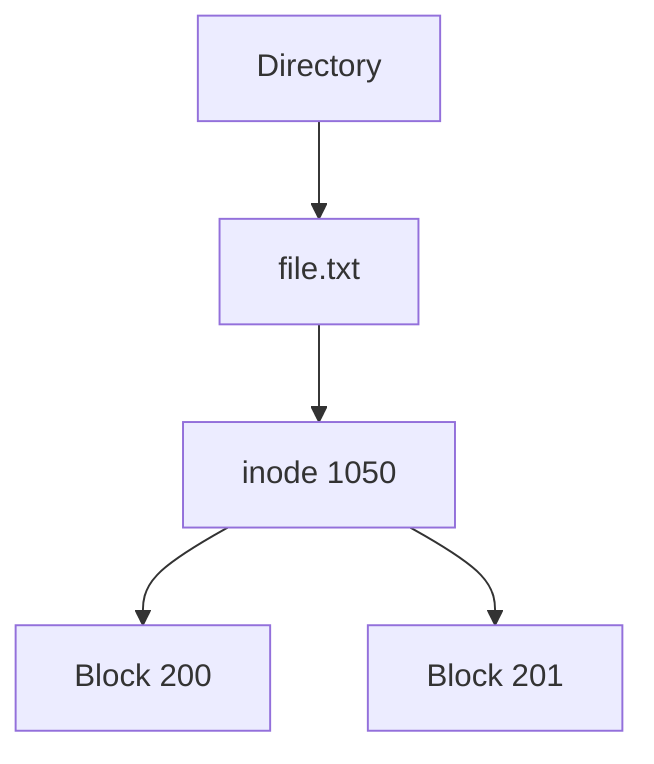
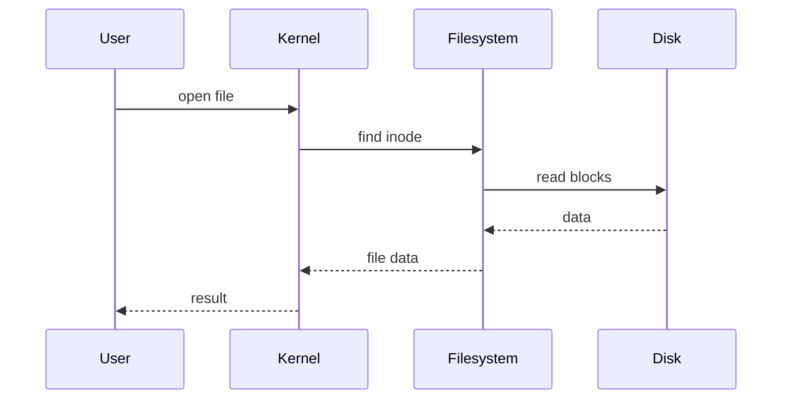
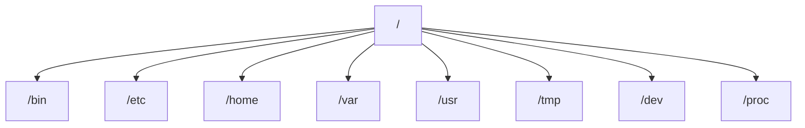
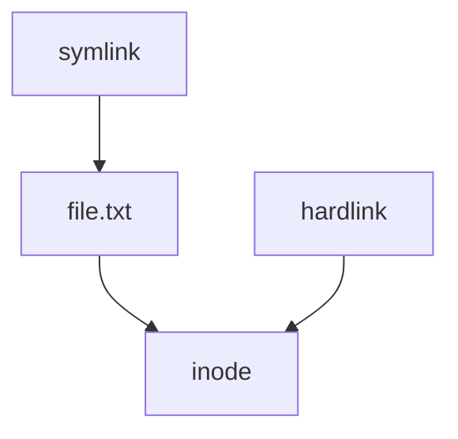
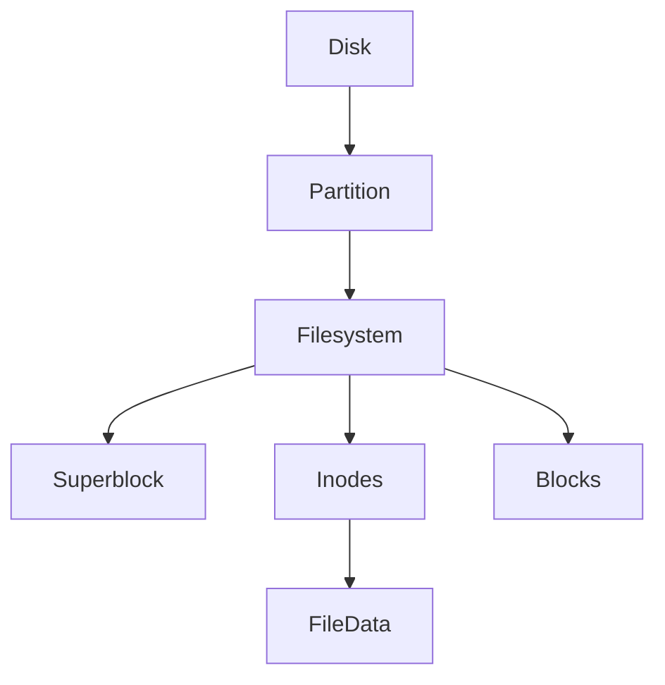

#
## 1. Що таке файлова система

`Файлова система (filesystem)` — це структура, яка визначає:
- як дані зберігаються на диску
- як файли знаходяться
- як організовані директорії
- як зберігаються метадані

Файлова система вирішує головну проблему:

> Як знайти потрібні дані серед мільярдів байтів на диску

Без файлової системи диск — це просто послідовність байтів.

## 2. Повна ієрархія зберігання даних

Важливо зрозуміти всю послідовність рівнів.




Коротко:
```
Диск
 └ Розділи
     └ Файлова система
          └ inode
              └ блоки
                  └ дані файлу
```

## 3. Блочні пристрої (Block Devices)

`Блочний пристрій` — це пристрій, який читає і записує дані фіксованими блоками.

Приклади:
```
жорсткий диск (HDD)
SSD
USB флешка
NVMe диск
```
У Linux вони представлені у каталозі:
```
/dev
```
Приклад:
```
/dev/sda
/dev/sdb
/dev/nvme0n1
```
***
**Що означає "блочний"**

Операційна система читає не байти, а блоки.

Наприклад:
```
блок = 4096 bytes
```
Коли читається файл:
```
read block 1200
read block 1201
read block 1202
```
Це значно швидше.

## 4. Сектори диска

Фізичний диск складається з секторів.

`Сектор` — це найменша фізична одиниця запису на диску.

Типові розміри:
```
512 bytes
4096 bytes
```

## 5. Розділи диска (Partitions)

`Розділ` — це частина диска, яка виглядає як окремий диск.

Наприклад:
```
Disk: /dev/sda

/dev/sda1
/dev/sda2
/dev/sda3
```

***
**Навіщо потрібні розділи**

1️⃣ відокремлення системи  
2️⃣ різні файлові системи  
3️⃣ мультизавантаження  
4️⃣ безпека  

Приклад:
```
/dev/sda1  EFI
/dev/sda2  Linux root
/dev/sda3  Home
/dev/sda4  Windows
```

## 6. Як називаються розділи

У Linux назви формуються так:
```
/dev/sdX
```
де
- sda — перший диск
- sdb — другий
- sdc — третій

Розділи:
```
/dev/sda1
/dev/sda2
/dev/sda3
```
***

**NVMe диски**

Називаються інакше:
```
/dev/nvme0n1
```
Розділи:
```
/dev/nvme0n1p1
/dev/nvme0n1p2
```

## 7. Таблиці розділів

`Таблиця розділів` — це структура, яка описує:
- де починається розділ
- де закінчується
- який тип

***
### MBR

Master Boot Record.

Особливості:
- максимум 4 primary partitions
- максимум 2TB диск

Як обійти 4 розділи:
```
extended partition
```

Схема MBR


### GPT

GUID Partition Table.

Сучасний стандарт.

Переваги:
- до 128 partitions
- підтримка великих дисків
- резервні таблиці
- унікальні GUID

Схема GPT



## 8. Як створити розділ

Використовується:
```bash
fdisk
parted
gdisk
```
***
**Переглянути диски**
```bash
lsblk
```
Приклад:
```
NAME   SIZE
sda    500G
sda1   512M
sda2   100G
```
***

**Створити розділ (fdisk)**
```bash
sudo fdisk /dev/sda
```

Основні команди:

- `n` — new partition
- `d` — delete
- `p` — print
- `w` — write changes

## 9. Створення файлової системи

Коли розділ створено — він порожній.

Потрібно створити файлову систему.

Команда:
```bash
mkfs
```
***
**Створити ext4**
```bash
sudo mkfs.ext4 /dev/sda1
```

**Інші файлові системи**
```bash
mkfs.xfs
mkfs.btrfs
mkfs.fat
mkfs.ntfs
```

## 10. Що створює mkfs

Коли створюється файлова система, створюються структури:
```
superblock
inode table
data blocks
journal
```

## 11. Метадані файлу

`Метадані` — це інформація про файл.

Не самі дані.

Приклад:
```
ім'я файлу
розмір
власник
права
дата створення
дата зміни
де лежать блоки
```
***

**Перегляд метаданих**
```bash
stat file.txt
```
Приклад:
```
Size: 1024
Owner: user
Permissions: rw-r--r--
```

## 12. Inode

`inode` (index node) — це структура, яка описує файл.

Вона містить:
```
права
власника
розмір
часи
адреси блоків
тип файлу
```
Але inode НЕ містить ім'я файлу.
***

**Чому?**

Тому що ім'я зберігається в директорії.

*** 

**Схема**


## 13. Як директорія зберігає файли

`Директорія` — це таблиця відповідностей:
```
ім'я файлу -> inode
```
Наприклад:
```
file.txt -> inode 1050
photo.jpg -> inode 1090
```

## 14. Блоки даних

Дані файлу зберігаються у блоках.

Розмір блоку:
```
4 KB
```
***

**Приклад**

Файл:
```
10 KB
```
Займе:
```
block1
block2
block3
```

## 15. Як читається файл



## 16. Монтування

Щоб використовувати файлову систему, її треба змонтувати.
```bash
mount /dev/sda1 /mnt
```
Це означає:

> вміст диска показується в /mnt

## 17. Ієрархія Linux

У Linux вся файлова система — це одне дерево, яке починається з кореня `/`.



```
/
├── /bin
├── /etc
├── /home
├── /var
├── /usr
├── /tmp
├── /dev
└── /proc
```


## 18. Типи файлів

У Linux є різні типи файлів.


| Тип              | Символ | Опис                 |
| ---------------- | ------ | -------------------- |
| Regular file     | -      | звичайний файл       |
| Directory        | d      | папка                |
| Symbolic link    | l      | символічне посилання |
| Block device     | b      | диск                 |
| Character device | c      | пристрій             |
| Socket           | s      | сокет                |
| FIFO             | p      | pipe                 |

Приклад:
```bash
ls -l
```
```bash
-rw-r--r-- file
drwxr-xr-x folder
lrwxrwxrwx link
```

## 19. Символічні і жорсткі посилання
**Hard link**

Два імені → один inode
```bash
ln file link
```

***

**Symbolic link**

Посилання на шлях
```bash
ln -s file link
```
***

**Схема**


## 20. Основні команди роботи з файлами

| команда | опис | 
| ----| -----|
| ls | перегляд |
| cd | перейти |
| mkdir | створити папку |
| touch | створити файл |
| cp | копіювати | 
| mv | перемістити | 
| rm | видалити | 

## 21. Перевірка диска
```bash
df -h
```

## 22. Використання місця
```bash
du -sh *
```

## 23. Перевірка файлової системи
```bash
fsck
```

## 24. Повна схема файлової системи

***

## **Важливо**

Якщо людина розуміє:
- блочні пристрої
- сектори
- таблиці розділів
- розділи
- файлові системи
- inode
- блоки
- метадані
- директорії
- монтування

вона реально розуміє файлову систему Linux.