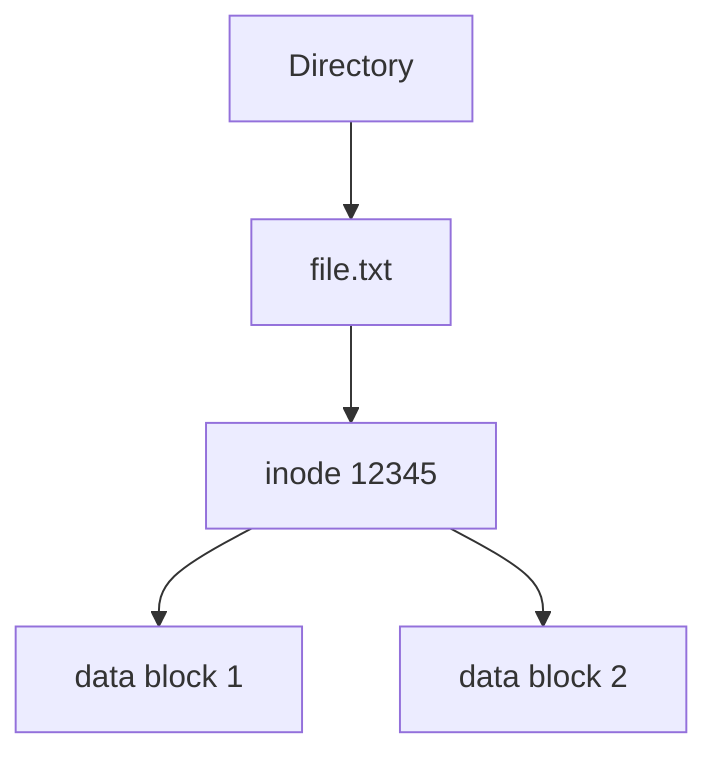
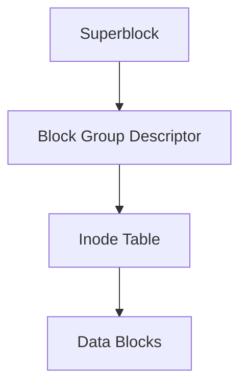
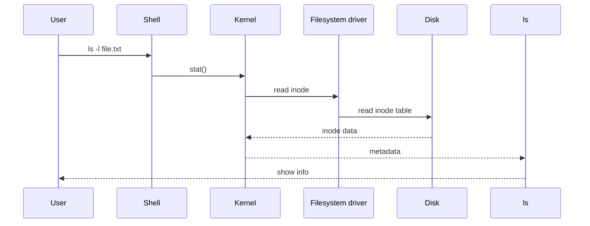
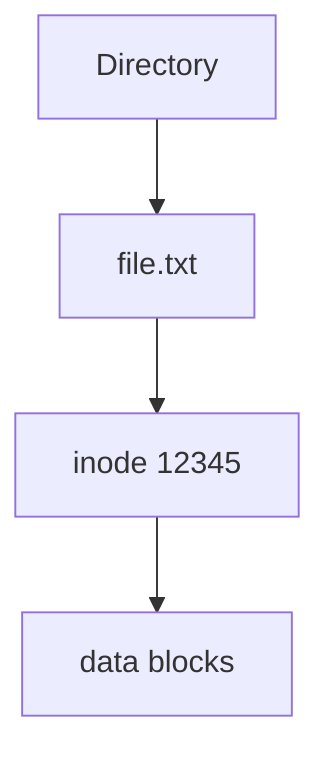
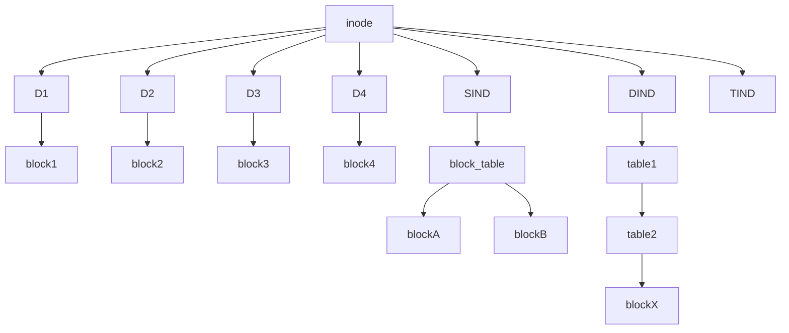
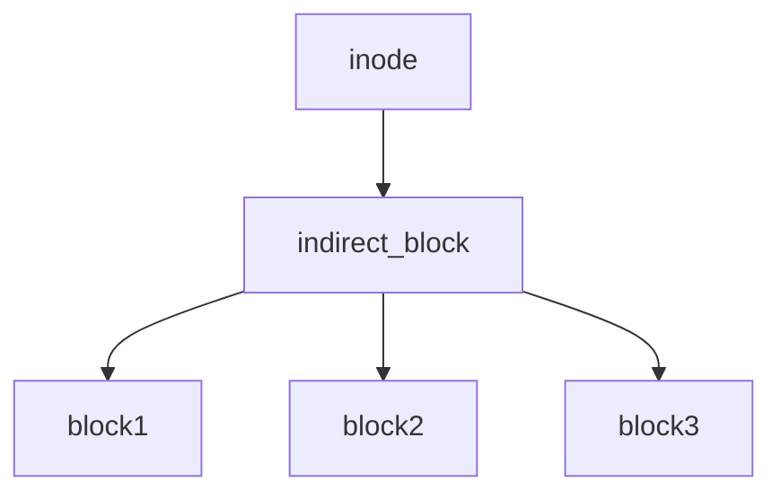
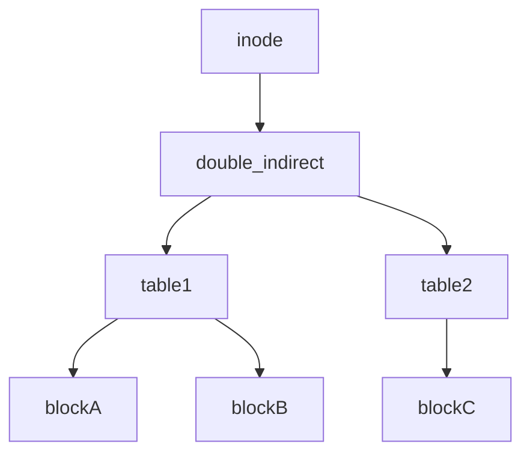
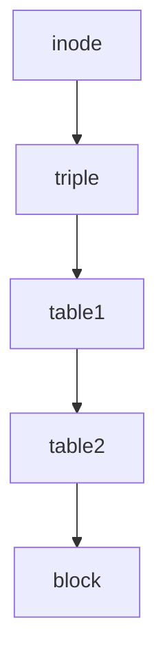
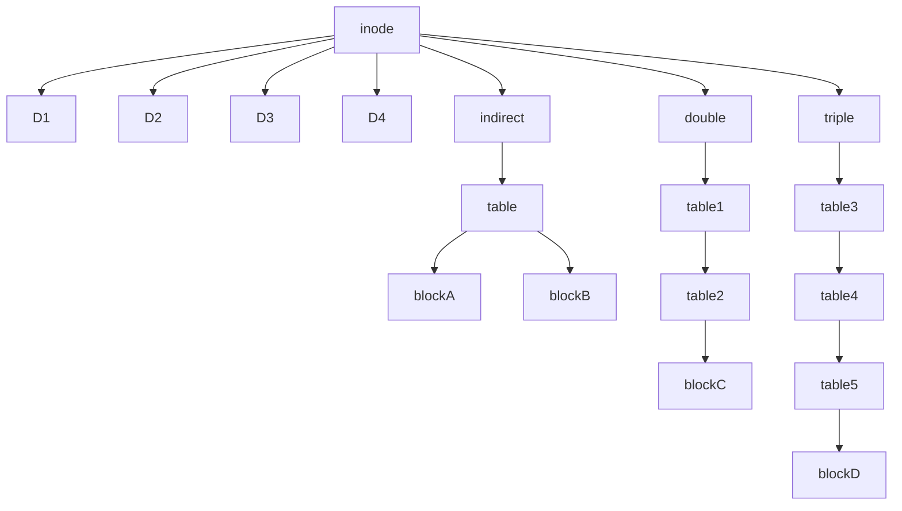

# inode <!-- omit in toc -->

## Зміст <!-- omit in toc -->
- [Що таке inode](#що-таке-inode)
- [Скільки inode може бути](#скільки-inode-може-бути)
- [Яким чином можна розшифрувати метадані із inode?](#яким-чином-можна-розшифрувати-метадані-із-inode)
  - [1. Де реально знаходиться inode](#1-де-реально-знаходиться-inode)
  - [2. Що реально містить inode](#2-що-реально-містить-inode)
  - [3. Як Linux їх читає](#3-як-linux-їх-читає)
  - [4. Команда `stat`](#4-команда-stat)
  - [5. Команда `ls -i`](#5-команда-ls--i)
  - [6. Як подивитися inode напряму (ext файлові системи)](#6-як-подивитися-inode-напряму-ext-файлові-системи)
  - [7. Ще глибше — stat системний виклик](#7-ще-глибше--stat-системний-виклик)
  - [8. А де зберігається ім’я файлу](#8-а-де-зберігається-імя-файлу)
  - [9. Що відбувається при відкритті файлу](#9-що-відбувається-при-відкритті-файлу)
- [10. Що відбувається при rm](#10-що-відбувається-при-rm)
- [як inode зберігає адреси блоків великих файлів](#як-inode-зберігає-адреси-блоків-великих-файлів)
  - [1. Direct blocks](#1-direct-blocks)
  - [2. Single Indirect Block](#2-single-indirect-block)
  - [3. Double Indirect Block](#3-double-indirect-block)
  - [4. Triple Indirect Block](#4-triple-indirect-block)

## Що таке inode
`inode` (index node) — це структура даних файлової системи, яка містить метадані файлу.

В Linux кожен файл має inode.

В inode зберігається:
- тип файлу
- права доступу
- власник і група
- розмір файлу
- час створення, зміни та доступу
- кількість жорстких посилань
- адреси блоків даних на диску

> [!NOTE]
> **Важливо:**
> inode не містить ім’я файлу

Ім’я файлу зберігається в директорії.

Як пов’язані ім’я файлу та inode

Директорія — це таблиця відповідностей:
```
ім'я файлу → inode
```
Приклад:
```
file.txt  → inode 12345
image.png → inode 12346
```
Коли система відкриває файл:
1. знаходить inode за ім’ям
2. читає метадані
3. отримує адреси блоків
4. читає дані

Схема роботи


Перегляд inode

Команда:
```bash
ls -i
```
Приклад:
```bash
12345 file.txt
12346 image.png
```
Детальна інформація про inode

Команда:
```bash
stat file.txt
```
Приклад:
```bash
File: file.txt
Size: 1200
Inode: 12345
Links: 1
Access: rw-r--r--
```

## Скільки inode може бути

Кількість inode визначається під час створення файлової системи.

Наприклад:
```bash
mkfs.ext4
```
Якщо inode закінчаться:
- нові файли створити не можна
- навіть якщо є місце на диску

Це іноді трапляється при великій кількості дрібних файлів.


## Яким чином можна розшифрувати метадані із inode?

важливо зрозуміти межу між внутрішньою структурою файлової системи і інструментами Linux, які дозволяють ці дані прочитати.

Коротко:

> inode — це бінарна структура на диску, яку інтерпретує драйвер файлової системи ядра Linux.
Користувач напряму її не "розшифровує" — це робить ядро, а команди просто показують ці дані.

Розберемо детально.

### 1. Де реально знаходиться inode

Inode зберігаються в спеціальній області файлової системи.

Наприклад у ext4 структура приблизно така:


Тобто:
```
filesystem
 ├ superblock
 ├ inode tables
 └ data blocks
 ```

### 2. Що реально містить inode

У файлових системах ext2/ext3/ext4 структура inode виглядає приблизно так:
```C
struct inode {
    mode
    uid
    size
    atime
    ctime
    mtime
    links_count
    blocks
    block_pointers[]
}
```
Наприклад:
| поле	| значення|
| -----| ------|
| mode	| тип файлу + права| 
| uid	| власник| 
| gid	| група |
| size	| розмір |
| atime |	час доступу |
| mtime	| час зміни|
| ctime	| час зміни inode |
| links_count	| кількість hard link |
| block pointers	| де лежать дані |

Це сирі бінарні дані.

### 3. Як Linux їх читає

Коли ти робиш:
```bash
ls -l file.txt
```
відбувається приблизно таке:


Тобто:
1️⃣ команда викликає системний виклик stat()  
2️⃣ ядро читає inode  
3️⃣ повертає метадані  

### 4. Команда `stat`

Найпряміший спосіб побачити інформацію з inode.
```bash
stat file.txt
```
Приклад:
```
File: file.txt
Size: 1200
Blocks: 8
IO Block: 4096 regular file
Device: 803h/2051d
Inode: 12345
Links: 1
Access: (0644/-rw-r--r--)
Uid: (1000/user)
Gid: (1000/user)

Access: 2025-03-10
Modify: 2025-03-10
Change: 2025-03-10
```
Усі ці дані — взяті з `inode`.

### 5. Команда `ls -i`

Показує номер inode.
```bash 
ls -i
```
Приклад:
```bash
12345 file.txt
12346 image.png
```

### 6. Як подивитися inode напряму (ext файлові системи)

Є спеціальна утиліта:
```bash
debugfs
```
Приклад:
```bash
sudo debugfs /dev/sda1
```
потім:
```bash
stat <inode_number>
```
Наприклад:
```
stat <12345>
```
Це покаже реальний inode.

### 7. Ще глибше — stat системний виклик

Коли програма хоче дізнатись інформацію про файл, вона викликає:
```C
stat()
fstat()
lstat()
```
Вони повертають структуру:
```
struct stat
```
Приклад:
```C
struct stat {
    mode_t st_mode;
    uid_t st_uid;
    gid_t st_gid;
    off_t st_size;
    time_t st_atime;
    time_t st_mtime;
    time_t st_ctime;
};
```

Це розшифровані дані inode.

### 8. А де зберігається ім’я файлу

Ім’я не входить в inode.

Воно лежить у директорії.

Директорія містить записи:
```shell
filename -> inode
```
Приклад:
```
file.txt -> inode 12345
```

### 9. Що відбувається при відкритті файлу

Коли відкривається файл:
```shell
cat file.txt
```
система робить:  


1️⃣ знаходить inode  
2️⃣ читає block pointers  
3️⃣ читає блоки  

## 10. Що відбувається при rm

Коли ти робиш:
```shell
rm file.txt
```
Linux:  
1️⃣ видаляє запис у директорії   
2️⃣ зменшує link count в inode  
3️⃣ якщо link count = 0 → inode і блоки звільняються  

Коротко

> inode — це бінарна структура файлової системи, яка містить метадані.

Її читають:
| команда	| що показує|
| ------| --------|
| stat	| майже всі метадані|
| ls -l |	частину |
| ls -i	| номер inode |
| debugfs	| прямий доступ |

## як inode зберігає адреси блоків великих файлів

Це одна з найцікавіших і найважливіших частин файлових систем Linux. Саме вона пояснює як inode знаходить дані файлу на диску, особливо коли файл стає великим.

Проблема, яку треба вирішити:
> inode має обмежений розмір, але файл може бути дуже великим.

Тому inode не зберігає всі адреси блоків напряму. Замість цього використовується багаторівнева система покажчиків.
***

**Як inode знаходить блоки файлу**

Inode містить масив покажчиків на блоки.

У класичних файлових системах Linux (ext2/ext3/ext4) inode має 15 покажчиків:
```
12 direct pointers
1 single indirect pointer
1 double indirect pointer
1 triple indirect pointer
```
Загальна схема


### 1. Direct blocks

Перші 12 покажчиків inode — це прямі адреси блоків.
```
inode
 ├ block1
 ├ block2
 ├ block3
 └ block12
```
Це означає:
```
inode → блок даних
```
Це найшвидший доступ.

Приклад

Якщо розмір блоку:
```
4 KB
```
12 блоків:
```
12 × 4 KB = 48 KB
```
Отже файл до ~48 KB читається напряму через inode.

### 2. Single Indirect Block

Коли файл більший за 12 блоків, використовується indirect block.
```
inode → block → список адрес блоків
```
Схема:


Цей блок містить таблицю адрес блоків.

Скільки блоків може бути

Приклад:
```
block size = 4096 bytes
pointer size = 4 bytes
```
Отже в одному блоці:
```
4096 / 4 = 1024 pointers
```
Це означає:
```
1024 blocks
```
або
```
1024 × 4 KB = 4 MB
```

### 3. Double Indirect Block

Коли файл стає ще більшим, використовується double indirect.

Схема:


Тобто:
```
inode → table → table → blocks
```
Скільки даних
```
1024 × 1024 blocks
```
це:
```
1,048,576 blocks
```
або
```
~4 GB
```
### 4. Triple Indirect Block

Для дуже великих файлів.

Схема:


Тобто:
```
inode → table → table → table → blocks
```
**Максимальний розмір**

При block size 4 KB:
```
1024³ blocks
```
це приблизно:
```
~4 TB
```

Повна схема


**Як читається великий файл**

При читанні Linux робить:  

1️⃣ читає inode  
2️⃣ дивиться покажчики  
3️⃣ знаходить таблицю  
4️⃣ читає блок  

Приклад
```
inode
  ↓
double indirect block
  ↓
block table
  ↓
data block
```
Чому це зроблено саме так

Ця схема має переваги:
- маленькі файли читаються швидко => бо використовують direct blocks
- великі файли підтримуються => через indirect levels
- inode залишається маленьким

типово:
```
128 або 256 bytes
```

> [!TIPP]
> Цікавий факт
> Більшість файлів у системі дуже маленькі.

Тому:

>90% файлів використовують лише direct blocks

**Ще одна важлива річ**

У сучасному `ext4` використовується інша система:
```
extents
```
Вона зберігає діапазони блоків, а не кожен блок окремо.

Це:
- швидше
- ефективніше
- менше фрагментації
***

**Коротко**

inode містить:
- direct block pointers
- indirect pointer
- double indirect pointer
- triple indirect pointer

Це дозволяє:
- швидко читати маленькі файли
- підтримувати дуже великі файли


