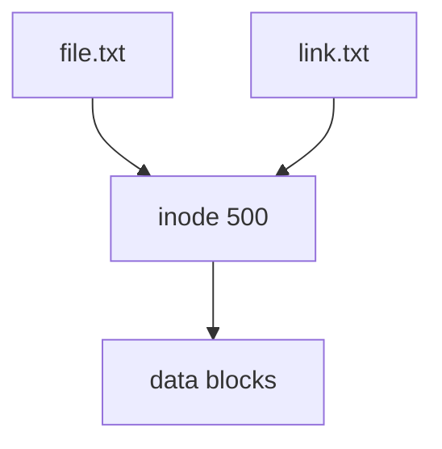
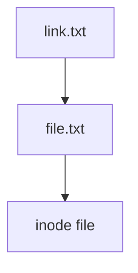

# Жорсткі та символічні посилання

У Linux файл може мати кілька імен.

Це реалізується через посилання (links).

Існує два типи:
```
hard link
symbolic link
```

## Hard link (жорстке посилання)

`Hard link` — це додаткове ім’я для того самого inode.

Тобто:
```
file.txt
link.txt
```
обидва вказують на один і той самий inode.

**Схема**

***

**Створення hard link**
```bash
ln file.txt link.txt
```
***

**Особливості hard link**

Hard link:
- має той самий inode
- не відрізняється від оригіналу
- не можна визначити який файл був "першим"

***

**Видалення**

Якщо видалити:
```bash
rm file.txt
```
дані не зникнуть, поки існує хоча б один link.

Файл зникне лише коли:
- link count = 0


***
**Обмеження hard link**

Hard link:
- не може посилатися на директорії
- не працює між різними файловими системами

## Symbolic link (символічне посилання)

`Symbolic link`(symlink) — це файл, який містить шлях до іншого файлу.

Тобто він працює як ярлик.

**Схема**


***
**Створення symlink**
```bash
ln -s file.txt link.txt
```

**Перегляд**
```bash
ls -l
```
Приклад:
```
lrwxrwxrwx link.txt -> file.txt
```
***

**Особливості symlink**

Symbolic link:
- має власний inode
- може посилатися на директорії
- може посилатися на файли з інших файлових систем

***

**Якщо оригінал видалити**

Symlink стає broken link.
```
link.txt -> file.txt (missing)
```

## Порівняння
| Властивість	| Hard link	| Symbolic link| 
| -------| :-------: | :--------:|
| inode	| той самий	| інший |
| працює між файловими системами	| ні	|так |
| може посилатися на директорії	|  ні	| так|
| якщо файл видалити	 |дані залишаться	| посилання зламається |