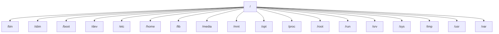

# ієрархія Linux

детальне пояснення ієрархії файлової системи Linux відповідно до стандарту Filesystem Hierarchy Standard (FHS).

## 1. Загальна ієрархія Linux

У Linux вся файлова система — це одне дерево, яке починається з кореня `/`.


## 2. Коренева директорія `/`
```
/
```

Це початок всієї файлової системи.

У Linux все — файл, тому всі ресурси системи підключаються до цього дерева.

У корені знаходяться лише найважливіші директорії, які потрібні для:
- завантаження системи
- базових команд
- роботи ядра

## 3. `/bin` — базові команди
```
/bin
```
Містить найважливіші програми, які повинні працювати навіть якщо інші файлові системи ще не змонтовані.

Приклади:
```bash
/bin/ls
/bin/cp
/bin/mv
/bin/rm
/bin/cat
/bin/bash
```
Ці команди використовуються:
- при завантаженні
- у recovery режимі
- у мінімальних системах

У сучасних системах /bin часто є символічним посиланням на /usr/bin.

## 4. `/sbin` — системні утиліти
```
/sbin
```
Це команди для адміністратора системи.

Приклади:
```bash
/sbin/fsck
/sbin/reboot
/sbin/mkfs
/sbin/mount
/sbin/ip
```
Ці команди:
- керують системою
- працюють з дисками
- керують мережею

У нових системах `/sbin` часто → `/usr/sbin`.

## 5. `/boot` — файли завантаження
```
/boot
```
Містить все необхідне для завантаження Linux.

Типові файли:
```bash
/boot/vmlinuz
/boot/initrd
/boot/grub
```
**Важливі файли**

Ядро Linux
```
vmlinuz
```
initramfs
```
initrd.img
```
Це тимчасова файловa система, яка допомагає системі знайти справжній root.

## 6. `/dev` — пристрої
```
/dev
```
У Linux пристрої представлені як файли.

Приклади:
```
/dev/sda
/dev/sda1
/dev/nvme0n1
/dev/null
/dev/tty
/dev/random
```
**Приклади**

Диск:
```
/dev/sda
```
Розділ:
```
/dev/sda1
```
Псевдо-пристрій:
```
/dev/null
```
все записане → зникає

## 7. `/etc` — конфігурація системи
```
/etc
```
Містить всі конфігураційні файли системи.

Приклади:
```
/etc/passwd
/etc/hosts
/etc/fstab
/etc/ssh/sshd_config
/etc/nginx/nginx.conf
```
**Важливі файли**

Користувачі
```
/etc/passwd
```
Паролі
```
/etc/shadow
```
Монтування дисків
```
/etc/fstab
```

## 8. `/home` — домашні директорії користувачів
```
/home
```
Кожен користувач має свою папку.

Приклад:
```
/home/alex
/home/maria
```
Тут зберігаються:
- документи
- налаштування програм
- проекти

Приклад:
```
/home/user/Documents
/home/user/.config
```

## 9. /root — домашня директорія root
```
/root
```
Це home для адміністратора системи.

Не плутати з `/`.

## 10. `/lib` і `/lib64` — системні бібліотеки
```
/lib
/lib64
```
Містять бібліотеки, які потрібні базовим програмам.

Приклад:
```
/lib/libc.so
/lib/libm.so
```
Це аналоги DLL у Windows.

## 11. `/usr` — основні програми
```
/usr
```
Це найбільша частина системи.

Ієрархія:
```
/usr/bin
```
Основні програми:
- python
- git
- node
- gcc
- vim
- nano
- /usr/sbin

Адміністративні утиліти:
- nginx
- apache
- useradd
- /usr/lib

Бібліотеки програм.
- /usr/share

Файли, незалежні від архітектури:
- іконки
- документація
- локалізація
- /usr/local

Програми, встановлені вручну.
- /usr/local/bin
- /usr/local/lib

## 12. `/var` — змінні дані
```
/var
```
Тут лежать дані, які змінюються під час роботи системи.
- /var/log

Логи системи.
- /var/log/syslog
- /var/log/auth.log
- /var/log/nginx
- /var/cache

Кеш програм.
- /var/lib

Бази даних програм.
- /var/lib/docker
- /var/lib/mysql

## 13. `/tmp` — тимчасові файли
```
/tmp
```
Використовується програмами для:
- тимчасових файлів
- кешу

Очищається при перезавантаженні.

## 14. `/proc`` — інформація про систему
```
/proc
```
Це віртуальна файловa система, яку створює ядро.

Приклади:
```
/proc/cpuinfo
/proc/meminfo
/proc/uptime
```
Ці файли не лежать на диску.

## 15. `/sys` — інформація про пристрої
```
/sys
```
Також віртуальна файловa система.

Містить:
- інформацію про драйвери
- пристрої
- ядро
- 
## 16.  `/run` — runtime дані
```
/run
```
Тут лежать:
- PID файли
- socket файли
- runtime інформація
- 
## 17. `/media` — автоматичне монтування
```
/media
```
Сюди монтуються:
- USB
- DVD
- карти пам'яті

Приклад:
```
/media/user/USB
```

## 18. `/mnt`` — тимчасове монтування
```
/mnt
```
Використовується адміністратором для ручного монтування.

## 19. `/opt` — сторонні програми
```
/opt
```
Тут встановлюються великі сторонні пакети.

Наприклад:
```
/opt/google
/opt/jetbrains
```

## 20. `/srv` — дані сервісів
```
/srv
```
Може містити:
- /srv/www
- /srv/ftp
  
## 21.  Повна схема
Коротке правило запам'ятовування

| директорія	| призначення|
|-----| ------|
| /bin |	базові команди| 
| /sbin	| системні утиліти| 
| /boot	| файли завантаження| 
| /dev	| пристрої| 
| /etc| 	конфігурація| 
| /home	| користувачі| 
| /lib| 	бібліотеки| 
| /lib| 	бібліотеки| 
| /usr	| програми| 
| /var	| змінні дані| 
| /tmp| 	тимчасові файли| 
| /proc| 	інформація про систему| 
| /sys| 	пристрої| 
| /media	| USB| 
| /mnt	| ручне монтування| 
| /opt	| сторонні програми| 