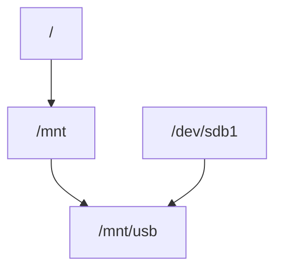

# Монтування файлових систем <!-- omit in toc -->

## Зміст <!-- omit in toc -->- [Що таке монтування](#що-таке-монтування)
- [Зміст - Що таке монтування](#зміст---що-таке-монтування)
- [Що таке монтування](#що-таке-монтування)
- [Команда mount](#команда-mount)
- [Відмонтування](#відмонтування)
- [Автоматичне монтування](#автоматичне-монтування)
- [Основні точки монтування](#основні-точки-монтування)
- [Перегляд блочних пристроїв](#перегляд-блочних-пристроїв)
- [Різниця між ручним і автоматичним монтуванням](#різниця-між-ручним-і-автоматичним-монтуванням)
  - [1. Що таке монтування](#1-що-таке-монтування)
  - [2. Що відбувається при mount](#2-що-відбувається-при-mount)
  - [3. Чому mount зникає після перезапуску](#3-чому-mount-зникає-після-перезапуску)
  - [4. Як працює автоматичне монтування](#4-як-працює-автоматичне-монтування)
  - [5. Структура `/etc/fstab`](#5-структура-etcfstab)
  - [6. Приклад розбору](#6-приклад-розбору)
  - [7. Як отримати UUID](#7-як-отримати-uuid)
  - [8. Як перевірити fstab без перезавантаження](#8-як-перевірити-fstab-без-перезавантаження)
  - [9. Як побачити змонтовані файлові системи](#9-як-побачити-змонтовані-файлові-системи)
  - [10. Приклад](#10-приклад)
  - [11. Що станеться якщо mount point не існує](#11-що-станеться-якщо-mount-point-не-існує)
  - [12. Що таке bind mount](#12-що-таке-bind-mount)
  - [13. Важлива концепція](#13-важлива-концепція)
  - [14. Що буде якщо змонтувати поверх директорії](#14-що-буде-якщо-змонтувати-поверх-директорії)
  - [15. Як відмонтувати](#15-як-відмонтувати)
  - [16. Важливе правило](#16-важливе-правило)
  - [17. Повний шлях даних](#17-повний-шлях-даних)
  - [Підсумок](#підсумок)
- [Mount options](#mount-options)
  - [Опції доступу](#опції-доступу)
  - [Опції продуктивності](#опції-продуктивності)
  - [Опції монтування](#опції-монтування)
  - [Опції користувача](#опції-користувача)
- [Перевизначення опцій монтування](#перевизначення-опцій-монтування)
  - [Як працює defaults](#як-працює-defaults)
  - [Якщо додати іншу опцію](#якщо-додати-іншу-опцію)
  - [Чи важливий порядок опцій](#чи-важливий-порядок-опцій)
  - [Як перевірити реальні опції](#як-перевірити-реальні-опції)
  - [Висновок](#висновок)
- [fsck order (6-та колонка fstab)](#fsck-order-6-та-колонка-fstab)
  - [Що таке fsck](#що-таке-fsck)
  - [Чому root має 1](#чому-root-має-1)
  - [Що означає 2](#що-означає-2)
  - [Чи можна ставити 0](#чи-можна-ставити-0)


## Що таке монтування

`Монтування` — це процес підключення файлової системи до дерева директорій Linux.

У Linux всі файлові системи об’єднані в одну ієрархію.

Приклад

Пристрій:
```
/dev/sdb1
```
може бути змонтований у:
```
/mnt/usb
```
Після цього його вміст буде доступний у:

`/mnt/usb`
Схема


## Команда mount
```bash
sudo mount /dev/sdb1 /mnt/usb
```
Перегляд змонтованих файлових систем
```bash
mount
```
або
```bash
df -h
```

## Відмонтування
```bash
sudo umount /mnt/usb
```
або
```bash
sudo umount /dev/sdb1
```

## Автоматичне монтування

Налаштовується у файлі:
```bash
/etc/fstab
```
Приклад:
```bash
UUID=xxxx /mnt/data ext4 defaults 0 2
```

## Основні точки монтування

Типові директорії:
```
/
 /home
 /boot
 /mnt
 /media
 ```

## Перегляд блочних пристроїв

Команда:
```bash
lsblk
```
Приклад:
```
sda
 ├─ sda1
 └─ sda2
 ```

## Різниця між ручним і автоматичним монтуванням

ключова різницю:
- ручне монтування (mount) — тимчасове
- автоматичне монтування — постійне

Розберемо це системно, бо це важлива частина теми FileSystem.

### 1. Що таке монтування
У Linux файлові системи не прив’язані до конкретних літер дисків, як у Windows.
Замість цього вони вбудовуються у єдине дерево директорій.
```Mermaid
flowchart TD
A[Filesystem]
B["/dev/sdb1"]
C["/mnt/data"]

B --> A
A --> C
```
Тобто:
```Text
device  →  mount point
```
Наприклад:
```Bash
mount /dev/sdb1 /mnt/data
```
тепер вміст `/dev/sdb1` доступний у директорії:
```
/mnt/data
```

### 2. Що відбувається при mount
Коли виконується:
```Bash
mount /dev/sdb1 /mnt/data
```
ядро:
- читає superblock файлової системи
- перевіряє тип FS (ext4, xfs тощо)
- підключає її до VFS
- прив’язує до mount point

**Схема:**
```Mermaid
flowchart TD
A["/dev/sdb1"]
B[Filesystem ext4]
C[VFS]
D["/mnt/data"]

A --> B
B --> C
C --> D
```

### 3. Чому mount зникає після перезапуску
Тому що інформація про монтування зберігається в оперативній пам'яті.
Linux має таблицю змонтованих файлових систем:
```Bash
/proc/self/mounts
```
або
```Bash
mount
```
Ця таблиця перезаписується при кожному завантаженні системи.

Тому всі ручні mount:
```Bash
mount /dev/sdb1 /mnt/data
```
зникнуть після reboot.

### 4. Як працює автоматичне монтування
Щоб система монтувала файлові системи автоматично, використовується файл:
```Bash
/etc/fstab
```
Це конфігурація монтування під час boot.

### 5. Структура `/etc/fstab`
Приклад:
```Text
UUID=1234-ABCD   /mnt/data   ext4   defaults   0   2
```
Тут є 6 колонок.
| колонка | значення        |
| ------- | --------------- |
| 1       | device          |
| 2       | mount point     |
| 3       | filesystem type |
| 4       | mount options   |
| 5       | dump            |
| 6       | fsck order      |

### 6. Приклад розбору
```
UUID=1234-ABCD /mnt/data ext4 defaults 0 2
```
1️⃣ device
```
UUID=1234-ABCD
```
це ідентифікатор файлової системи.
Можна також писати:
```
/dev/sdb1
```
але UUID надійніший.
***

2️⃣ mount point
```
/mnt/data
```
директорія, куди буде підключена FS.
***

3️⃣ filesystem
```
ext4
```
тип файлової системи.
***

4️⃣ mount options
```
defaults
```
стандартний набір опцій.
***

5️⃣ dump
```
0
```
старий механізм резервного копіювання.  
Зараз майже не використовується.
***

6️⃣ fsck order
```
2
```
порядок перевірки файлових систем при boot.
- 1 → root filesystem
- 2 → інші
  
### 7. Як отримати UUID
```Bash
blkid
```
приклад:
```
/dev/sdb1: UUID="1234-ABCD" TYPE="ext4"
```

### 8. Як перевірити fstab без перезавантаження
Після редагування:
```Bash
mount -a
```
ця команда:
> монтує всі записи з fstab
> які ще не змонтовані

### 9. Як побачити змонтовані файлові системи
```Bash
mount
```
або
```Bash
findmnt
```
або
```Bash
lsblk
```

### 10. Приклад
```Bash
lsblk
```
```
sda
├─sda1  /
├─sda2  /home
```

### 11. Що станеться якщо mount point не існує
Монтування не спрацює.

Тому перед додаванням у fstab потрібно:
```Bash
mkdir /mnt/data
```

### 12. Що таке bind mount
Можна змонтувати директорію у іншу директорію.
```Bash
mount --bind /data /mnt/data
```
Це часто використовується у:
- containers
- chroot

### 13. Важлива концепція
Монтування не копіює файли.  
Це лише підключення файлової системи до дерева директорій.

### 14. Що буде якщо змонтувати поверх директорії
Наприклад:
```
/mnt/data
```
вже містить файли:
```
file1
file2
```
Після:
```Bash
mount /dev/sdb1 /mnt/data
```
старі файли тимчасово зникнуть.  
Вони знову з’являться після:
```Bash
umount /mnt/data
```

### 15. Як відмонтувати
```Bash
umount /mnt/data
```
або
```Bash
umount /dev/sdb1
```

### 16. Важливе правило
Монтування працює тільки з порожніми директоріями (рекомендується).

### 17. Повний шлях даних
```Mermaid
flowchart TD
A[Disk]
B[Partition]
C[Filesystem]
D[Mount]
E[Directory Tree]

A --> B
B --> C
C --> D
D --> E
```

### Підсумок
| тип        | поведінка         |
| ---------- | ----------------- |
| mount      | тимчасове         |
| /etc/fstab | постійне          |
| mount -a   | застосувати fstab |


## Mount options
Mount options визначають як файлову систему буде використовувати ядро.  
Вони записуються у 4-й колонці `/etc/fstab`.
Приклад:
```Text
UUID=1234-ABCD /data ext4 defaults,noexec,nosuid 0 2
```
Найпоширеніші mount options
> defaults

Це набір стандартних параметрів:
- rw
- suid
- dev
- exec
- auto
- nouser
- async

Тобто:
| опція  | значення                    |
| ------ | --------------------------- |
| rw     | читання + запис             |
| suid   | дозволені SUID програми     |
| dev    | дозволені device files      |
| exec   | дозволено виконання програм |
| auto   | монтується через mount -a   |
| nouser | тільки root може монтувати  |
| async  | асинхронний запис           |

### Опції доступу
- `ro`
  
  ```Bash
  ro
  ````
  монтує файлову систему тільки для читання.
  Приклад:  
  ```Text
  UUID=... /backup ext4 ro 0 2
  ```

- `rw`
  
  ```bash
  - `rw`
  ```
  читання і запис (стандарт).
  
- `noexec`
  ```bash
  noexec
  ```
  забороняє виконання програм з цього розділу.

  Часто використовують для:
  - /tmp
  - /shared
  - nosuid
  
- `nosuid`
  ігнорує SUID і SGID біти.  
  Тобто програми не можуть запускатися з правами власника.  
  Це важливо для безпеки.
- `nodev`
  ```bash
  nodev
  ```
  забороняє використання device files на цьому розділі. 
  Це також захист.  
***

**Приклад для /tmp**  
Часто:
```bash
tmpfs /tmp tmpfs defaults,nosuid,nodev,noexec 0 0
```
Це:
- забороняє запуск програм
- забороняє device files
- ігнорує suid
***

### Опції продуктивності
- `noatime`
  
Linux за замовчуванням змінює час доступу до файлу (`atime`).   
Це створює зайві записи на диск.
```Text
noatime
```
вимикає оновлення atime.
- `relatime`
  Компроміс між:

  - atime
  - noatime
  оновлює atime лише якщо:
  - mtime змінився
  - або пройшов час  
У сучасних системах часто за замовчуванням.

### Опції монтування
- `auto`
  монтується автоматично через:
  ```Bash
  mount -a
  ```

- `noauto`
  монтується тільки вручну.

### Опції користувача
- `user`
  дозволяє звичайному користувачу монтувати файлову систему.

- `nouser`
  тільки root.

## Перевизначення опцій монтування

### Як працює defaults
`defaults` — це просто набір опцій, який розгортається приблизно у:
```Text
rw,suid,dev,exec,auto,nouser,async
```
Тобто:
```Text
defaults = rw,suid,dev,exec,auto,nouser,async
```

### Якщо додати іншу опцію
Наприклад:
```Text
defaults,ro
```
розгортається у:
```
rw,suid,dev,exec,auto,nouser,async,ro
```
Тут є конфлікт:
- rw
- ro
  
У такому випадку остання опція перемагає.
Тобто система фактично використовує:
> ro
***

**Приклад**
```Text
UUID=xxxx /data ext4 defaults,ro 0 2
```
Фактично це означає:
```Text
read-only filesystem
```
***
**Інший приклад**
```Text
defaults,noexec
```
розгортається у:
```Text
rw,suid,dev,exec,auto,nouser,async,noexec
```
Тут:
- exec
- noexec
Остання опція:
 > `noexec` буде активною.
***

**Чи рекомендується так робити**   
Так, це звичайна практика.
Наприклад:
Text
Копіювати код
defaults,noexec,nosuid,nodev
часто використовують для:
- /tmp
- /shared
***  

**Але є більш "чистий" варіант**  
Іноді пишуть опції без defaults, наприклад:
```Text
rw,noexec,nosuid,nodev
```
Це просто більш явна конфігурація.

### Чи важливий порядок опцій
Так.

Наприклад:
```Text
ro,rw
```
результат:  
> rw  
бо остання опція — rw.

### Як перевірити реальні опції
Після монтування можна подивитись:
```Bash
mount | grep data
```
або краще:
```Bash
findmnt
```
Приклад:
```
/data ext4 rw,nosuid,nodev
```
***

**Важлива деталь**
Деякі опції взаємовиключні:
| опція | протилежна |
| ----- | ---------- |
| rw    | ro         |
| exec  | noexec     |
| suid  | nosuid     |
| dev   | nodev      |
| atime | noatime    |

### Висновок
Можна писати:
```Text
defaults,noexec,nosuid
```
і це нормальна практика.

Головне пам’ятати правило:   
> остання опція має пріоритет

***
💡 До речі, є одна дуже цікава особливість mount, яку багато хто не знає:   
насправді одну і ту ж файлову систему можна змонтувати кілька разів у різні точки дерева директорій.
Це називається multiple mounts, і воно активно використовується у контейнерах.


## fsck order (6-та колонка fstab)
Це параметр:
  ```bash
  fsck order
  ```
  який визначає порядок перевірки файлових систем при boot.

### Що таке fsck
`fsck` — це утиліта перевірки файлових систем.
  ```Bash
  fsck
  ```
Наприклад:
```
fsck.ext4
```
Значення 

| fsck order | значення              |
| ---------- | --------------------- |
| 0          | не перевіряти         |
| 1          | перевіряти першим     |
| 2          | перевіряти після root |

Типовий приклад
```Text

UUID=... /     ext4 defaults 0 1
UUID=... /home ext4 defaults 0 2
UUID=... /data ext4 defaults 0 2
```
Тут:
- root → перевіряється першим
- інші → після

### Чому root має 1
Бо система повинна перевірити кореневу файлову систему перед використанням.

### Що означає 2
Файлові системи з значенням 2 перевіряються паралельно, якщо вони на різних дисках.

### Чи можна ставити 0
Так, можна.

`0`  означає:
> fsck ніколи не перевіряє цю FS при boot
> 
Це часто використовують для:
- network drives
- tmpfs
- usb

Приклад
```Text
tmpfs /tmp tmpfs defaults,nosuid,nodev,noexec 0 0
```

Тут:
- dump = 0
- fsck = 0  
бо tmpfs не має сенсу перевіряти.


**Важливе правило**  
Для ext файлових систем рекомендується:
- root → 1
- інші → 2

**Підсумок**  
1. mount options   
- визначають:
> як файлову систему використовує ядро

- важливі:
  - ro
  - rw
  - noexec
  - nosuid
  - nodev
  - noatime
  - relatime
1. fsck order
- визначає:
> порядок перевірки FS при boot
- значення:
  - 0 → не перевіряти
  - 1 → root filesystem
  - 2 → інші файлові системи

**💡 Маленька цікава деталь:**
у сучасних системах /etc/fstab часто використовує UUID замість /dev/sda1, і це дуже важливо.  
Бо порядок дисків може змінюватися при завантаженні.

