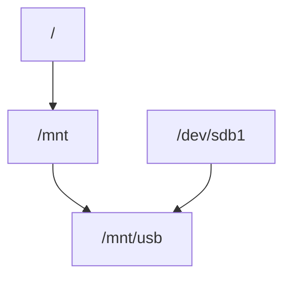

# Монтування файлових систем

## Що таке монтування

`Монтування` — це процес підключення файлової системи до дерева директорій Linux.

У Linux всі файлові системи об’єднані в одну ієрархію.

Приклад

Пристрій:
```
/dev/sdb1
```
може бути змонтований у:
```
/mnt/usb
```
Після цього його вміст буде доступний у:

`/mnt/usb`
Схема


## Команда mount
```bash
sudo mount /dev/sdb1 /mnt/usb
```
Перегляд змонтованих файлових систем
```bash
mount
```
або
```bash
df -h
```

## Відмонтування
```bash
sudo umount /mnt/usb
```
або
```bash
sudo umount /dev/sdb1
```

## Автоматичне монтування

Налаштовується у файлі:
```bash
/etc/fstab
```
Приклад:
```bash
UUID=xxxx /mnt/data ext4 defaults 0 2
```

## Основні точки монтування

Типові директорії:
```
/
 /home
 /boot
 /mnt
 /media
 ```

## Перегляд блочних пристроїв

Команда:
```bash
lsblk
```
Приклад:
```
sda
 ├─ sda1
 └─ sda2
 ```