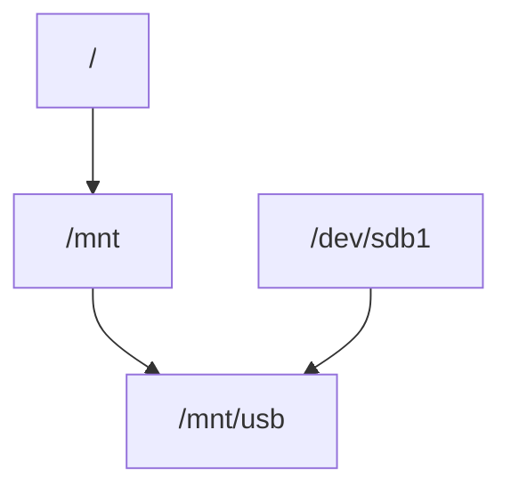

# Монтування файлових систем

## Що таке монтування

`Монтування` — це процес підключення файлової системи до дерева директорій Linux.

У Linux всі файлові системи об’єднані в одну ієрархію.

Приклад

Пристрій:
```
/dev/sdb1
```
може бути змонтований у:
```
/mnt/usb
```
Після цього його вміст буде доступний у:

`/mnt/usb`
Схема


## Команда mount
```bash
sudo mount /dev/sdb1 /mnt/usb
```
Перегляд змонтованих файлових систем
```bash
mount
```
або
```bash
df -h
```

## Відмонтування
```bash
sudo umount /mnt/usb
```
або
```bash
sudo umount /dev/sdb1
```

## Автоматичне монтування

Налаштовується у файлі:
```bash
/etc/fstab
```
Приклад:
```bash
UUID=xxxx /mnt/data ext4 defaults 0 2
```

## Основні точки монтування

Типові директорії:
```
/
 /home
 /boot
 /mnt
 /media
 ```

## Перегляд блочних пристроїв

Команда:
```bash
lsblk
```
Приклад:
```
sda
 ├─ sda1
 └─ sda2
 ```

## Різниця між ручним і автоматичним монтуванням

ключова різницю:
- ручне монтування (mount) — тимчасове
- автоматичне монтування — постійне
- 
Розберемо це системно, бо це важлива частина теми FileSystem.
1. Що таке монтування
У Linux файлові системи не прив’язані до конкретних літер дисків, як у Windows.
Замість цього вони вбудовуються у єдине дерево директорій.
Mermaid
Копіювати код
flowchart TD
A[Filesystem]
B[/dev/sdb1]
C[/mnt/data]

B --> A
A --> C
Тобто:
Text
Копіювати код
device  →  mount point
Наприклад:
Bash
Копіювати код
mount /dev/sdb1 /mnt/data
тепер вміст /dev/sdb1 доступний у директорії:
Копіювати код

/mnt/data
2. Що відбувається при mount
Коли виконується:
Bash
Копіювати код
mount /dev/sdb1 /mnt/data
ядро:
читає superblock файлової системи
перевіряє тип FS (ext4, xfs тощо)
підключає її до VFS
прив’язує до mount point
Схема:
Mermaid
Копіювати код
flowchart TD
A[/dev/sdb1]
B[Filesystem ext4]
C[VFS]
D[/mnt/data]

A --> B
B --> C
C --> D
3. Чому mount зникає після перезапуску
Тому що інформація про монтування зберігається в оперативній пам'яті.
Linux має таблицю змонтованих файлових систем:
Bash
Копіювати код
/proc/self/mounts
або
Bash
Копіювати код
mount
Ця таблиця перезаписується при кожному завантаженні системи.
Тому всі ручні mount:
Bash
Копіювати код
mount /dev/sdb1 /mnt/data
зникнуть після reboot.
4. Як працює автоматичне монтування
Щоб система монтувала файлові системи автоматично, використовується файл:
Bash
Копіювати код
/etc/fstab
Це конфігурація монтування під час boot.
5. Структура /etc/fstab
Приклад:
Text
Копіювати код
UUID=1234-ABCD   /mnt/data   ext4   defaults   0   2
Тут є 6 колонок.
колонка
значення
1
device
2
mount point
3
filesystem type
4
mount options
5
dump
6
fsck order
6. Приклад розбору
Копіювати код

UUID=1234-ABCD /mnt/data ext4 defaults 0 2
1️⃣ device
Копіювати код

UUID=1234-ABCD
це ідентифікатор файлової системи.
Можна також писати:
Копіювати код

/dev/sdb1
але UUID надійніший.
2️⃣ mount point
Копіювати код

/mnt/data
директорія, куди буде підключена FS.
3️⃣ filesystem
Копіювати код

ext4
тип файлової системи.
4️⃣ mount options
Копіювати код

defaults
стандартний набір опцій.
5️⃣ dump
Копіювати код

0
старий механізм резервного копіювання.
Зараз майже не використовується.
6️⃣ fsck order
Копіювати код

2
порядок перевірки файлових систем при boot.
Копіювати код

1 → root filesystem
2 → інші
7. Як отримати UUID
Bash
Копіювати код
blkid
приклад:
Копіювати код

/dev/sdb1: UUID="1234-ABCD" TYPE="ext4"
8. Як перевірити fstab без перезавантаження
Після редагування:
Bash
Копіювати код
mount -a
ця команда:
Копіювати код

монтує всі записи з fstab
які ще не змонтовані
9. Як побачити змонтовані файлові системи
Bash
Копіювати код
mount
або
Bash
Копіювати код
findmnt
або
Bash
Копіювати код
lsblk
10. Приклад
Bash
Копіювати код
lsblk
Копіювати код

sda
├─sda1  /
├─sda2  /home
11. Що станеться якщо mount point не існує
Монтування не спрацює.
Тому перед додаванням у fstab потрібно:
Bash
Копіювати код
mkdir /mnt/data
12. Що таке bind mount
Можна змонтувати директорію у іншу директорію.
Bash
Копіювати код
mount --bind /data /mnt/data
Це часто використовується у:
Копіювати код

containers
chroot
13. Важлива концепція
Монтування не копіює файли.
Це лише підключення файлової системи до дерева директорій.
14. Що буде якщо змонтувати поверх директорії
Наприклад:
Копіювати код

/mnt/data
вже містить файли:
Копіювати код

file1
file2
Після:
Bash
Копіювати код
mount /dev/sdb1 /mnt/data
старі файли тимчасово зникнуть.
Вони знову з’являться після:
Bash
Копіювати код
umount /mnt/data
15. Як відмонтувати
Bash
Копіювати код
umount /mnt/data
або
Bash
Копіювати код
umount /dev/sdb1
16. Важливе правило
Монтування працює тільки з порожніми директоріями (рекомендується).
17. Повний шлях даних
Mermaid
Копіювати код
flowchart TD
A[Disk]
B[Partition]
C[Filesystem]
D[Mount]
E[Directory Tree]

A --> B
B --> C
C --> D
D --> E
Підсумок
тип
поведінка
mount
тимчасове
/etc/fstab
постійне
mount -a
застосувати fstab


1. Mount options
Mount options визначають як файлову систему буде використовувати ядро.
Вони записуються у 4-й колонці /etc/fstab.
Приклад:
Text
Копіювати код
UUID=1234-ABCD /data ext4 defaults,noexec,nosuid 0 2
Найпоширеніші mount options
defaults
Text
Копіювати код
defaults
Це набір стандартних параметрів:
Копіювати код

rw
suid
dev
exec
auto
nouser
async
Тобто:
опція
значення
rw
читання + запис
suid
дозволені SUID програми
dev
дозволені device files
exec
дозволено виконання програм
auto
монтується через mount -a
nouser
тільки root може монтувати
async
асинхронний запис
Опції доступу
ro
Bash
Копіювати код
ro
монтує файлову систему тільки для читання.
Приклад:
Text
Копіювати код
UUID=... /backup ext4 ro 0 2
rw
Text
Копіювати код
rw
читання і запис (стандарт).
Опції безпеки
noexec
Text
Копіювати код
noexec
забороняє виконання програм з цього розділу.
Часто використовують для:
Копіювати код

/tmp
/shared
nosuid
Text
Копіювати код
nosuid
ігнорує SUID і SGID біти.
Тобто програми не можуть запускатися з правами власника.
Це важливо для безпеки.
nodev
Text
Копіювати код
nodev
забороняє використання device files на цьому розділі.
Це також захист.
Приклад для /tmp
Часто:
Text
Копіювати код
tmpfs /tmp tmpfs defaults,nosuid,nodev,noexec 0 0
Це:
Копіювати код

забороняє запуск програм
забороняє device files
ігнорує suid
Опції продуктивності
noatime
Linux за замовчуванням змінює час доступу до файлу (atime).
Це створює зайві записи на диск.
Text
Копіювати код
noatime
вимикає оновлення atime.
relatime
Компроміс між:
Копіювати код

atime
noatime
оновлює atime лише якщо:
Копіювати код

mtime змінився
або пройшов час
У сучасних системах часто за замовчуванням.
Опції монтування
auto
монтується автоматично через:
Bash
Копіювати код
mount -a
noauto
монтується тільки вручну.
Опції користувача
user
дозволяє звичайному користувачу монтувати файлову систему.
nouser
тільки root.
2. fsck order (6-та колонка fstab)
Це параметр:
Text
Копіювати код
fsck order
який визначає порядок перевірки файлових систем при boot.
Що таке fsck
fsck — це утиліта перевірки файлових систем.
Bash
Копіювати код
fsck
Наприклад:
Копіювати код

fsck.ext4
Значення fsck order
значення
значення
0
не перевіряти
1
перевіряти першим
2
перевіряти після root
Типовий приклад
Text
Копіювати код
UUID=... /     ext4 defaults 0 1
UUID=... /home ext4 defaults 0 2
UUID=... /data ext4 defaults 0 2
Тут:
Копіювати код

root → перевіряється першим
інші → після
Чому root має 1
Бо система повинна перевірити кореневу файлову систему перед використанням.
Що означає 2
Файлові системи з значенням 2 перевіряються паралельно, якщо вони на різних дисках.
Чи можна ставити 0
Так, можна.
Text
Копіювати код
0
означає:
Копіювати код

fsck ніколи не перевіряє цю FS при boot
Це часто використовують для:
Копіювати код

network drives
tmpfs
usb
Приклад
Text
Копіювати код
tmpfs /tmp tmpfs defaults,nosuid,nodev,noexec 0 0
Тут:
Копіювати код

dump = 0
fsck = 0
бо tmpfs не має сенсу перевіряти.
Важливе правило
Для ext файлових систем рекомендується:
Копіювати код

root → 1
інші → 2
Підсумок
mount options
визначають:
Копіювати код

як файлову систему використовує ядро
важливі:
Копіювати код

ro
rw
noexec
nosuid
nodev
noatime
relatime
fsck order
визначає:
Копіювати код

порядок перевірки FS при boot
значення:
Копіювати код

0 → не перевіряти
1 → root filesystem
2 → інші файлові системи
💡 Маленька цікава деталь:
у сучасних системах /etc/fstab часто використовує UUID замість /dev/sda1, і це дуже важливо.
Бо порядок дисків може змінюватися при завантаженні.

Коротко:
опції можуть перекривати одна одну, і остання має пріоритет.
Тобто конфлікту як помилки не буде — просто одна опція перевизначить іншу.
1. Як працює defaults
defaults — це просто набір опцій, який розгортається приблизно у:
Text
Копіювати код
rw,suid,dev,exec,auto,nouser,async
Тобто:
Text
Копіювати код
defaults = rw,suid,dev,exec,auto,nouser,async
2. Якщо додати іншу опцію
Наприклад:
Text
Копіювати код
defaults,ro
розгортається у:
Text
Копіювати код
rw,suid,dev,exec,auto,nouser,async,ro
Тут є конфлікт:
Копіювати код

rw
ro
У такому випадку остання опція перемагає.
Тобто система фактично використовує:
Text
Копіювати код
ro
3. Приклад
Text
Копіювати код
UUID=xxxx /data ext4 defaults,ro 0 2
Фактично це означає:
Text
Копіювати код
read-only filesystem
4. Інший приклад
Text
Копіювати код
defaults,noexec
розгортається у:
Text
Копіювати код
rw,suid,dev,exec,auto,nouser,async,noexec
Тут:
Копіювати код

exec
noexec
Остання опція:
Text
Копіювати код
noexec
буде активною.
5. Чи рекомендується так робити
Так, це звичайна практика.
Наприклад:
Text
Копіювати код
defaults,noexec,nosuid,nodev
часто використовують для:
Копіювати код

/tmp
/shared
6. Але є більш "чистий" варіант
Іноді пишуть опції без defaults, наприклад:
Text
Копіювати код
rw,noexec,nosuid,nodev
Це просто більш явна конфігурація.
7. Чи важливий порядок опцій
Так.
Наприклад:
Text
Копіювати код
ro,rw
результат:
Text
Копіювати код
rw
бо остання опція — rw.
8. Як перевірити реальні опції
Після монтування можна подивитись:
Bash
Копіювати код
mount | grep data
або краще:
Bash
Копіювати код
findmnt
Приклад:
Копіювати код

/data ext4 rw,nosuid,nodev
9. Важлива деталь
Деякі опції взаємовиключні:
опція
протилежна
rw
ro
exec
noexec
suid
nosuid
dev
nodev
atime
noatime
10. Висновок
Можна писати:
Text
Копіювати код
defaults,noexec,nosuid
і це нормальна практика.
Головне пам’ятати правило:
Text
Копіювати код
остання опція має пріоритет
💡 До речі, є одна дуже цікава особливість mount, яку багато хто не знає:
насправді одну і ту ж файлову систему можна змонтувати кілька разів у різні точки дерева директорій.
Це називається multiple mounts, і воно активно використовується у контейнерах.
