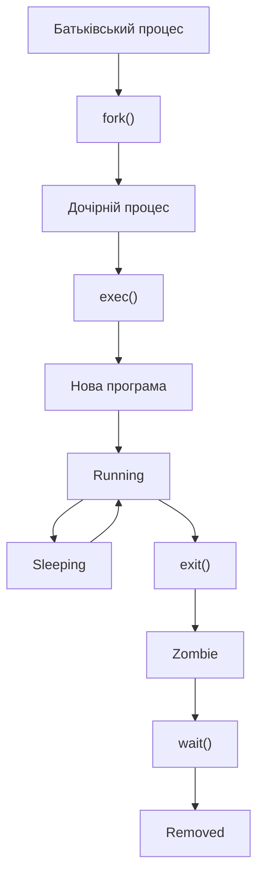
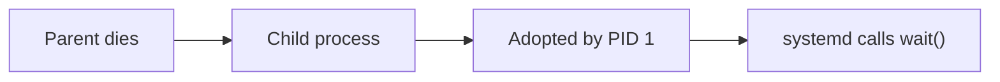
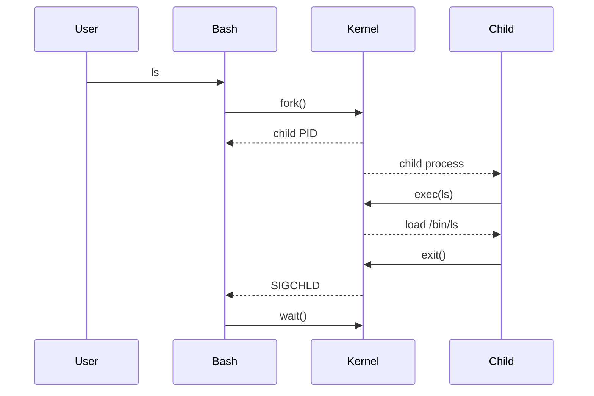

# Розділ 3. Життєвий цикл процесу в Linux <!-- omit in toc -->

## Зміст <!-- omit in toc -->

- [1. Загальна схема життя процесу](#1-загальна-схема-життя-процесу)
- [2. Створення процесу: fork()](#2-створення-процесу-fork)
- [3. Завантаження програми: exec()](#3-завантаження-програми-exec)
- [4. Завершення процесу: exit()](#4-завершення-процесу-exit)
- [5. Очікування: wait()](#5-очікування-wait)
- [6. Zombie процеси](#6-zombie-процеси)
- [7. Orphan процеси](#7-orphan-процеси)
- [8. Повний цикл](#8-повний-цикл)
- [9. Практичний приклад](#9-практичний-приклад)
- [10. Типові помилки](#10-типові-помилки)
- [11. Візуальна схема](#11-візуальна-схема)
- [🔥 Найважливіше, що треба запам’ятати](#-найважливіше-що-треба-запамятати)
- [🧠 Міні-перевірка](#-міні-перевірка)


## 1. Загальна схема життя процесу

Ось спрощений життєвий цикл:
```
створення → готовий → виконання → очікування → завершення
```
А більш точно:
```
fork() → exec() → running → sleeping → exit() → zombie → cleaned
```


***
<div style="text-align: center;">
<a href="#зміст-">Повернутись до змісту ⬆️</a>
</div>

## 2. Створення процесу: fork()
**🔹 Що таке fork()**

👉 `fork()` — це системний виклик, який створює новий процес

**🔹 Як це працює**

Коли процес викликає fork():

👉 ядро створює копію процесу

🔹 Що копіюється
- пам’ять (логічно, через copy-on-write)
- змінні
- відкриті файли
- контекст
- environment
- робочий каталог

**🔹 Що відрізняється**

| Батько                     | Дитина            |
| -------------------------- | ----------------- |
| має свій PID               | має новий PID     |
| fork() повертає PID дитини | fork() повертає 0 |

**🔹 Приклад логіки**
```C
pid = fork();

if (pid == 0) {
    // дитина
} else {
    // батько
}
```

**🔥 Важливий момент**

👉 після fork() існують два процеси, які виконують той самий код

**🔹 Copy-on-Write (дуже важливо)**

Linux НЕ копіює всю пам’ять одразу.

👉 копіює тільки коли щось змінюється

Це робить fork() дуже швидким.

***
<div style="text-align: center;">
<a href="#зміст-">Повернутись до змісту ⬆️</a>
</div>

## 3. Завантаження програми: exec()
**🔹 Що таке exec()**

👉 `exec()` — це системний виклик, який:

👉 замінює поточний процес новою програмою

**🔹 Важливо**

❗ exec() НЕ створює новий процес  
❗ він змінює існуючий

**🔹 Що відбувається**

Після exec():
- старий код зникає
- новий код завантажується
- пам’ять оновлюється
- PID залишається той самий

🔹 Приклад

Shell робить:
```bash
fork()
```
у дочірньому процесі → `exec(ls)`

**🔥 Результат**
```bash
bash → fork → child → exec(ls)
```

👉 і тепер цей процес — це `ls`

**🔹 Сімейство exec**
- `execve()` (основний)
- `execl()`
- `execp()`

***
<div style="text-align: center;">
<a href="#зміст-">Повернутись до змісту ⬆️</a>
</div>

## 4. Завершення процесу: exit()
**🔹 Що таке exit()**

👉 процес завершує роботу

**🔹 Що відбувається**
- звільняється пам’ять
- закриваються файли
- повертається код завершення
- процес переходить у zombie

**🔹 Код завершення**
```bash
echo $?
```
👉 показує статус останнього процесу

**🔹 Приклад**
```bash
exit 0
```
> 0 → успіх  
> інші значення → помилка

***
<div style="text-align: center;">
<a href="#зміст-">Повернутись до змісту ⬆️</a>
</div>

## 5. Очікування: wait()
**🔹 Що таке wait()**

👉 батьківський процес “забирає” результат дитини

**🔹 Чому це потрібно**

Щоб:
- прибрати zombie
- отримати exit code

**🔹 Як працює**
```C
wait(&status);
```

**🔥 Якщо НЕ викликати wait()**

👉 виникає zombie процес

***
<div style="text-align: center;">
<a href="#зміст-">Повернутись до змісту ⬆️</a>
</div>

## 6. Zombie процеси
**🔹 Що це таке**

👉 процес вже завершився, але:
- запис у таблиці процесів ще є
- батько не забрав статус


**🔹 Як виглядає**
```bash
ps aux | grep Z
```
```
Z
```
**🔹 Що залишилось**
- PID
- exit status

**🔹 Чого НЕ залишилось**
- пам’яті
- виконання

**🔹 Чому це проблема**

Якщо їх багато:

👉 можна вичерпати PID space

**🔹 Як прибрати**

- батько викликає `wait()`
- або завершується → systemd прибирає

***
<div style="text-align: center;">
<a href="#зміст-">Повернутись до змісту ⬆️</a>
</div>

##  7. Orphan процеси
**🔹 Що це**

👉 процес, у якого батько завершився


**🔹 Що відбувається**

👉 він передається PID 1
```bash
parent died → child → systemd
```

**🔹 Чому це нормально**

systemd:
- підхоплює процес
- викликає wait()
- очищає його

***
<div style="text-align: center;">
<a href="#зміст-">Повернутись до змісту ⬆️</a>
</div>

## 8. Повний цикл


🔥 Реальний сценарій
```bash
ls
```
🔹 Кроки

1. bash працює
2. користувач вводить `ls`
3. bash викликає `fork()`
4. створюється `child`
5. child викликає `exec(ls)`
6. ядро запускає `/bin/ls`
7. процес виконується
8. викликає `exit()`
9. стає `zombie`
10. bash викликає `wait()`
11. zombie зникає

***
<div style="text-align: center;">
<a href="#зміст-">Повернутись до змісту ⬆️</a>
</div>

## 9. Практичний приклад
```bash
sleep 5 &
ps aux | grep sleep
```

**🔹 Що відбувається**
- fork → новий процес
- exec → sleep
- running → sleeping
- exit → zombie → cleaned

***
<div style="text-align: center;">
<a href="#зміст-">Повернутись до змісту ⬆️</a>
</div>

## 10. Типові помилки
❌ fork створює нову програму

👉 ні, тільки копіює процес
***
❌ exec створює процес

👉 ні, замінює
***
❌ zombie — це активний процес

👉 ні, це “залишок”
***
❌ orphan — це проблема

👉 ні, це нормально
***

***
<div style="text-align: center;">
<a href="#зміст-">Повернутись до змісту ⬆️</a>
</div>

## 11. Візуальна схема
```bash
bash
  │
  ├─ fork()
  │     ↓
  ├─ child
  │     ↓
  ├─ exec(ls)
  │     ↓
  ├─ running
  │     ↓
  ├─ exit()
  │     ↓
  ├─ zombie
  │     ↓
  └─ wait() → cleaned
```

***
<div style="text-align: center;">
<a href="#зміст-">Повернутись до змісту ⬆️</a>
</div>

## 🔥 Найважливіше, що треба запам’ятати

1. Процеси створюються через `fork()`
2. `exec()` замінює програму
3. `exit()` завершує процес
4. `wait()` очищає zombie
5. zombie — це не “живий” процес
6. orphan переходить до systemd
7. shell завжди робить fork + exec

***
<div style="text-align: center;">
<a href="#зміст-">Повернутись до змісту ⬆️</a>
</div>

## 🧠 Міні-перевірка

1. Чим `fork()` відрізняється від `exec()`?
2. Чому після exit з’являється zombie?
3. Хто прибирає zombie?
4. Чому orphan не проблема?
5. Чи змінюється PID після exec?
***
<div style="text-align: center;">
<a href="#зміст-">Повернутись до змісту ⬆️</a>
</div>