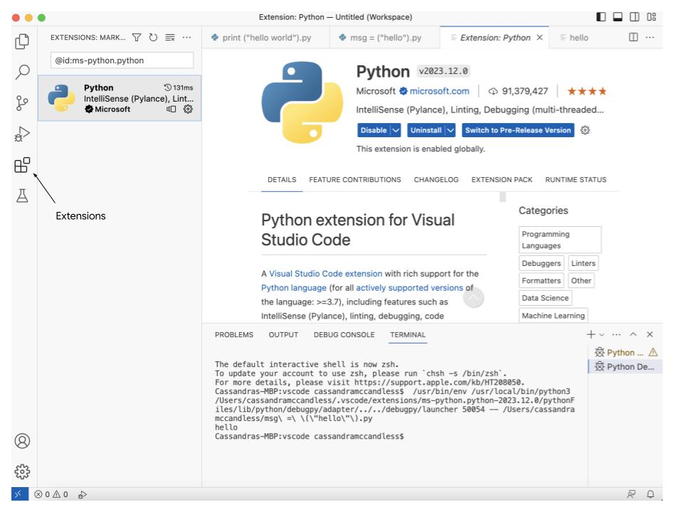
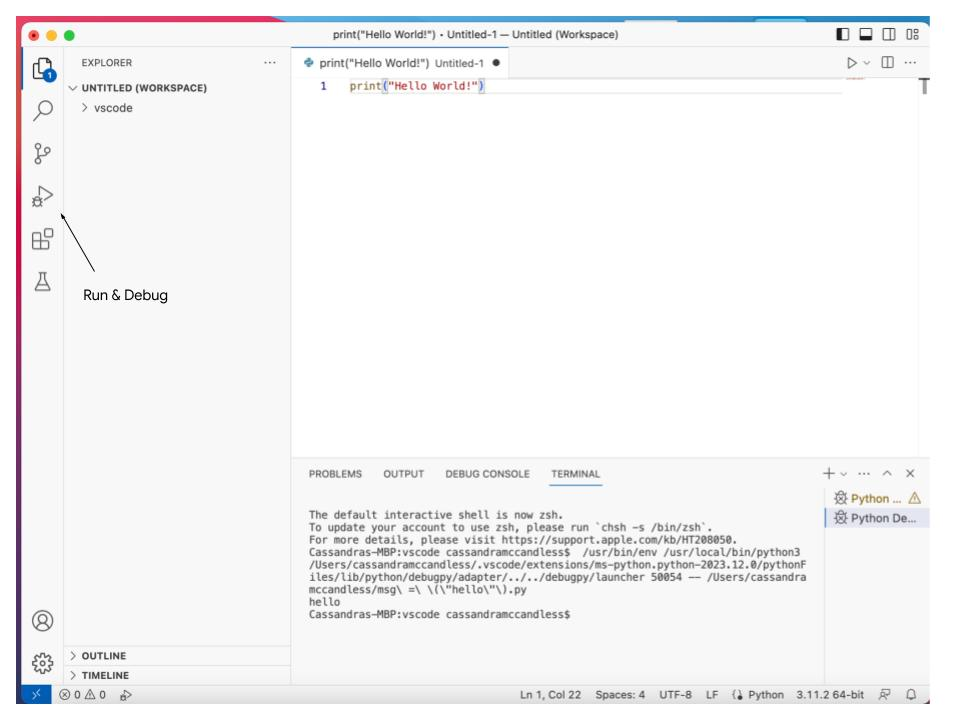
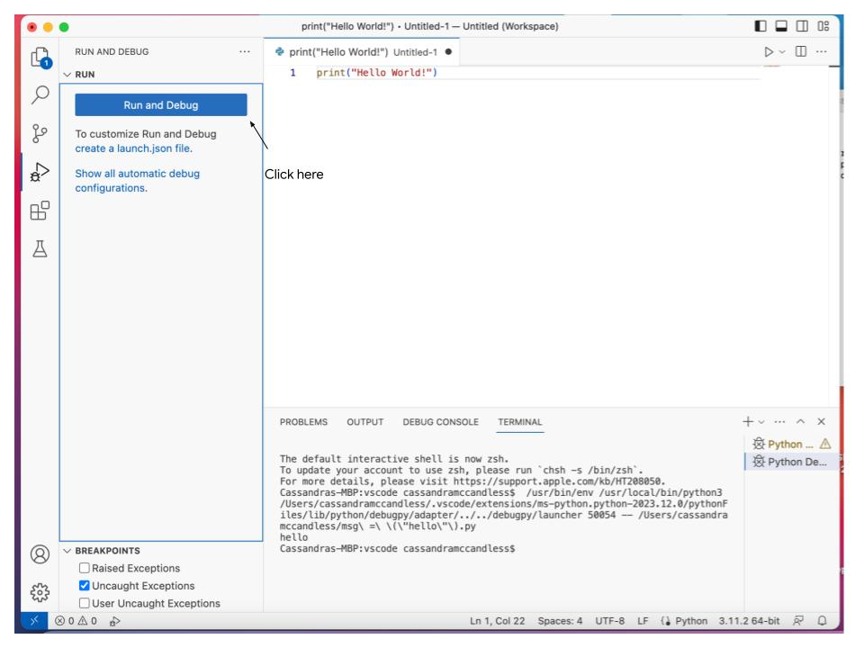
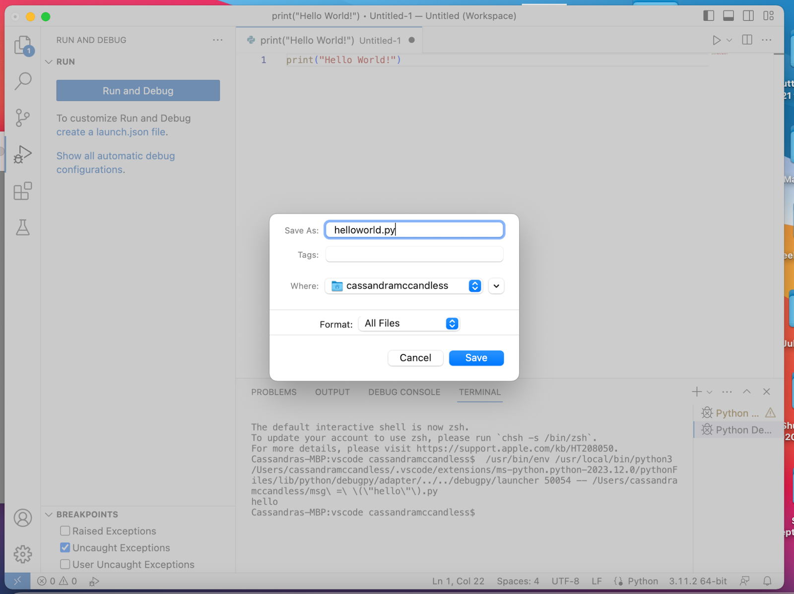
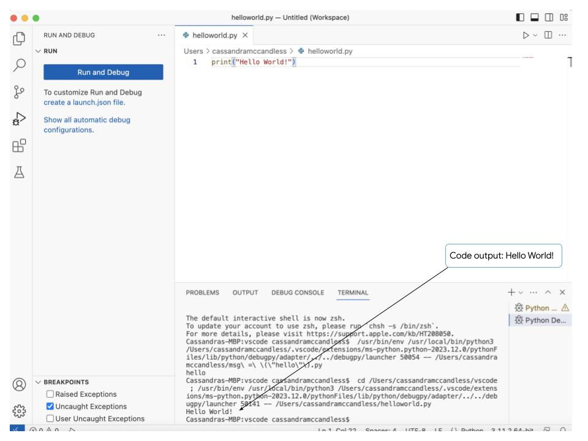

# Використання VS Code 
VS Code - це редактор з відкритим вихідним кодом, який включає інструменти розробника. Він схожий на ноутбуки Jupyter та Colab, але він включає більше функцій. Код VS забезпечує вбудовану підтримку з доповненням коду [Intellisense](https://code.visualstudio.com/docs/editing/intellisense#:~:text=IntelliSense%20is%20a%20general%20term,%2C%20and%20%22code%20hinting.%22), інтерактивним налагоджувачем та іншими інструментами збирання та сценаріїв. VS Code має простий дизайн, який простий у використанні. Його інтуїтивно зрозумілі функції роблять його чудовим вибором для кодування на Python!

## Використання VS Code з Python
Щоб використовувати код VS для Python, вам потрібно буде встановити Python3, VS Code та розширення VS Code Python. Переконайтеся, що у вас на комп'ютері встановлений Python3, ввівши наступну команду в терміналі на вашому комп'ютері. 

Linux/macOS: відкрийте вікно терміналу та введіть таку команду:
```bash
python3 --version 
```
Windows: відкрийте командний рядок і виконайте таку команду:
```bash
py -3 --version
```

Якщо встановлено Python3, вихід повинен виглядати так:
```bash
$python3 -- version

Python 3.11.3
```
Якщо він не встановлений, вихід буде виглядати наступним чином:
```bash
$python3 -- version

command not found: python
```

## Завантажте VS Code і встановіть розширення Python
Ви можете завантажити код VS [тут](https://code.visualstudio.com/Download). Ви можете використовувати код VS в операційних системах Windows, Mac та Linux. Завантажте версію, сумісну з вашою операційною системою. Дотримуйтесь підказок щодо завантаження. Після завершення завантаження та встановлення ви зможете відкрити VS Code і почати його використовувати. 

Далі ви встановите розширення Python. Зробити це можна, відвідавши 
[VS Code Marketplace](https://marketplace.visualstudio.com/items?itemName=ms-python.python). Дотримуйтесь інструкцій щодо завантаження там. Ви можете перевірити, чи розширення Python було успішно додано, натиснувши цю піктограму в VS Code.


> [!NOTE]
>  Ви не можете використовувати VS Code Marketplace для встановлення розширення Python на macOS. 

Для macOS відкрийте палітру команд у VS код. Ви можете зробити це, натиснувши команду `Cmd+Shift+P`. Введіть `shell command`. Знайдіть команду оболонки: `Install ‘code’ command in PATH`. 

Як тільки це буде завершено, ви можете почати писати, запускати та налагоджувати код Python у VS Code!

**Порада професіонала:** Щоб спробувати VS Code без завантаження та встановлення, натисніть [тут](https://vscode.dev/?vscode-lang=uk-ua).

## Створіть файл Python
Щоб створити файл Python у VS Code, перейдіть до Файл → Новий файл... → Файл Python. З'явиться нова робоча область, і ви можете почати писати код Python. Давайте перевіримо це простим твердженням. Введіть наступний оператор у новій робочій області.
```py
print(“Hello World!”)
```
Далі натисніть на значок «Виконати та налагодити» на лівій панелі інструментів. 


Потім натисніть Виконати та налагодити тут:


Вам буде запропоновано назвати і зберегти файл. Дайте ім'я файлу Python і натисніть зберегти.


Ваш код запуститься, і ви побачите його вихід тут. 


Тепер ви знаєте основи VS Code і як ним користуватися! 

## Ключові висновки
VS Code є надзвичайно надійним редактором вихідного коду. Він використовує технологію [Intellisense](https://code.visualstudio.com/docs/editing/intellisense#:~:text=IntelliSense%20is%20a%20general%20term,%2C%20and%20%22code%20hinting.%22), яка забезпечує підсвічування синтаксису та автозаповнення для кодування. VS код дозволяє налагоджувати прямо в редакторі за допомогою його інтерактивної консолі. Загалом, код VS надзвичайно інтерактивний та настроюється. Існує також велика бібліотека розширень, які легко інтегруються!

## Ресурси для отримання додаткової інформації
Ось деякі ресурси про те, що може запропонувати VS Code!

- Цей [ресурс](https://code.visualstudio.com/#powerful-debugging) надає огляд VS Code. 

- Цей [ресурс](https://code.visualstudio.com/docs/languages/python) надає більше інформації про використання Python з VS Code, а також містить підручник, за яким ви можете слідувати.

- Це [бібліотека розширень](https://marketplace.visualstudio.com/VSCode) для VS Code.   