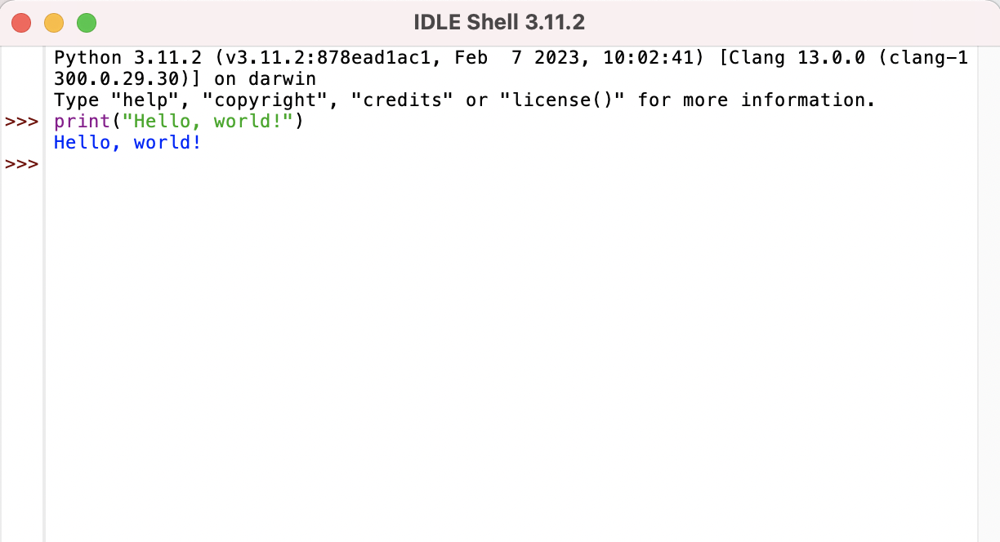
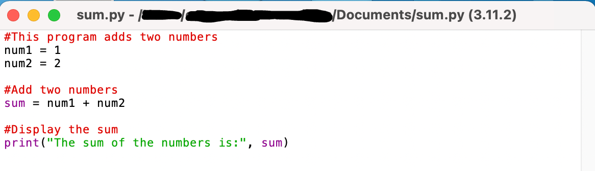
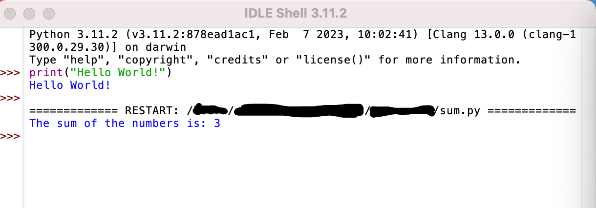

# Використання командного рядка
Командний рядок використовується, щоб повідомити вашому комп'ютеру, що робити. Ви можете використовувати його для доступу до серверів, переміщення файлів, зміни каталогів та написання сценаріїв. У цьому читанні ви дізнаєтеся, як писати сценарії Python у командному рядку разом із графічним інтерфейсом Python IDLE. Ми також розглянемо різні способи доступу до командного рядка на основі вашої операційної системи. 

## Використання командного рядка на macOS
Використовуючи пошук у прожекторі, введіть «термінал». Виберіть додаток терміналу. Ви повинні побачити своє ім'я користувача, за яким слідує знак $. macOS поставляється з попередньо встановленим Python 2.7. Ви можете встановити Python 3 з [python.org](https://www.python.org/). Тільки пам'ятайте, це означає, що у вас на Mac буде встановлено 2 версії Python, і вам потрібно буде приділити особливу увагу вашим шляхам.

Щоб перевірити, яку версію Python ви встановили на своєму Mac, скористайтеся наступною командою.
```bash
python --version
```
Щоб перевірити наявність Python3, скористайтеся наступною командою. 
```bash
python3 --version
```

## Використання командного рядка в ОС Windows
У Windows відкрийте меню «Пуск». У пошуковому рядку введіть cmd. Клацніть правою кнопкою миші на cmd і виберіть Виконати від імені адміністратора. Це відкриє командний рядок. ОС Windows не поставляється з встановленим Python. Відвідайте офіційну [сторінку завантаження](https://www.python.org/downloads/windows/) Python для Windows. Виберіть інсталятор Windows (64-розрядний) або (32-розрядний). Після завантаження інсталятора двічі клацніть файл. Виберіть пункт Встановити запуск для всіх користувачів. Дотримуйтесь підказок під час установки. Обов'язково встановіть прапо рець Додати шлях до python.exe. Це дозволить запустити Python з командного рядка. Після завершення інсталяції ви можете перевірити наявність Python з командного рядка.

Щоб перевірити наявність Python, скористайтеся наступною командою. З'явиться встановлена вами версія Python. 
```shell
python --version
```

## Використання командного рядка на ОС Linux
Доступ до терміналу Linux за допомогою <kbd>Ctrl</kbd> + <kbd>Alt</kbd> + <kbd>T</kbd>. Це дозволить вам перевірити наявність Python. Введіть пітон. Python поставляється попередньо встановленим на більшості систем Linux. Якщо команда не знайдена, ви можете встановити Python, написавши sudo apt install python3. 

Ви можете почати писати код Python з терміналу. Просто введіть python, щоб використовувати інтерактивний режим. Ви також можете писати сценарії Python за допомогою Linux з IDLE, які ми розглянемо далі. 


## Використання IDLE
Python IDLE входить в комплект інсталяцій Python на Windows і MacOS. Ви можете завантажити IDLE за допомогою менеджера пакетів на Linux. Python IDLE - інтерактивний інтерпретатор або редактор файлів, який дозволяє легко писати сценарії та програми Python. IDLE забезпечує підсвічування синтаксису, завершення коду та автоматичне відступ. 

Двічі клацніть піктограму IDLE, щоб відкрити його на комп'ютері. Це відкриє порожнє вікно інтерпретатора Python. Ви можете почати писати код відразу. 




Також можна відкрити новий файл. Перейдіть у меню Файл → Відкрити → Створити файл. Тут ви можете написати файл Python. Після завершення запису коду Python у файлі перейдіть до Файл → Зберегти як. Дайте ім'я файлу Python. Натисніть Зберегти. Щоб запустити код Python у збереженому файлі натисніть Виконати → Виконати модуль у меню.


[Sum](assets/Sum.py) 

Файл


Вихід Sum.py


Ключові висновки
Яку б операційну систему ви не використовували, ви зможете запускати Python з командного рядка. Використання текстового редактора типу IDLE та запуск python з командного рядка найкраще підходить для виконання та налагодження окремих скриптів або файлів.py. 


Ресурси для отримання додаткової інформації
Ось список додаткових ресурсів для написання та запуску Python на локальній машині. 

- [Посібник](https://medium.com/data-science/a-quick-guide-to-using-command-line-terminal-96815b97b955) із використання терміналу (командний рядок) в операційних системах Mac, Windows та Linux. 

- [Документація та інструкції IDLE](https://docs.python.org/3/library/idle.html)

- [Скрипти Python проти Jupyter Notebooks](https://learnpython.com/blog/python-scripts-vs-jupyter-notebooks/)