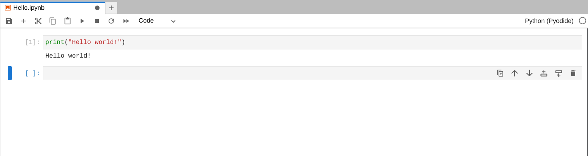
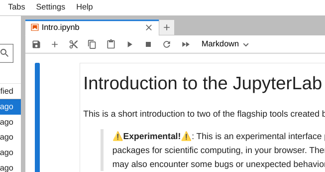
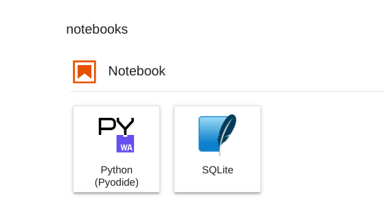

# Огляд: Використання JupyterLab та Jupyter Notebooks
Існує багато різних місць та середовищ, які ви можете використовувати для запису та запуску коду. У цьому відео ви дізнаєтеся більше про блокноти JupyterLab та Jupyter для написання, запуску та налагодження коду Python. JupyterLab та Jupyter Notebooks є частиною проекту з відкритим кодом під назвою [Project Jupyter](https://jupyter.org/) і є безкоштовними у використанні. 

## JupyterLab
JupyterLab - це веб-інтерфейс, який дозволяє використовувати блокноти Jupyter для запису, запуску та налагодження коду Python. JupyterLab - це онлайн-середовище, яке дозволяє запускати код у хмарі. 

## Jupyter Notebooks
Jupyter Notebook можна використовувати та запускати в веб-інтерфейсі 
через [JupyterLab](https://jupyter.org/try-jupyter/lab/) або на локальній машині. Jupyter Notebook дозволяє створювати документи, що містять живий код. Ви можете писати програми та скрипти Python за допомогою блокнотів Jupyter і бачити, як вони виконуються в одному місці. Це чудовий інструмент для створення та розуміння коду, який ви пишете, оскільки ви можете бачити свої вхідні та вихідні дані в одному місці. 


 

## Використання Jupyter Notebook на JupyterLab
Щоб використовувати Jupyter Notebook у хмарному середовищі натисніть [тут](https://jupyter.org/try-jupyter/lab/).
 Щоб створити новий блокнот у лабораторному середовищі, + нову вкладку та виберіть Python під 


Блокнот. Відкриється новий блокнот, і ви можете почати писати та запускати код Python. 




## Установка Jupyter
Якщо ви хочете встановити JupyterLab та Jupyter Notebooks на локальній машині, ви можете зробити це за допомогою команди pip з командного рядка терміналу Python.


**JupyterLab**
1. Встановити JupyterLab 
    ```bash
    pip install jupyterlab
    ```
2. Після встановлення запустіть JupyterLab 
    ```bash
    jupyter-lab
    ```


**Jupyter Notebook**
1. Встановіть класичний ноутбук Jupyter 
    ```bash
    pip install notebook
    ```

2. Запустіть блокнот 
    ```bash
    jupyter notebook
    ```


## Спільний доступ до Jupyter Notebooks
Блокноти JupyterLab та Jupyter є чудовим ресурсом для написання коду Python. Зошити можна легко ділитися та зберігати за допомогою електронної пошти, GitHub та [Jupyter Notebook Viewer](https://nbviewer.org/). 


## Ресурси Jupyter
Доступні тонни ресурсів Jupyter. Ось список деяких чудових, які допоможуть вам розпочати роботу!

- Спробуйте [Jupyter Notebooks](https://docs.jupyter.org/en/latest/start/index.html) у вашому браузері.

- Встановіть та використовуйте [JupyterLab та Jupyter Notebooks](https://docs.jupyter.org/en/latest/install.html).

- Додаткова інформація про [початок роботи](https://jupyter-notebook-beginner-guide.readthedocs.io/en/latest/what_is_jupyter.html) та використання Jupyter Notebooks. 

- [Офіційна документація](https://docs.jupyter.org/en/latest/) проекту Jupyter. 

