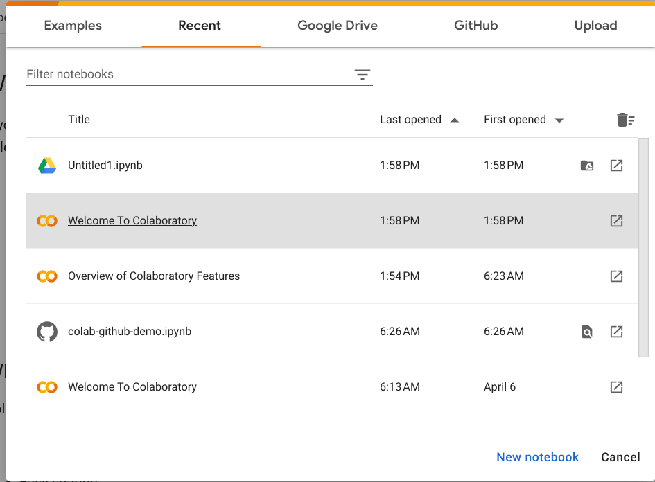

# Відгук: Використовуйте Colab
Ноутбуки Colab — це блокноти Jupyter, розміщені компанією Google Colaboratory. У Colab ви можете писати та запускати код Python. У цьому читанні ви дізнаєтеся більше про те, як використовувати Colab та його особливості.

## Про Colab
Colab - це веб-платформа, яка дозволяє писати та запускати код Python дуже швидко на Google Диску. Він безкоштовний і готовий до використання з нульовою конфігурацією. Ви можете просто відвідати [Colab](https://colab.research.google.com/notebooks/basic_features_overview.ipynb), щоб почати! 

## Особливості Colab
Colab надає всі функціональні можливості, які пропонує Python. Комірки в Colab можуть містити код, текст і зображення. Комірки коду включають виконуваний код і багатий текст, що полегшує написання та запуск коду. Colab також дозволяє легко включити позначку у ваші зошити. Це чудова функція для спільного використання зошитів, оскільки ви можете додавати заголовки, абзаци, списки, математичні формули тощо. Ви можете встановити пакети Python за допомогою команди pip в комірці коду. Ноутбуки Colab також можна легко ділитися з іншими співробітниками. 

Примітка. Коли ви створюєте блокнот Colab, він зберігається на вашому Диску Google. Ви можете легко поділитися за допомогою кнопки спільного доступу у верхньому правому куті ноутбука. 

### Створіть блокнот Colab
1. Відкрийте [Google Colab](https://colab.research.google.com/notebooks/welcome.ipynb#recent=true).

2. Натисніть на Новий блокнот у нижньому правому куті. 


3. Почніть писати код Python. 

4. Щоб запустити код і побачити його виконання, скористайтеся  


**Порада професіонала:** Щоб встановити бібліотеку Python, використовуйте команду pip зі знаком оклику.
```bash
!pip install <library name>
```

## Ресурси для отримання додаткової інформації
Перегляньте наступні ресурси, щоб дізнатися більше про Colab: 

- Цей [ресурс](https://colab.research.google.com/notebooks/basic_features_overview.ipynb) надає огляд функцій Colab з прикладами. 

- Це [посібник із встановлення та використання бібліотек Python в Colab](https://colab.research.google.com/notebooks/snippets/importing_libraries.ipynb). 

- На цьому [ресурсі](https://colab.research.google.com/github/googlecolab/colabtools/blob/main/notebooks/colab-github-demo.ipynb) наведено вказівки щодо збереження та завантаження ноутбуків Colab в GitHub.  
